# Cord 项目架构设计 - Mermaid 图解

本文档使用 Mermaid 图表详细展示 Cord（Yank Note）项目的四大核心架构设计模式及其相互关系。

---

## 一、整体架构概览

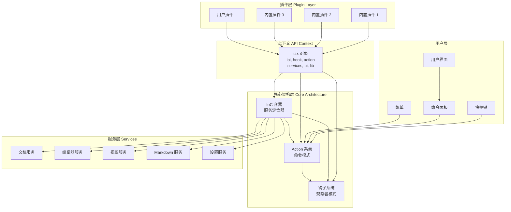
```mermaid
graph TB
    subgraph "用户层"
        UI[用户界面]
        KB[快捷键]
        CMD[命令面板]
        MENU[菜单]
    end

    subgraph "插件层 Plugin Layer"
        P1[内置插件 1]
        P2[内置插件 2]
        P3[内置插件 3]
        P4[用户插件...]
    end

    subgraph "上下文 API Context"
        CTX[ctx 对象<br/>ioi, hook, action<br/>services, ui, lib]
    end

    subgraph "核心架构层 Core Architecture"
        IOC[IoC 容器<br/>服务定位器]
        HOOK[钩子系统<br/>观察者模式]
        ACTION[Action 系统<br/>命令模式]
    end

    subgraph "服务层 Services"
        DOC[文档服务]
        EDIT[编辑器服务]
        VIEW[视图服务]
        MD[Markdown 服务]
        SET[设置服务]
    end

    UI --> CMD
    KB --> ACTION
    CMD --> ACTION
    MENU --> ACTION
    
    P1 --> CTX
    P2 --> CTX
    P3 --> CTX
    P4 --> CTX
    
    CTX --> IOC
    CTX --> HOOK
    CTX --> ACTION
    
    IOC --> HOOK
    ACTION --> HOOK
    IOC --> ACTION
    
    IOC --> DOC
    IOC --> EDIT
    IOC --> VIEW
    IOC --> MD
    IOC --> SET
```

**图表说明：**

这是整个项目的**顶层架构图**，展示了五层架构结构：

1. **用户层（User Layer）**：用户通过界面、快捷键、命令面板、菜单等方式与系统交互
2. **插件层（Plugin Layer）**：所有功能都以插件形式存在，包括内置插件和用户插件
3. **上下文 API（Context）**：插件开发的统一接口层，提供所有可用能力
4. **核心架构层（Core Architecture）**：三大核心模式 - IoC 容器、钩子系统、Action 系统
5. **服务层（Services）**：具体的业务服务实现，如文档、编辑器、视图等

**数据流向**：用户操作 → Action 系统 → 钩子通知 → 服务执行 → 插件响应

**关键设计**：
- 所有层间通信都通过 Context API 进行
- IoC 容器是基础设施，存储所有服务实例
- 钩子系统是事件总线，实现模块解耦
- Action 系统是命令中枢，统一处理用户操作

---

## 二、服务定位器模式（IoC 容器）

### 2.1 核心结构

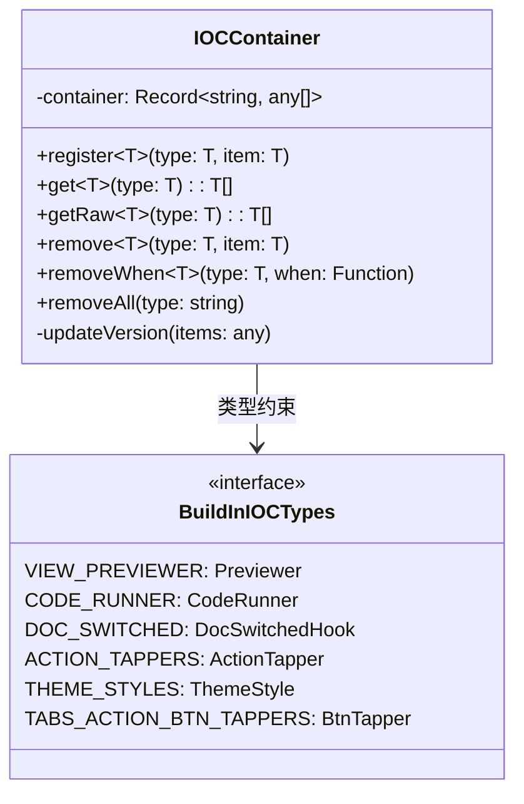
```mermaid
classDiagram
    class IOCContainer {
        -container: Record~string, any[]~
        +register~T~(type: T, item: T)
        +get~T~(type: T): T[]
        +getRaw~T~(type: T): T[]
        +remove~T~(type: T, item: T)
        +removeWhen~T~(type: T, when: Function)
        +removeAll(type: string)
        -updateVersion(items: any)
    }

    class BuildInIOCTypes {
        <<interface>>
        VIEW_PREVIEWER: Previewer
        CODE_RUNNER: CodeRunner
        DOC_SWITCHED: DocSwitchedHook
        ACTION_TAPPERS: ActionTapper
        THEME_STYLES: ThemeStyle
        TABS_ACTION_BTN_TAPPERS: BtnTapper
    }

    IOCContainer --> BuildInIOCTypes : 类型约束
```

**图表说明：**

这是 IoC 容器的**类结构图**，展示了核心组件：

**IOCContainer 类**：
- `container`: 底层存储结构，使用 `Record<string, any[]>` 存储所有服务实例
- `register<T>()`: 注册服务，支持泛型类型约束
- `get<T>()`: 获取服务副本（浅拷贝），防止外部意外修改
- `getRaw<T>()`: 获取原始引用（带版本号），用于 Vue 响应式
- `remove<T>()`: 移除指定服务实例
- `removeWhen<T>()`: 按条件移除服务
- `removeAll()`: 清空某类型的所有服务
- `updateVersion()`: 私有方法，更新版本号以触发响应式更新

**BuildInIOCTypes 接口**：
定义了所有可注册的服务类型，包括：
- `VIEW_PREVIEWER`: Markdown 预览器
- `CODE_RUNNER`: 代码运行器
- `DOC_SWITCHED`: 文档切换钩子
- `ACTION_TAPPERS`: Action 修改器
- `THEME_STYLES`: 主题样式
- `TABS_ACTION_BTN_TAPPERS`: 标签页按钮修改器

**类型安全机制**：通过 TypeScript 泛型约束，确保注册的服务类型正确，在编译时就能发现类型错误。

---

### 2.2 数据流转

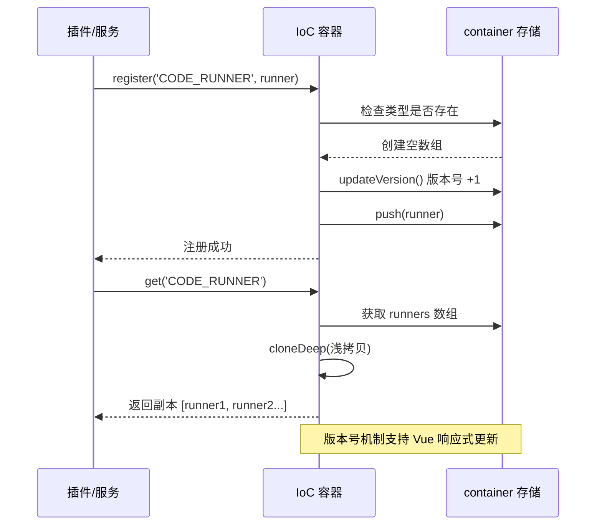
```mermaid
sequenceDiagram
    participant P as 插件/服务
    participant IOC as IoC 容器
    participant C as container 存储

    P->>IOC: register('CODE_RUNNER', runner)
    IOC->>C: 检查类型是否存在
    C-->>IOC: 创建空数组
    IOC->>C: updateVersion() 版本号 +1
    IOC->>C: push(runner)
    IOC-->>P: 注册成功

    P->>IOC: get('CODE_RUNNER')
    IOC->>C: 获取 runners 数组
    IOC->>IOC: cloneDeep(浅拷贝)
    IOC-->>P: 返回副本 [runner1, runner2...]

    Note over IOC,C: 版本号机制支持 Vue 响应式更新
```

**图表说明：**

这个**时序图**展示了 IoC 容器的完整工作流程：

**注册流程（上半部分）**：
1. 插件/服务调用 `ioc.register('CODE_RUNNER', runner)`
2. IoC 容器检查该类型是否已存在
3. 如不存在，创建空数组
4. 调用 `updateVersion()` 更新版本号（`_version++`）
5. 将服务实例推入数组
6. 返回注册成功

**获取流程（下半部分）**：
1. 插件/服务调用 `ioc.get('CODE_RUNNER')`
2. IoC 容器从 container 中获取数组
3. 使用 `cloneDeep()` 创建浅拷贝
4. 返回副本而非原始引用

**设计亮点**：
- **版本号机制**：每次注册/移除都会更新 `_version` 属性，配合 Vue 的响应式系统自动触发组件更新
- **返回副本**：`get()` 返回浅拷贝，防止外部直接修改容器数据
- **类型安全**：通过泛型确保类型正确

---

### 2.3 注册与获取流程

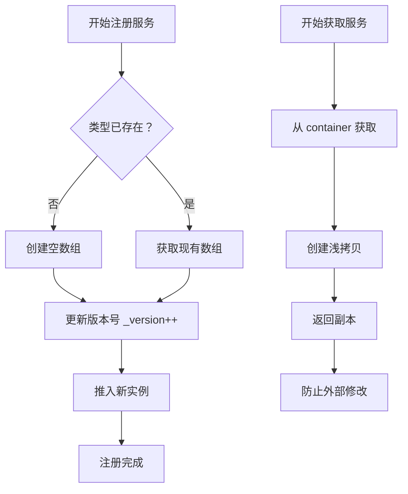
```mermaid
flowchart TD
    A[开始注册服务] --> B{类型已存在？}
    B -->|否 | C[创建空数组]
    B -->|是 | D[获取现有数组]
    C --> E[更新版本号 _version++]
    D --> E
    E --> F[推入新实例]
    F --> G[注册完成]

    H[开始获取服务] --> I[从 container 获取]
    I --> J[创建浅拷贝]
    J --> K[返回副本]
    K --> L[防止外部修改]
```

**图表说明：**

这个**流程图**清晰地展示了服务注册与获取的决策流程：

**注册流程（左侧）**：
1. **开始注册服务**：调用 `register(type, item)`
2. **判断类型是否存在**：检查 `container[type]` 是否存在
3. **创建/获取数组**：不存在则创建空数组，存在则直接获取
4. **更新版本号**：`_version++`，触发 Vue 响应式更新
5. **推入新实例**：`container[type].push(item)`
6. **注册完成**

**获取流程（右侧）**：
1. **开始获取服务**：调用 `get(type)`
2. **从 container 获取**：获取原始数组
3. **创建浅拷贝**：使用 `cloneDeep()` 创建副本
4. **返回副本**：返回拷贝后的数据
5. **防止外部修改**：确保容器数据安全

**关键设计**：
- 使用版本号机制实现响应式更新
- 返回副本保护容器数据
- 支持同一类型注册多个实例（数组存储）

---

### 2.4 服务注册示例
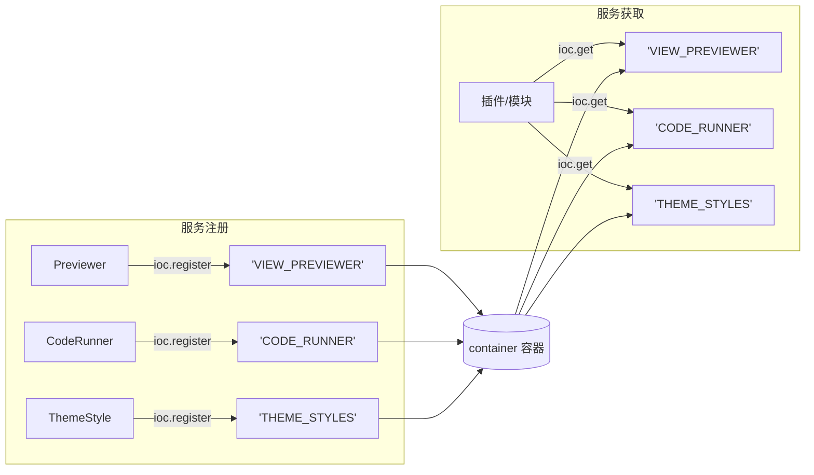
```mermaid
graph LR
    subgraph "服务注册"
        A[Previewer] -->|ioc.register| B["'VIEW_PREVIEWER'"]
        C[CodeRunner] -->|ioc.register| D["'CODE_RUNNER'"]
        E[ThemeStyle] -->|ioc.register| F["'THEME_STYLES'"]
    end

    subgraph "服务获取"
        G[插件/模块] -->|ioc.get| H["'VIEW_PREVIEWER'"]
        G -->|ioc.get| I["'CODE_RUNNER'"]
        G -->|ioc.get| J["'THEME_STYLES'"]
    end

    B --> K[(container 容器)]
    D --> K
    F --> K
    K --> H
    K --> I
    K --> J
```

**图表说明：**

这个**示意图**展示了服务注册与获取的具体示例：

**左侧 - 服务注册**：
- `Previewer` 实例通过 `ioc.register()` 注册到 `'VIEW_PREVIEWER'` 类型
- `CodeRunner` 实例通过 `ioc.register()` 注册到 `'CODE_RUNNER'` 类型
- `ThemeStyle` 实例通过 `ioc.register()` 注册到 `'THEME_STYLES'` 类型

**右侧 - 服务获取**：
- 插件/模块通过 `ioc.get('VIEW_PREVIEWER')` 获取所有预览器
- 插件/模块通过 `ioc.get('CODE_RUNNER')` 获取所有代码运行器
- 插件/模块通过 `ioc.get('THEME_STYLES')` 获取所有主题样式

**中间 - container 容器**：
所有服务都存储在中央容器 `container` 中，数据结构为：
```typescript
container = {
  'VIEW_PREVIEWER': [previewer1, previewer2, ...],
  'CODE_RUNNER': [runner1, runner2, ...],
  'THEME_STYLES': [style1, style2, ...],
  ...
}
```

**特点**：
- 支持一对多关系（一个类型对应多个实例）
- 注册和获取都通过统一的 IoC 容器
- 解耦服务提供者和消费者

---

## 三、观察者模式（钩子系统）

### 3.1 核心架构

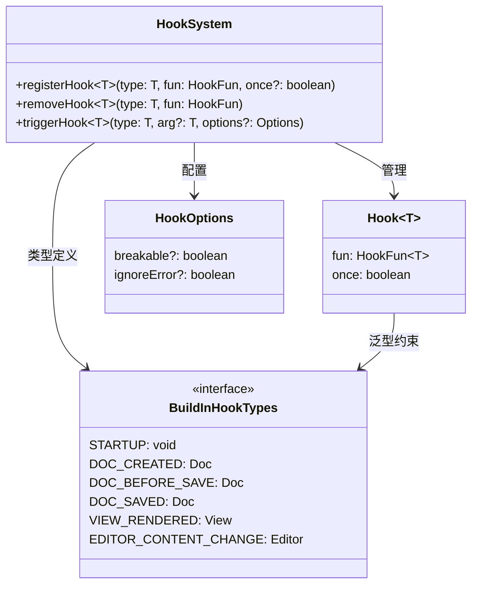
```mermaid
classDiagram
    class HookSystem {
        +registerHook~T~(type: T, fun: HookFun, once?: boolean)
        +removeHook~T~(type: T, fun: HookFun)
        +triggerHook~T~(type: T, arg?: T, options?: Options)
    }

    class Hook~T~ {
        fun: HookFun~T~
        once: boolean
    }

    class HookOptions {
        breakable?: boolean
        ignoreError?: boolean
    }

    class BuildInHookTypes {
        <<interface>>
        STARTUP: void
        DOC_CREATED: Doc
        DOC_BEFORE_SAVE: Doc
        DOC_SAVED: Doc
        VIEW_RENDERED: View
        EDITOR_CONTENT_CHANGE: Editor
    }

    HookSystem --> Hook : 管理
    HookSystem --> HookOptions : 配置
    HookSystem --> BuildInHookTypes : 类型定义
    Hook --> BuildInHookTypes : 泛型约束
```

**图表说明：**

这是钩子系统的**类结构图**，展示了观察者模式的核心组件：

**HookSystem 类**：
钩子系统的主体，提供三个核心 API：
- `registerHook<T>()`: 注册钩子函数，支持泛型类型约束
- `removeHook<T>()`: 移除指定的钩子函数
- `triggerHook<T>()`: 触发钩子，支持可选参数和配置项

**Hook<T> 类**：
钩子的数据结构，包含：
- `fun: HookFun<T>`: 回调函数，接收参数并可能返回布尔值
- `once: boolean`: 是否只执行一次（执行后自动移除）

**HookOptions 接口**：
触发钩子的配置选项：
- `breakable?: boolean`: 是否可中断（某个钩子返回 true 则停止后续调用）
- `ignoreError?: boolean`: 是否忽略错误（错误不中断后续执行）

**BuildInHookTypes 接口**：
定义了系统内置的钩子类型（约 80 种），包括：
- `STARTUP`: 应用启动
- `DOC_CREATED`: 文档创建
- `DOC_BEFORE_SAVE`: 文档保存前
- `DOC_SAVED`: 文档保存后
- `VIEW_RENDERED`: 视图渲染完成
- `EDITOR_CONTENT_CHANGE`: 编辑器内容变化

**类型安全**：通过泛型约束确保钩子函数签名正确。

---

### 3.2 发布 - 订阅流程

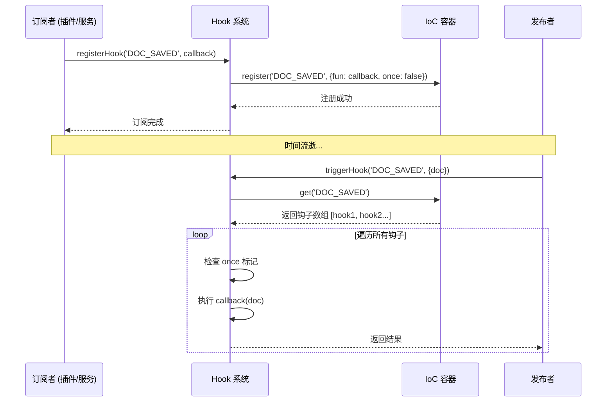
```mermaid
sequenceDiagram
    participant S as 订阅者 (插件/服务)
    participant H as Hook 系统
    participant IOC as IoC 容器
    participant P as 发布者

    S->>H: registerHook('DOC_SAVED', callback)
    H->>IOC: register('DOC_SAVED', {fun: callback, once: false})
    IOC-->>H: 注册成功
    H-->>S: 订阅完成

    Note over S,P: 时间流逝...

    P->>H: triggerHook('DOC_SAVED', {doc})
    H->>IOC: get('DOC_SAVED')
    IOC-->>H: 返回钩子数组 [hook1, hook2...]
    
    loop 遍历所有钩子
        H->>H: 检查 once 标记
        H->>H: 执行 callback(doc)
        H-->>P: 返回结果
    end
```

**图表说明：**

这个**时序图**展示了观察者模式的完整工作流程：

**订阅阶段（上半部分）**：
1. 订阅者（插件/服务）调用 `registerHook('DOC_SAVED', callback)`
2. Hook 系统内部调用 `ioc.register('DOC_SAVED', {fun: callback, once: false})`
3. IoC 容器存储钩子对象
4. 返回注册成功

**时间流逝**：订阅完成后，系统正常运行，等待事件触发

**发布阶段（下半部分）**：
1. 发布者调用 `triggerHook('DOC_SAVED', {doc})`
2. Hook 系统从 IoC 容器获取所有 `DOC_SAVED` 钩子
3. IoC 容器返回钩子数组 `[hook1, hook2, ...]`
4. **循环遍历所有钩子**：
   - 检查 `once` 标记（如果为 true，执行后移除）
   - 执行回调函数 `callback(doc)`
   - 收集返回值

**设计亮点**：
- 使用 IoC 容器存储钩子，统一管理
- 支持 `once` 一次性钩子
- 支持异步回调（返回 Promise）
- 完全解耦发布者和订阅者

---

### 3.3 可中断的钩子链（Breakable）
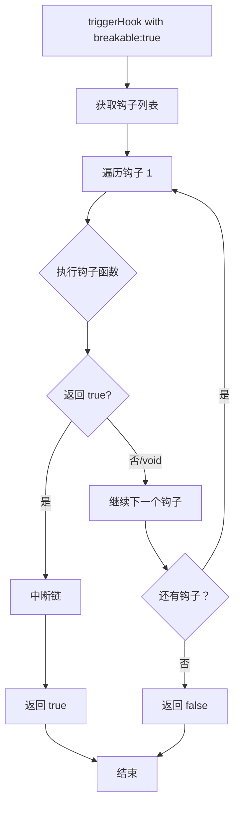
```mermaid
flowchart TD
    A[triggerHook with breakable:true] --> B[获取钩子列表]
    B --> C[遍历钩子 1]
    C --> D{执行钩子函数}
    D --> E{返回 true?}
    E -->|是 | F[中断链]
    E -->|否/void | G[继续下一个钩子]
    F --> H[返回 true]
    G --> I{还有钩子？}
    I -->|是 | C
    I -->|否 | J[返回 false]
    H --> K[结束]
    J --> K
```

**图表说明：**

这个**流程图**展示了可中断钩子链（breakable 模式）的执行逻辑：

**执行流程**：
1. **触发钩子**：调用 `triggerHook(type, arg, {breakable: true})`
2. **获取钩子列表**：从 IoC 容器获取所有该类型的钩子
3. **遍历钩子**：依次执行每个钩子函数

**决策点 1 - 返回值判断**：
- 如果钩子函数**返回 true**：
  - 立即**中断链**，停止后续钩子执行
  - 返回 `true` 给调用者
  - 流程结束
- 如果钩子函数**返回 false/void**：
  - **继续下一个钩子**

**决策点 2 - 是否还有钩子**：
- 如果**还有钩子**：返回继续遍历
- 如果**没有钩子了**：返回 `false` 给调用者

**使用场景**：
- **拦截器模式**：某个钩子返回 true 表示已处理，无需后续处理
- **权限检查**：某个权限检查失败返回 true 中断后续操作
- **短路逻辑**：满足特定条件时提前终止

**示例代码**：
```typescript
// 保存前的权限检查
registerHook('DOC_BEFORE_SAVE', ({doc}) => {
  if (!hasPermission(doc)) {
    return true  // 中断后续保存操作
  }
  // 继续执行
})
```

---

### 3.4 钩子生命周期

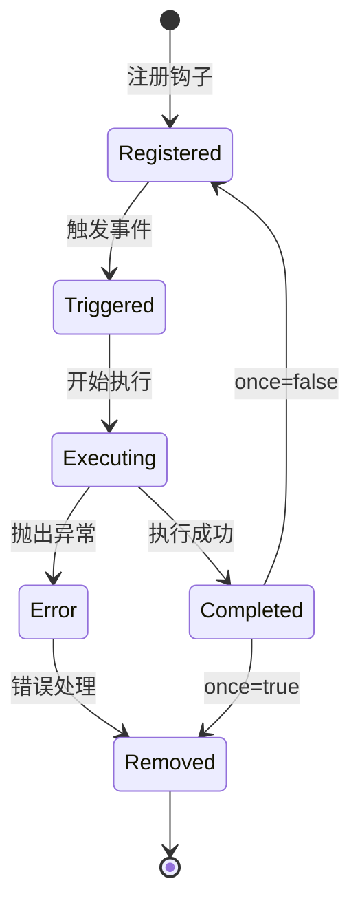
```mermaid
stateDiagram-v2
    [*] --> Registered : 注册钩子
    Registered --> Triggered : 触发事件
    Triggered --> Executing : 开始执行
    Executing --> Completed : 执行成功
    Executing --> Error : 抛出异常
    Error --> Removed : 错误处理
    Completed --> Removed : once=true
    Completed --> Registered : once=false
    Removed --> [*]
```

**图表说明：**

这个**状态图**展示了钩子从注册到销毁的完整生命周期：

**状态流转**：

1. **初始状态** → **Registered（已注册）**
   - 调用 `registerHook(type, fun, once)` 后进入此状态
   - 钩子被存储在 IoC 容器中

2. **Registered** → **Triggered（被触发）**
   - 调用 `triggerHook(type, arg)` 时触发
   - 可能有多个钩子同时被触发

3. **Triggered** → **Executing（执行中）**
   - 开始执行钩子回调函数
   - 可能是同步或异步执行

4. **Executing** → **Completed（完成）**
   - 回调函数成功执行
   - 返回值被收集

5. **Executing** → **Error（错误）**
   - 回调函数抛出异常
   - 根据 `ignoreError` 选项决定是否继续

6. **Error** → **Removed（已移除）**
   - 错误处理后移除钩子
   - 或者根据配置保留

7. **Completed** → **Removed**（当 `once=true`）
   - 一次性钩子，执行后自动移除

8. **Completed** → **Registered**（当 `once=false`）
   - 可重复使用的钩子，返回注册状态等待下次触发

9. **Removed** → **终结状态**
   - 钩子被完全销毁

**设计亮点**：
- 支持一次性钩子（`once=true`）
- 支持错误隔离（某个钩子错误不影响其他钩子）
- 清晰的状态流转，便于调试

---

### 3.5 核心钩子事件分类

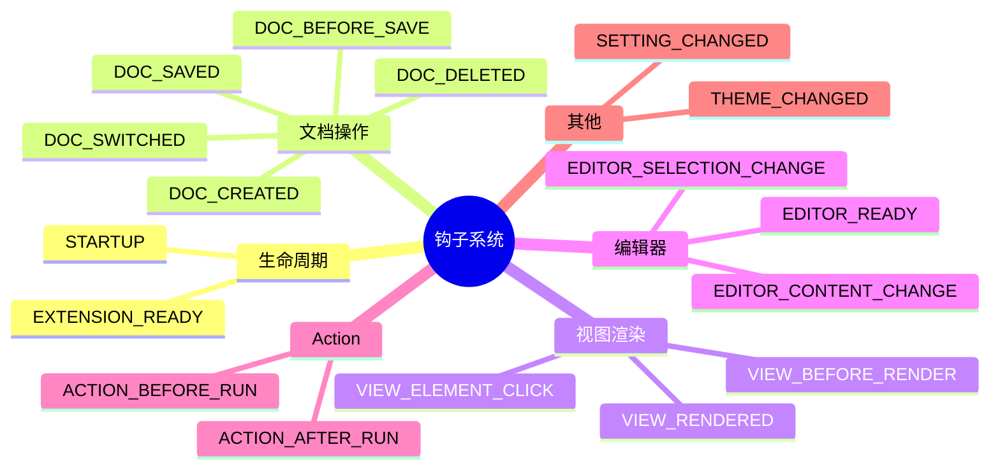
```mermaid
mindmap
  root((钩子系统))
    生命周期
      STARTUP
      EXTENSION_READY
    文档操作
      DOC_CREATED
      DOC_BEFORE_SAVE
      DOC_SAVED
      DOC_SWITCHED
      DOC_DELETED
    视图渲染
      VIEW_BEFORE_RENDER
      VIEW_RENDERED
      VIEW_ELEMENT_CLICK
    编辑器
      EDITOR_READY
      EDITOR_CONTENT_CHANGE
      EDITOR_SELECTION_CHANGE
    Action
      ACTION_BEFORE_RUN
      ACTION_AFTER_RUN
    其他
      SETTING_CHANGED
      THEME_CHANGED
```

**图表说明：**

这个**思维导图**展示了系统中所有钩子事件的分类，共计约 80 种事件类型：

**1. 生命周期事件（Lifecycle）**：
- `STARTUP`: 应用启动时触发，用于初始化
- `EXTENSION_READY`: 所有扩展加载完成后触发

**2. 文档操作事件（Document Operations）**：
- `DOC_CREATED`: 创建新文档后
- `DOC_BEFORE_SAVE`: 保存文档前（可拦截）
- `DOC_SAVED`: 保存文档后
- `DOC_SWITCHED`: 切换文档后
- `DOC_DELETED`: 删除文档后

**3. 视图渲染事件（View Rendering）**：
- `VIEW_BEFORE_RENDER`: 视图渲染前（可修改内容）
- `VIEW_RENDERED`: 视图渲染完成后
- `VIEW_ELEMENT_CLICK`: 点击视图元素时（可拦截）

**4. 编辑器事件（Editor）**：
- `EDITOR_READY`: 编辑器初始化完成
- `EDITOR_CONTENT_CHANGE`: 编辑器内容变化
- `EDITOR_SELECTION_CHANGE`: 选区变化

**5. Action 事件**：
- `ACTION_BEFORE_RUN`: Action 执行前（可拦截）
- `ACTION_AFTER_RUN`: Action 执行后

**6. 其他事件**：
- `SETTING_CHANGED`: 设置变化
- `THEME_CHANGED`: 主题变化

**使用频率**：
- 最常用：`DOC_SAVED`、`DOC_SWITCHED`、`VIEW_ELEMENT_CLICK`
- 中等频率：`DOC_CREATED`、`EDITOR_CONTENT_CHANGE`
- 低频：`STARTUP`、`EXTENSION_READY`

---

## 四、命令模式（Action 系统）

### 4.1 核心架构

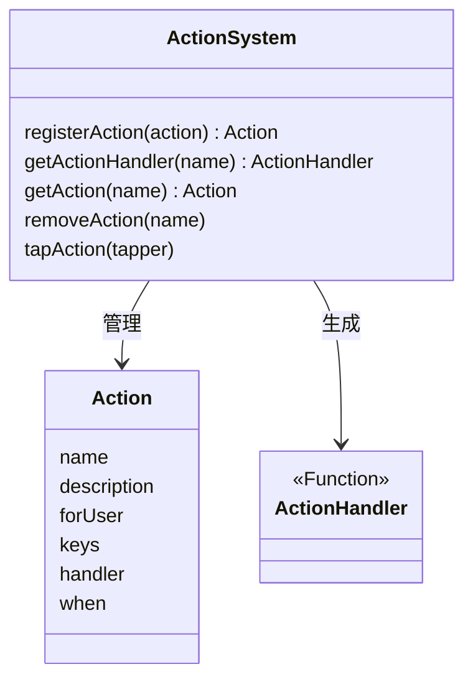
```mermaid
classDiagram
    class ActionSystem {
        registerAction(action) Action
        getActionHandler(name) ActionHandler
        getAction(name) Action
        removeAction(name)
        tapAction(tapper)
    }

    class Action {
        name
        description
        forUser
        keys
        handler
        when
    }

    class ActionHandler {
        <<Function>>
    }

    ActionSystem --> Action: 管理
    ActionSystem --> ActionHandler: 生成
```

**图表说明：**

这是 Action 系统的**类结构图**，展示了命令模式的核心组件：

**ActionSystem 类**：
命令系统的主体，提供五个核心 API：
- `registerAction<T>()`: 注册动作，返回 Action 对象
- `getActionHandler<T>()`: 获取动作执行器（包装后的函数）
- `getAction<T>()`: 获取动作定义（应用所有 Tappers 后）
- `removeAction()`: 移除动作
- `tapAction()`: 添加动作修改器（AOP 切面）

**Action<T> 接口**：
动作的数据结构，包含：
- `name: T`: 动作名称（唯一标识），如 `"doc.save"`
- `description?: string`: 动作描述（显示在命令面板）
- `forUser?: boolean`: 是否对用户可见（在命令面板显示）
- `keys?: (string|number)[]`: 快捷键绑定，如 `[Ctrl, "S"]`
- `handler: Function`: 执行函数
- `when?: () => boolean`: 执行条件（动态判断是否可执行）

**ActionHandler<T> 类型**：
包装后的执行函数类型：
- 接收任意参数 `(...args: any[])`
- 返回任意类型 `(any)`
- 在执行前后自动触发钩子

**设计亮点**：
- 统一的命令注册和执行机制
- 支持快捷键、菜单、命令面板多种触发方式
- 支持条件执行（`when` 函数）
- 支持 AOP 切面编程（`tapAction`）

---

### 4.2 Action 执行流程

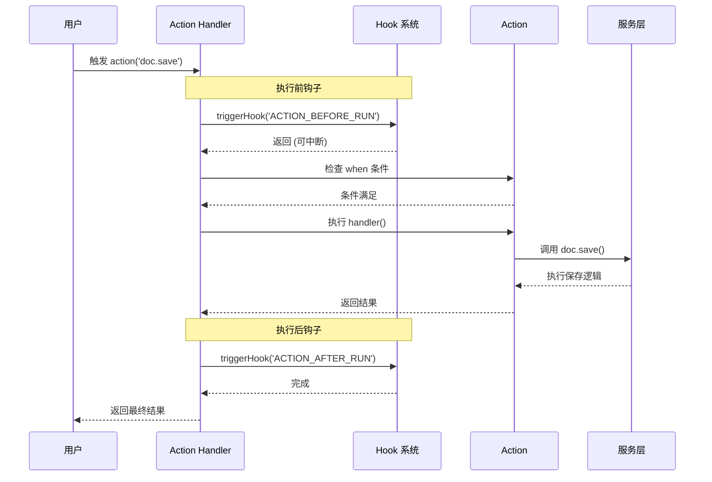
```mermaid
sequenceDiagram
    participant U as 用户
    participant AH as Action Handler
    participant H as Hook 系统
    participant A as Action
    participant S as 服务层

    U->>AH: 触发 action('doc.save')
    
    Note over AH,H: 执行前钩子
    AH->>H: triggerHook('ACTION_BEFORE_RUN')
    H-->>AH: 返回 (可中断)
    
    AH->>A: 检查 when 条件
    A-->>AH: 条件满足
    
    AH->>A: 执行 handler()
    A->>S: 调用 doc.save()
    S-->>A: 执行保存逻辑
    A-->>AH: 返回结果
    
    Note over AH,H: 执行后钩子
    AH->>H: triggerHook('ACTION_AFTER_RUN')
    H-->>AH: 完成
    
    AH-->>U: 返回最终结果
```

**图表说明：**

这个**时序图**展示了 Action 执行的完整流程，包含执行前后的钩子调用：

**执行流程（按编号顺序）**：

1. **用户触发**：用户通过快捷键、菜单或命令面板触发 `action('doc.save')`

2. **执行前钩子**：
   - Action Handler 调用 `triggerHook('ACTION_BEFORE_RUN')`
   - 钩子可能返回中断信号（breakable 模式）
   - 如果未被中断，继续执行

3. **检查 when 条件**：
   - 获取 Action 定义
   - 调用 `action.when()` 检查执行条件
   - 条件不满足则跳过执行

4. **执行 handler**：
   - 条件满足时调用原始 `handler()` 函数
   - 传递参数给 handler
   - 收集返回值

5. **调用服务层**：
   - handler 内部调用具体的服务（如 `doc.save()`）
   - 服务层执行业务逻辑
   - 返回执行结果

6. **执行后钩子**：
   - 调用 `triggerHook('ACTION_AFTER_RUN')`
   - 通知其他模块 Action 已执行完成
   - 插件可以响应执行后事件

7. **返回结果**：将最终结果返回给用户

**设计亮点**：
- 类似中间件的执行流程
- 支持执行前拦截
- 支持条件执行
- 完整的生命周期钩子

---

### 4.3 Tapper 机制（AOP 切面）

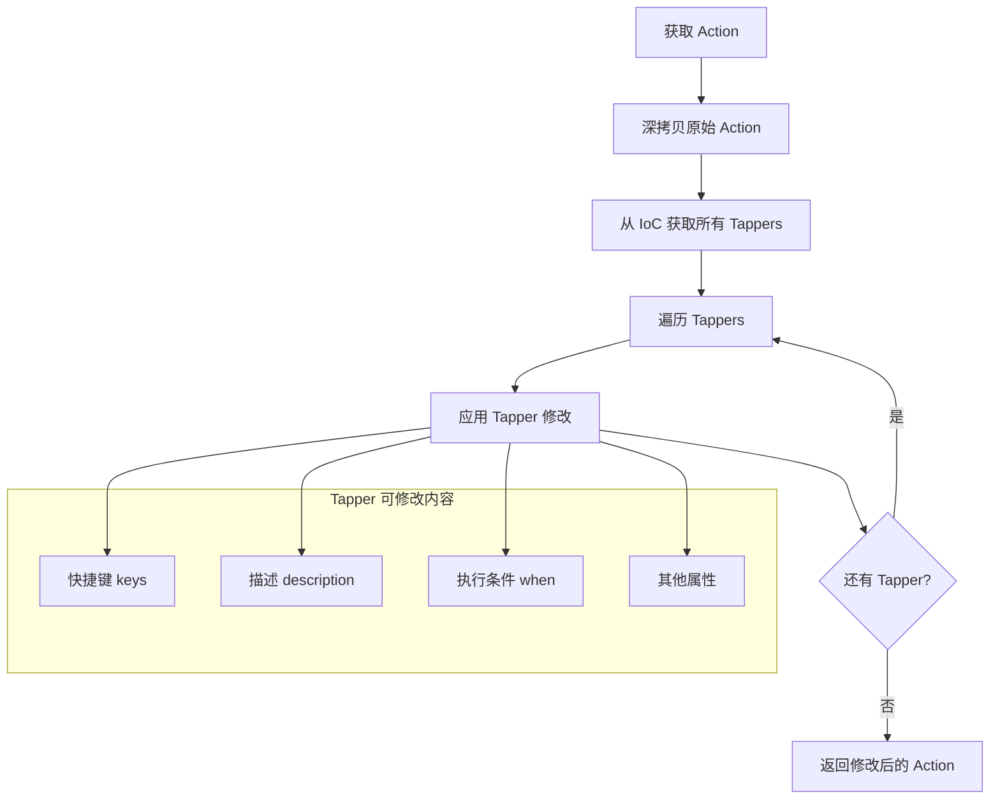
```mermaid
flowchart TD
    A[获取 Action] --> B[深拷贝原始 Action]
    B --> C[从 IoC 获取所有 Tappers]
    C --> D[遍历 Tappers]
    D --> E[应用 Tapper 修改]
    E --> F{还有 Tapper?}
    F -->|是 | D
    F -->|否 | G[返回修改后的 Action]
    
    subgraph "Tapper 可修改内容"
        H[快捷键 keys]
        I[描述 description]
        J[执行条件 when]
        K[其他属性]
    end
    
    E --> H
    E --> I
    E --> J
    E --> K
```

**图表说明：**

这个**流程图**展示了 Tapper 机制（AOP 切面）的工作原理：

**Tapper 机制流程**：

1. **获取 Action**：调用 `getAction(name)` 获取 Action 定义

2. **深拷贝原始 Action**：
   - 使用 `cloneDeep()` 创建 Action 的深拷贝
   - 避免直接修改原始 Action
   - 保证每次获取的都是新对象

3. **从 IoC 获取 Tappers**：
   - 从 IoC 容器获取所有注册的 Tapper 函数
   - Tapper 函数签名：`(action: Action) => void`
   - Tapper 可以修改 Action 的任意属性

4. **遍历 Tappers**：依次应用每个 Tapper

5. **应用 Tapper 修改**：
   - Tapper 函数接收 Action 对象
   - 修改 Action 的属性
   - 不返回值（直接修改传入的对象）

6. **判断是否还有 Tapper**：
   - 有则继续遍历下一个
   - 无则返回修改后的 Action

**Tapper 可修改的内容**：
- **快捷键 keys**：动态修改快捷键绑定
- **描述 description**：国际化翻译、动态描述
- **执行条件 when**：根据上下文修改执行条件
- **其他属性**：handler、forUser 等

**使用场景**：
```typescript
// 示例 1：国际化翻译
tapAction((action) => {
  action.description = i18n.t(action.description)
})

// 示例 2：动态修改快捷键
tapAction((action) => {
  if (userPreferences.customKeys) {
    action.keys = userPreferences.getKeymap(action.name)
  }
})

// 示例 3：修改执行条件
tapAction((action) => {
  if (action.name === 'doc.save') {
    const originalWhen = action.when
    action.when = () => {
      if (isReadOnlyMode()) return false
      return originalWhen?.() ?? true
    }
  }
})
```

**设计亮点**：
- AOP（面向切面编程）的典型应用
- 解耦 Action 定义和修改逻辑
- 支持多个 Tapper 链式调用

---

### 4.4 Action 注册与触发
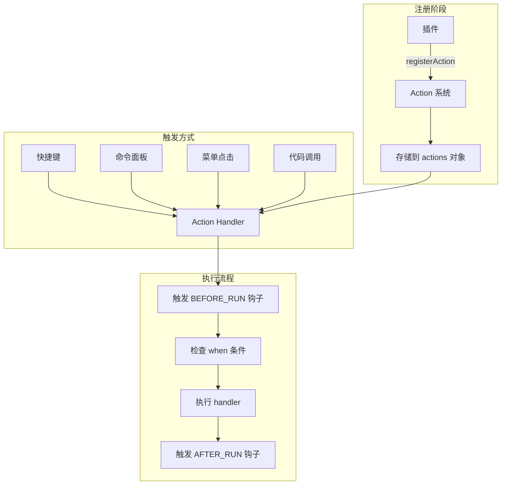
```mermaid
graph TB
    subgraph "注册阶段"
        A[插件] -->|registerAction| B[Action 系统]
        B --> C[存储到 actions 对象]
    end

    subgraph "触发方式"
        D1[快捷键] --> E[Action Handler]
        D2[命令面板] --> E
        D3[菜单点击] --> E
        D4[代码调用] --> E
    end

    subgraph "执行流程"
        E --> F[触发 BEFORE_RUN 钩子]
        F --> G[检查 when 条件]
        G --> H[执行 handler]
        H --> I[触发 AFTER_RUN 钩子]
    end

    C --> E
```

**图表说明：**

这个**示意图**展示了 Action 的注册、触发和执行流程：

**三个阶段的子图**：

**1. 注册阶段（左上）**：
- 插件调用 `registerAction()` 注册 Action
- Action 系统存储到 `actions` 对象
- 键为 Action 名称（如 `"doc.save"`）
- 值为 Action 定义对象

**2. 触发方式（右上）**：
四种触发方式都指向同一个 Action Handler：
- **快捷键**：用户按下快捷键（如 Ctrl+S）
- **命令面板**：用户在命令面板搜索并选择
- **菜单点击**：用户点击菜单项
- **代码调用**：程序中调用 `action('doc.save')`

**3. 执行流程（下方）**：
Action Handler 按顺序执行：
- 触发 `BEFORE_RUN` 钩子
- 检查 `when` 条件
- 执行 `handler` 函数
- 触发 `AFTER_RUN` 钩子

**数据流**：
```
注册阶段：Action → Action 系统 → actions 对象
                                      ↓
触发方式：快捷键/菜单/命令面板/代码 → Action Handler
                                      ↓
执行流程：BEFORE_RUN → when → handler → AFTER_RUN
```

**特点**：
- 统一的触发入口
- 多种触发方式
- 完整的执行生命周期

---

### 4.5 Action 示例
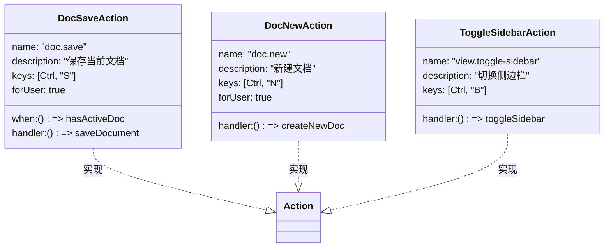
```mermaid
classDiagram
    class DocSaveAction {
        name: "doc.save"
        description: "保存当前文档"
        keys: [Ctrl, "S"]
        forUser: true
        when: () => hasActiveDoc
        handler: () => saveDocument
    }

    class DocNewAction {
        name: "doc.new"
        description: "新建文档"
        keys: [Ctrl, "N"]
        forUser: true
        handler: () => createNewDoc
    }

    class ToggleSidebarAction {
        name: "view.toggle-sidebar"
        description: "切换侧边栏"
        keys: [Ctrl, "B"]
        handler: () => toggleSidebar
    }

    DocSaveAction ..|> Action : 实现
    DocNewAction ..|> Action : 实现
    ToggleSidebarAction ..|> Action : 实现
```

**图表说明：**

这个**类图**展示了三个具体的 Action 实现示例：

**1. DocSaveAction（保存文档）**：
```typescript
{
  name: "doc.save",
  description: "保存当前文档",
  keys: [Ctrl, "S"],
  forUser: true,
  when: () => hasActiveDoc,
  handler: () => saveDocument
}
```
- **name**: 唯一标识符
- **description**: 在命令面板显示的描述
- **keys**: 快捷键绑定（Ctrl+S）
- **forUser**: true 表示用户可见
- **when**: 检查是否有活动文档
- **handler**: 执行保存逻辑

**2. DocNewAction（新建文档）**：
```typescript
{
  name: "doc.new",
  description: "新建文档",
  keys: [Ctrl, "N"],
  forUser: true,
  handler: () => createNewDoc
}
```
- 没有 `when` 条件（随时可执行）
- 快捷键：Ctrl+N

**3. ToggleSidebarAction（切换侧边栏）**：
```typescript
{
  name: "view.toggle-sidebar",
  description: "切换侧边栏",
  keys: [Ctrl, "B"],
  handler: () => toggleSidebar
}
```
- 没有 `forUser`（默认 false）
- 没有 `when` 条件
- 快捷键：Ctrl+B

**Action 命名规范**：
- 使用点分命名：`模块。功能`
- 如：`doc.save`、`doc.new`、`view.toggle-sidebar`
- 避免命名冲突

**实现关系**：
三个类都实现了 Action 接口（虚线箭头表示实现关系）

---

## 五、插件化架构

### 5.1 插件系统架构

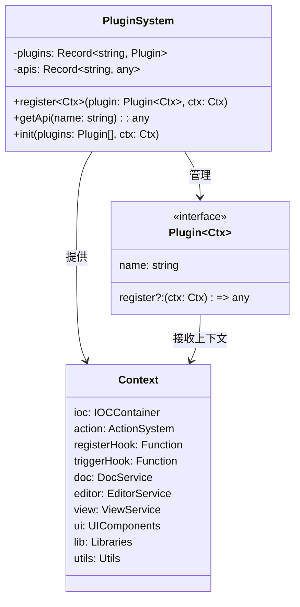
```mermaid
classDiagram
    class PluginSystem {
        -plugins: Record~string, Plugin~
        -apis: Record~string, any~
        +register~Ctx~(plugin: Plugin~Ctx~, ctx: Ctx)
        +getApi(name: string): any
        +init(plugins: Plugin[], ctx: Ctx)
    }

    class Plugin~Ctx~ {
        <<interface>>
        name: string
        register?: (ctx: Ctx) => any
    }

    class Context {
        ioc: IOCContainer
        action: ActionSystem
        registerHook: Function
        triggerHook: Function
        doc: DocService
        editor: EditorService
        view: ViewService
        ui: UIComponents
        lib: Libraries
        utils: Utils
    }

    PluginSystem --> Plugin : 管理
    PluginSystem --> Context : 提供
    Plugin --> Context : 接收上下文
```

**图表说明：**

这是插件系统的**类结构图**，展示了插件化架构的核心组件：

**PluginSystem 类**：
插件管理的主体，提供三个核心 API：
- `register<Ctx>()`: 注册单个插件，执行插件的 register 函数
- `getApi()`: 获取插件导出的 API 对象
- `init()`: 批量初始化插件（用于内置插件）

**内部数据结构**：
- `plugins: Record<string, Plugin>`: 存储所有插件对象
- `apis: Record<string, any>`: 存储所有插件导出的 API

**Plugin<Ctx> 接口**：
插件的最小定义：
```typescript
interface Plugin<Ctx> {
  name: string;                    // 插件名称（唯一标识）
  register?: (ctx: Ctx) => any;   // 注册函数，返回 API
}
```
- **name**: 插件的唯一标识符，不能重复
- **register**: 可选的注册函数，接收 Context 并返回 API

**Context 类**：
插件开发的上下文环境，包含所有可用能力：
- **核心框架**：ioc、action、registerHook、triggerHook
- **服务层**：doc、editor、view、markdown 等
- **UI 组件**：ui（toast、modal、contextMenu 等）
- **工具库**：lib（lodash、dayjs、marked）、utils

**设计亮点**：
- 插件通过 name 唯一标识
- register 函数可选（纯静态插件可不实现）
- 插件 API 被隔离，互不干扰
- 统一的 Context 提供所有能力

---

### 5.2 插件注册流程

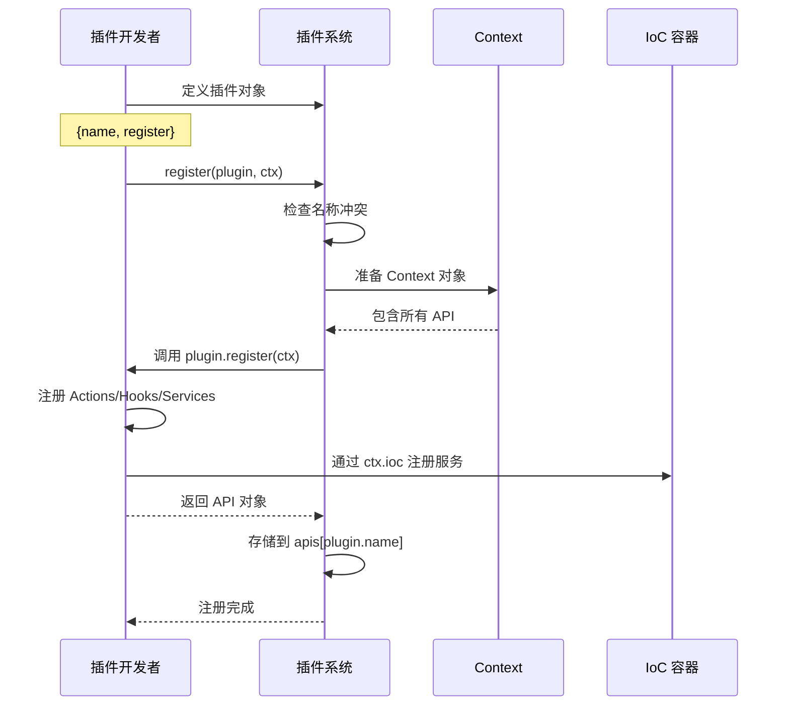
```mermaid
sequenceDiagram
    participant P as 插件开发者
    participant PS as 插件系统
    participant C as Context
    participant IOC as IoC 容器

    P->>PS: 定义插件对象
    Note over P: {name, register}
    
    P->>PS: register(plugin, ctx)
    PS->>PS: 检查名称冲突
    
    PS->>C: 准备 Context 对象
    C-->>PS: 包含所有 API
    
    PS->>P: 调用 plugin.register(ctx)
    P->>P: 注册 Actions/Hooks/Services
    P->>IOC: 通过 ctx.ioc 注册服务
    P-->>PS: 返回 API 对象
    
    PS->>PS: 存储到 apis[plugin.name]
    PS-->>P: 注册完成
```

**图表说明：**

这个**时序图**展示了插件注册的完整流程：

**注册流程（按时间顺序）**：

1. **定义插件对象**：
   ```typescript
   const plugin = {
     name: 'my-plugin',
     register: (ctx) => {
       // 注册逻辑
       return { api1, api2 }
     }
   }
   ```

2. **调用 register()**：插件开发者调用 `register(plugin, ctx)`

3. **检查名称冲突**：
   - 插件系统检查 `plugins[plugin.name]` 是否存在
   - 如已存在，记录错误并返回
   - 如不存在，继续注册流程

4. **准备 Context**：
   - 插件系统准备 Context 对象
   - Context 包含所有 API（ioc、action、hook、services 等）
   - Context 被冻结（Object.freeze）防止修改

5. **调用 plugin.register(ctx)**：
   - 执行插件的注册函数
   - 传入 Context 对象

6. **插件注册逻辑**：
   - 注册 Actions：`ctx.action.registerAction(...)`
   - 注册 Hooks：`ctx.registerHook(...)`
   - 注册服务：通过 `ctx.ioc.register(...)`
   - 其他初始化逻辑

7. **返回 API 对象**：
   - register 函数返回插件的 API
   - API 包含插件导出的所有功能

8. **存储 API**：
   - 插件系统存储到 `apis[plugin.name]`
   - 其他插件可通过 `getApi(name)` 获取

9. **注册完成**：返回成功

**设计亮点**：
- 插件名称唯一性检查
- Context 不可变（冻结对象）
- 插件 API 隔离
- 支持插件间依赖（通过 getApi）

---

### 5.3 Context API 结构

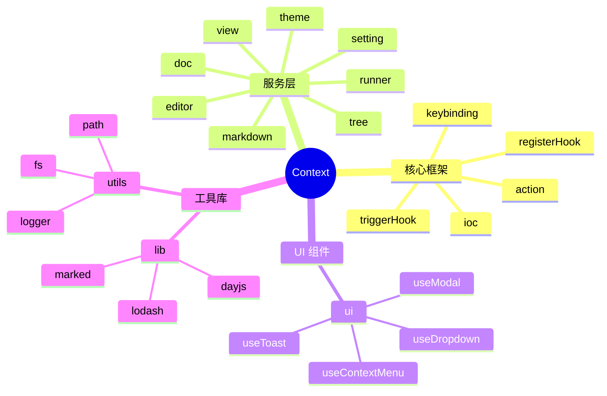
```mermaid
mindmap
  root((Context))
    核心框架
      ioc
      action
      registerHook
      triggerHook
      keybinding
    服务层
      doc
      editor
      view
      tree
      markdown
      setting
      theme
      runner
    UI 组件
      ui
        useToast
        useModal
        useContextMenu
        useDropdown
    工具库
      lib
        lodash
        dayjs
        marked
      utils
        fs
        path
        logger
```

**图表说明：**

这个**思维导图**详细展示了 Context API 的完整结构，包含四大类能力：

**1. 核心框架（Core Framework）**：
- **ioc**: IoC 容器，服务注册与获取
  - `register()`, `get()`, `getRaw()`, `remove()`
- **action**: Action 系统，命令管理
  - `registerAction()`, `getActionHandler()`, `tapAction()`
- **registerHook**: 注册钩子函数
- **triggerHook**: 触发钩子
- **keybinding**: 快捷键定义
  - `Ctrl`, `Shift`, `Alt` 等修饰键

**2. 服务层（Services）**：
- **doc**: 文档服务
  - 文档创建、保存、删除、切换
- **editor**: 编辑器服务
  - 编辑器内容、选区、光标
- **view**: 视图服务
  - 视图渲染、预览
- **tree**: 文件树服务
  - 文件浏览、操作
- **markdown**: Markdown 渲染服务
  - Markdown 解析、渲染
- **setting**: 设置管理
  - 读取、修改用户设置
- **theme**: 主题管理
  - 主题切换、样式加载
- **runner**: 代码运行器
  - 注册、执行代码

**3. UI 组件（UI Components）**：
- **ui**: UI 工具集合
  - **useToast**: 提示框（成功、错误、警告）
  - **useModal**: 对话框（确认、输入）
  - **useContextMenu**: 右键菜单
  - **useDropdown**: 下拉菜单

**4. 工具库（Utilities）**：
- **lib**: 第三方库
  - **lodash**: 工具函数库
  - **dayjs**: 日期处理
  - **marked**: Markdown 解析器
- **utils**: 自定义工具
  - **fs**: 文件系统操作
  - **path**: 路径处理
  - **logger**: 日志记录

**使用示例**：
```typescript
// 插件注册函数
register: (ctx) => {
  // 使用核心框架
  ctx.registerHook('DOC_SAVED', ({doc}) => {
    console.log('文档保存:', doc.name)
  })
  
  // 使用服务层
  const activeDoc = ctx.editor.getActiveDoc()
  
  // 使用 UI 组件
  ctx.ui.useToast().show('保存成功')
  
  // 使用工具库
  const path = ctx.lib.path.join('/docs', 'file.md')
}
```

### 5.4 插件类型

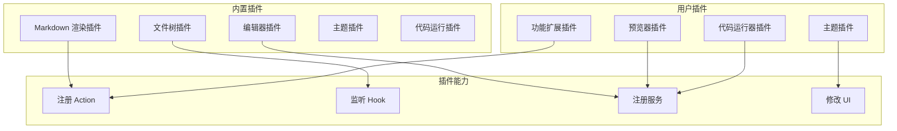
```mermaid
graph TB
    subgraph "内置插件"
        A1[Markdown 渲染插件]
        A2[文件树插件]
        A3[编辑器插件]
        A4[主题插件]
        A5[代码运行插件]
    end

    subgraph "用户插件"
        B1[功能扩展插件]
        B2[主题插件]
        B3[预览器插件]
        B4[代码运行器插件]
    end

    subgraph "插件能力"
        C1[注册 Action]
        C2[监听 Hook]
        C3[注册服务]
        C4[修改 UI]
    end

    A1 --> C1
    A2 --> C2
    A3 --> C3
    B1 --> C1
    B2 --> C4
    B3 --> C3
    B4 --> C3
```

**图表说明：**

这个**示意图**展示了内置插件和用户插件的分类及其使用的能力：

**内置插件（Built-in Plugins）**：
系统自带的核心功能插件：

1. **Markdown 渲染插件**：
   - 使用能力：注册 Action（渲染命令）
   - 功能：Markdown 解析和预览

2. **文件树插件**：
   - 使用能力：监听 Hook（文件事件）
   - 功能：文件浏览和管理

3. **编辑器插件**：
   - 使用能力：注册服务（编辑器服务）
   - 功能：代码编辑

4. **主题插件**：
   - 使用能力：修改 UI（主题切换）
   - 功能：界面主题

5. **代码运行插件**：
   - 使用能力：注册服务（代码运行器）
   - 功能：执行代码

**用户插件（User Plugins）**：
用户开发的扩展插件：

1. **功能扩展插件**：
   - 使用能力：注册 Action
   - 示例：番茄钟、待办事项

2. **主题插件**：
   - 使用能力：修改 UI
   - 示例：自定义配色方案

3. **预览器插件**：
   - 使用能力：注册服务
   - 示例：Mermaid 预览、LaTeX 预览

4. **代码运行器插件**：
   - 使用能力：注册服务
   - 示例：Rust 运行器、SQL 运行器

**插件能力（Plugin Capabilities）**：
1. **注册 Action**：添加新的命令
2. **监听 Hook**：响应系统事件
3. **注册服务**：提供新能力
4. **修改 UI**：改变界面表现

**设计哲学**：
- 所有功能都是插件（包括内置功能）
- 平等的扩展能力（内置和用户插件能力相同）
- 通过 Context 统一接口

---

## 六、四大架构的协同工作

### 6.1 完整架构图

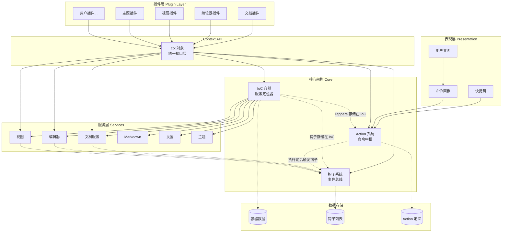
```mermaid
graph TB
    subgraph Presentation["表现层 Presentation"]
        UI[用户界面]
        KB[快捷键]
        CMD[命令面板]
    end

    subgraph PluginLayer["插件层 Plugin Layer"]
        P1[文档插件]
        P2[编辑器插件]
        P3[视图插件]
        P4[主题插件]
        P5[用户插件...]
    end

    subgraph ContextAPI["Context API"]
        CTX[ctx 对象<br/>统一接口层]
    end

    subgraph Core["核心架构 Core"]
        IOC[IoC 容器<br/>服务定位器]
        HOOK[钩子系统<br/>事件总线]
        ACTION[Action 系统<br/>命令中枢]
    end

    subgraph Services["服务层 Services"]
        DOC[文档服务]
        EDIT[编辑器]
        VIEW[视图]
        MD[Markdown]
        SET[设置]
        THEME[主题]
    end

    subgraph Storage["数据存储"]
        D1[(容器数据)]
        D2[(钩子列表)]
        D3[(Action 定义)]
    end

    UI --> CMD
    KB --> ACTION
    CMD --> ACTION
    
    P1 --> CTX
    P2 --> CTX
    P3 --> CTX
    P4 --> CTX
    P5 --> CTX
    
    CTX --> IOC
    CTX --> HOOK
    CTX --> ACTION
    CTX --> DOC
    CTX --> EDIT
    CTX --> VIEW
    
    IOC -.->|钩子存储在 IoC| HOOK
    ACTION -.->|执行前后触发钩子| HOOK
    IOC -.->|Tappers 存储在 IoC| ACTION
    
    IOC --> DOC
    IOC --> EDIT
    IOC --> VIEW
    IOC --> MD
    IOC --> SET
    IOC --> THEME
    
    DOC -.-> HOOK
    EDIT -.-> HOOK
    VIEW -.-> HOOK
    
    IOC -.-> D1
    HOOK -.-> D2
    ACTION -.-> D3
```

**图表说明：**

这个**完整架构图**展示了整个系统的分层架构和数据流：

**六个层次（从上到下）**：

**1. 表现层（Presentation）**：
- 用户界面、快捷键、命令面板
- 用户交互的入口

**2. 插件层（Plugin Layer）**：
- 文档插件、编辑器插件、视图插件、主题插件
- 用户插件可扩展

**3. Context API**：
- 统一的接口层
- 插件通过 Context 访问所有能力

**4. 核心架构（Core）**：
- **IoC 容器**：服务定位器模式
- **钩子系统**：观察者模式/事件总线
- **Action 系统**：命令模式/命令中枢

**5. 服务层（Services）**：
- 文档、编辑器、视图、Markdown、设置、主题
- 具体的业务逻辑实现

**6. 数据存储（Data Storage）**：
- 容器数据：IoC 容器存储的服务实例
- 钩子列表：所有注册的钩子
- Action 定义：所有注册的 Action

**数据流向**：
1. 用户操作 → Action 系统
2. Action → 触发钩子
3. 钩子 → 通知服务层
4. 服务层 → 触发业务钩子
5. 业务钩子 → 通知插件
6. 所有数据存储在底层

**关键连接**：
- **IoC ↔ Hook**：钩子存储在 IoC 容器中
- **Action ↔ Hook**：Action 执行前后触发钩子
- **IoC ↔ Action**：Tappers 存储在 IoC 容器中
- **服务 → Hook**：服务在关键节点触发事件

---

### 6.2 典型场景：保存文档

```mermaid
sequenceDiagram
    autonumber
    participant U as 用户
    participant M as 菜单/快捷键
    participant AH as Action Handler
    participant H1 as BEFORE_RUN 钩子
    participant HS as 保存服务
    participant H2 as BEFORE_SAVE 钩子
    participant API as 文件系统
    participant H3 as SAVED 钩子
    participant P1 as 同步插件
    participant P2 as 索引插件

    U->>M: 点击保存/按 Ctrl+S
    M->>AH: action('doc.save')
    
    activate AH
    AH->>H1: triggerHook('ACTION_BEFORE_RUN')
    H1-->>AH: 继续执行
    
    AH->>HS: 调用保存 handler
    
    activate HS
    HS->>H2: triggerHook('DOC_BEFORE_SAVE')
    H2-->>HS: 返回
    
    HS->>API: 写入文件
    API-->>HS: 保存成功
    
    HS->>H3: triggerHook('DOC_SAVED')
    activate H3
    H3->>P1: 通知同步插件
    P1->>P1: 同步到云端
    H3->>P2: 通知索引插件
    P2->>P2: 更新索引
    deactivate H3
    
    deactivate HS
    AH->>H3: triggerHook('ACTION_AFTER_RUN')
    AH-->>U: 返回成功
    deactivate AH
```

**图表说明：**

这个**时序图**展示了"保存文档"这一典型场景中，四大架构如何协同工作：

**完整流程（带序号）**：

**阶段 1：用户触发（1-2）**
1. 用户点击保存菜单或按下 Ctrl+S
2. 触发 `action('doc.save')`

**阶段 2：Action 执行前钩子（3-4）**
3. Action Handler 触发 `ACTION_BEFORE_RUN` 钩子
4. 没有钩子返回中断信号，继续执行

**阶段 3：保存服务执行（5-12）**
5. Action 调用保存服务的 handler
6. 保存服务触发 `DOC_BEFORE_SAVE` 钩子
7. 钩子执行完成（可能有插件修改文档内容）
8. 调用文件系统 API 写入文件
9. 文件保存成功
10. 保存服务触发 `DOC_SAVED` 钩子
11. **并行通知多个插件**：
    - 同步插件：开始同步到云端
    - 索引插件：更新文件索引
12. 所有钩子执行完成

**阶段 4：Action 执行后钩子（13-14）**
13. Action Handler 触发 `ACTION_AFTER_RUN` 钩子
14. 返回成功给用户

**涉及的架构组件**：
- **Action 系统**：统一命令入口
- **钩子系统**：事件通知机制
- **IoC 容器**：存储所有服务和钩子
- **插件系统**：响应事件的插件

**设计亮点**：
- 完全解耦：保存服务不知道有哪些插件
- 可扩展：新插件只需监听 `DOC_SAVED` 钩子
- 错误隔离：某个插件失败不影响其他插件
- 异步支持：钩子可以是异步函数

---

### 6.3 典型场景：文档切换

```mermaid
sequenceDiagram
    participant U as 用户
    participant T as 文件树
    participant DOC as 文档服务
    participant H1 as DOC_SWITCHED
    participant E as 编辑器
    participant V as 视图
    participant P as 插件

    U->>T: 点击文件
    T->>DOC: switchDoc(docId)
    
    DOC->>H1: triggerHook('DOC_SWITCHED')
    
    par 并行处理
        H1->>E: 加载编辑器内容
        H1->>V: 重新渲染视图
        H1->>P: 插件响应事件
    end
    
    E->>E: 更新编辑器状态
    V->>V: 渲染新文档
    P->>P: 更新插件状态
    
    DOC-->>T: 切换完成
    T-->>U: 显示新文档
```

**图表说明：**

这个**时序图**展示了"文档切换"场景中的并行处理机制：

**完整流程**：

**1. 用户操作**：
- 用户在文件树中点击文件

**2. 文件树调用文档服务**：
- 调用 `switchDoc(docId)` 切换文档

**3. 文档服务触发钩子**：
- 触发 `DOC_SWITCHED` 钩子
- 传递新文档对象给钩子

**4. 并行处理（par 块）**：
三个监听者同时收到通知，并行执行：

- **编辑器（E）**：
  - 加载新文档内容到编辑器
  - 更新语法高亮
  - 恢复光标位置

- **视图（V）**：
  - 重新渲染 Markdown 预览
  - 更新目录树
  - 刷新面包屑导航

- **插件（P）**：
  - 番茄钟插件：重置计时器
  - 大纲插件：重新生成大纲
  - 标签插件：更新标签显示

**5. 各自更新**：
- 编辑器更新状态
- 视图渲染新文档
- 插件更新内部状态

**6. 完成切换**：
- 文档服务返回完成
- 文件树显示新文档

**并行处理的优势**：
- 提高响应速度（不需要串行等待）
- 模块解耦（各模块独立处理）
- 易于扩展（新增监听者不影响现有逻辑）

**对比"保存文档"场景**：
- 保存文档：串行执行（需要保证顺序）
- 文档切换：并行执行（各模块独立）

---

### 6.4 依赖关系矩阵
```mermaid
graph LR
    subgraph "被依赖方"
        A[IoC 容器]
        B[钩子系统]
        C[Action 系统]
    end

    subgraph "依赖方"
        D[插件系统]
        E[服务层]
        F[UI 层]
    end

    A --> |存储钩子|B 
    A --> |存储 Tappers|C 
    A --> |提供服务注册|D 
    A --> |服务间调用|E   
    
    B --> |执行前后钩子|C 
    B --> |插件监听事件|D 
    B --> |服务触发事件|E 
    
    C --> |插件注册命令|D 
    C --> |用户触发命令|F 
    
    D --> |调用服务|E 
    E --> |更新 UI|F 
```

**图表说明：**

这个**依赖关系矩阵**清晰展示了各组件之间的依赖方向：

**被依赖方（左侧）**：
核心基础设施，被其他层依赖：

1. **IoC 容器（A）**：
   - 存储钩子 → 被钩子系统依赖
   - 存储 Tappers → 被 Action 系统依赖
   - 提供服务注册 → 被插件系统依赖
   - 服务间调用 → 被服务层依赖

2. **钩子系统（B）**：
   - 执行前后钩子 → 被 Action 系统依赖
   - 插件监听事件 → 被插件系统依赖
   - 服务触发事件 → 被服务层依赖

3. **Action 系统（C）**：
   - 插件注册命令 → 被插件系统依赖
   - 用户触发命令 → 被 UI 层依赖

**依赖方（右侧）**：
使用核心能力的上层组件：

1. **插件系统（D）**：
   - 依赖 IoC 容器注册服务
   - 依赖钩子系统监听事件
   - 依赖 Action 系统注册命令
   - 调用服务层执行功能

2. **服务层（E）**：
   - 依赖 IoC 容器获取其他服务
   - 依赖钩子系统触发事件
   - 调用 UI 层更新界面

3. **UI 层（F）**：
   - 依赖 Action 系统触发用户命令
   - 依赖服务层获取数据

**依赖特点**：
- 单向依赖：下层不依赖上层
- 层次清晰：基础设施 → 核心架构 → 服务 → UI
- 解耦设计：通过钩子实现反向通知

---

### 6.5 数据流向

```mermaid
flowchart TB
    subgraph "用户输入"
        U1[点击]
        U2[快捷键]
        U3[命令]
    end

    subgraph "命令处理"
        A[Action 系统]
        AH[Action Handler]
    end

    subgraph "事件广播"
        H1[BEFORE_RUN]
        H2[业务钩子]
        H3[AFTER_RUN]
    end

    subgraph "服务执行"
        S1[文档服务]
        S2[编辑器服务]
        S3[视图服务]
    end

    subgraph "插件响应"
        P1[插件 1]
        P2[插件 2]
        P3[插件 3]
    end

    U1 --> A
    U2 --> A
    U3 --> A
    
    A --> AH
    AH --> H1
    H1 --> S1
    S1 --> H2
    H2 --> S2
    S2 --> S3
    S3 --> H3
    H3 --> P1
    H3 --> P2
    H3 --> P3
```

**图表说明：**

这个**流程图**展示了从用户输入到插件响应的完整数据流向：

**五个阶段（子图）**：

**1. 用户输入（User Input）**：
三种输入方式：
- 点击：鼠标点击界面元素
- 快捷键：键盘快捷键
- 命令：命令面板输入

**2. 命令处理（Command Processing）**：
- 所有输入都汇聚到 Action 系统
- Action Handler 统一处理

**3. 事件广播（Event Broadcasting）**：
- BEFORE_RUN：Action 执行前钩子
- 业务钩子：具体的业务事件（如 DOC_BEFORE_SAVE）
- AFTER_RUN：Action 执行后钩子

**4. 服务执行（Service Execution）**：
- S1：文档服务（处理文档逻辑）
- S2：编辑器服务（更新编辑器状态）
- S3：视图服务（重新渲染视图）

**5. 插件响应（Plugin Response）**：
- P1、P2、P3：多个插件并行响应
- 每个插件独立处理，互不干扰

**数据流特点**：
- 汇聚：多种输入 → Action 系统
- 广播：Action → 多个钩子
- 串行：服务层按顺序执行
- 并行：插件层并行响应

**完整示例（保存文档）**：
```
用户按 Ctrl+S
  ↓
Action 系统 (doc.save)
  ↓
BEFORE_RUN 钩子
  ↓
文档服务保存文件
  ↓
DOC_BEFORE_SAVE 钩子
  ↓
编辑器服务更新
  ↓
视图服务渲染
  ↓
DOC_SAVED 钩子
  ↓
插件 1: 同步到云端
插件 2: 更新索引
插件 3: 记录日志
```

---

## 七、架构设计亮点

### 7.1 类型安全

```mermaid
graph TD
    A[TypeScript 泛型] --> B[BuildInIOCTypes]
    A --> C[BuildInHookTypes]
    A --> D[Action 泛型]
    
    B --> E[IoC 容器类型约束]
    C --> F[钩子类型约束]
    D --> G[Action 类型约束]
    
    E --> H[编译时类型检查]
    F --> H
    G --> H
    
    H --> I[运行时类型安全]
    I --> J[减少 bug]
```

**图表说明：**

这个**流程图**展示了类型安全机制如何减少 bug：

**类型安全流程**：

**1. TypeScript 泛型（源头）**：
泛型提供类型约束能力，应用于三个方向

**2. 三个应用方向**：
- **BuildInIOCTypes**：IoC 容器的类型定义
- **BuildInHookTypes**：钩子系统的类型定义
- **Action 泛型**：Action 系统的类型定义

**3. 类型约束**：
- **IoC 容器类型约束**：注册的服务必须符合定义的类型
- **钩子类型约束**：钩子函数的参数必须符合类型
- **Action 类型约束**：Action 的 name 和 handler 必须匹配

**4. 编译时类型检查**：
三个约束都汇聚到编译时检查：
- 类型不匹配时报错
- 参数错误时报错
- 返回值错误时报错

**5. 运行时类型安全**：
编译时检查保证了运行时的类型安全

**6. 减少 bug**：
- 类型错误在开发阶段发现
- 避免运行时错误
- 提供智能提示和自动补全

**示例**：
```typescript
// ✅ 正确：类型匹配
registerHook('DOC_SAVED', ({doc}) => {
  console.log(doc.name)  // 智能提示 doc 的类型
})

// ❌ 错误：编译时报错
registerHook('DOC_SAVED', (arg) => {
  console.log(arg.wrongProperty)  // 类型错误
})

// ✅ 正确：泛型约束
ioc.register('CODE_RUNNER', {
  name: 'python',
  run: async (code) => { /* ... */ }
})

// ❌ 错误：缺少必需属性
ioc.register('CODE_RUNNER', {
  name: 'python'
  // 错误：缺少 run 方法
})
```

---

### 7.2 解耦机制
```mermaid
mindmap
  root((解耦))
    模块间通信
      钩子系统
        发布订阅
        事件驱动
        零耦合
    服务依赖
      IoC 容器
        服务定位器
        依赖注入
        松耦合
    命令执行
      Action 系统
        命令模式
        统一入口
        可扩展
    插件扩展
      Context API
        统一接口
        能力隔离
        热插拔
```

**图表说明：**

这个**思维导图**展示了系统的四大解耦机制：

**1. 模块间通信 - 钩子系统**：
- **发布订阅**：发布者和订阅者完全解耦
- **事件驱动**：基于事件触发，而非直接调用
- **零耦合**：发布者不知道有哪些订阅者

**示例**：文档服务触发 `DOC_SAVED` 钩子时，不知道有哪些插件在监听

**2. 服务依赖 - IoC 容器**：
- **服务定位器**：通过容器获取服务，而非直接依赖
- **依赖注入**：服务被动注册，主动获取
- **松耦合**：服务间不直接依赖

**示例**：通过 `ioc.get('DOC_SERVICE')` 获取服务，而不是 `import {docService}`

**3. 命令执行 - Action 系统**：
- **命令模式**：命令和执行者解耦
- **统一入口**：所有操作都通过 Action
- **可扩展**：新命令不影响现有代码

**示例**：注册命令时不关心谁触发，触发命令时不关心如何实现

**4. 插件扩展 - Context API**：
- **统一接口**：所有能力通过 Context 提供
- **能力隔离**：插件只能访问 Context 提供的能力
- **热插拔**：插件可动态加载/卸载

**示例**：插件通过 `ctx.action`、`ctx.registerHook` 等统一接口访问系统

**解耦的好处**：
- 易于维护：修改一个模块不影响其他模块
- 易于测试：可以独立测试每个模块
- 易于扩展：新增功能不需要修改现有代码
- 降低复杂度：每个模块职责单一

---

### 7.3 扩展性

```mermaid
graph LR
    subgraph "内置扩展点"
        A[注册新 Hook]
        B[注册新 Action]
        C[注册新服务]
        D[注册预览器]
        E[注册代码运行器]
    end

    subgraph "插件能力"
        F[修改现有 Action]
        G[拦截 Hook]
        H[替换服务]
        I[添加 UI]
    end

    A --> J[完全可扩展]
    B --> J
    C --> J
    D --> J
    E --> J
    
    F --> J
    G --> J
    H --> J
    I --> J
```

**图表说明：**

这个**流程图**展示了系统的扩展性设计，分为内置扩展点和插件能力两部分：

**内置扩展点（Built-in Extension Points）**：

系统预定义的扩展能力，插件可以使用：

1. **注册新 Hook（A）**：
   - 插件可以定义新的事件类型
   - 在关键时刻触发通知

2. **注册新 Action（B）**：
   - 插件可以添加新的命令
   - 支持快捷键、菜单、命令面板

3. **注册新服务（C）**：
   - 通过 IoC 容器注册新服务
   - 其他插件可以获取使用

4. **注册预览器（D）**：
   - 添加新的文件预览方式
   - 如 Mermaid 预览、LaTeX 预览

5. **注册代码运行器（E）**：
   - 支持新的编程语言
   - 如 Rust、SQL、HTTP 请求

**插件能力（Plugin Capabilities）**：

插件可以修改和扩展现有功能：

1. **修改现有 Action（F）**：
   - 通过 Tapper 机制
   - 修改快捷键、描述、条件

2. **拦截 Hook（G）**：
   - 在 breakable 模式下返回 true
   - 中断后续钩子执行

3. **替换服务（H）**：
   - 注册同名服务覆盖原有实现
   - 提供自定义逻辑

4. **添加 UI（I）**：
   - 添加新的界面元素
   - 修改现有界面

**完全可扩展**：
所有扩展点都汇聚到"完全可扩展"，表示系统具有极强的扩展能力

**设计哲学**：
- 开放封闭原则：对扩展开放，对修改封闭
- 插件平等：内置插件和用户插件有相同的扩展能力
- 渐进式增强：可以不修改现有代码添加新功能

---

### 7.4 生命周期管理
```mermaid
stateDiagram-v2
    [*] --> 应用启动
    应用启动 --> STARTUP 钩子
    STARTUP 钩子 --> 插件初始化
    插件初始化 --> EXTENSION_READY
    EXTENSION_READY --> 正常运行
    
    正常运行 --> 用户操作
    用户操作 --> Action 执行
    Action 执行 --> 业务钩子
    业务钩子 --> 插件响应
    插件响应 --> 正常运行
    
    正常运行 --> 应用关闭
    应用关闭 --> [*]
```

**图表说明：**

这个**状态图**展示了应用的完整生命周期：

**启动阶段**：

1. **初始状态** → **应用启动**：
   - 应用开始启动
   - 初始化基础环境

2. **应用启动** → **STARTUP 钩子**：
   - 触发 `STARTUP` 钩子
   - 插件可以监听进行初始化

3. **STARTUP 钩子** → **插件初始化**：
   - 执行插件的初始化逻辑
   - 注册 Actions、Hooks、Services

4. **插件初始化** → **EXTENSION_READY**：
   - 所有插件初始化完成
   - 触发 `EXTENSION_READY` 钩子

5. **EXTENSION_READY** → **正常运行**：
   - 应用进入正常运行状态
   - 可以响应用户操作

**运行阶段（循环）**：

6. **正常运行** → **用户操作**：
   - 用户通过界面、快捷键、命令面板操作

7. **用户操作** → **Action 执行**：
   - Action 系统处理命令
   - 执行前后触发钩子

8. **Action 执行** → **业务钩子**：
   - 服务层触发业务钩子
   - 如 `DOC_SAVED`、`VIEW_RENDERED`

9. **业务钩子** → **插件响应**：
   - 插件监听钩子并响应
   - 执行自定义逻辑

10. **插件响应** → **正常运行**：
    - 返回正常运行状态
    - 等待下一次用户操作

**关闭阶段**：

11. **正常运行** → **应用关闭**：
    - 用户退出应用
    - 触发清理钩子

12. **应用关闭** → **终结状态**：
    - 应用完全关闭

**生命周期钩子**：
- `STARTUP`：应用启动时
- `EXTENSION_READY`：插件加载完成
- `DOC_CREATED/SAVED/SWITCHED`：文档操作
- `VIEW_RENDERED`：视图渲染
- 等等（约 80 种事件）

**插件开发要点**：
- 在 `STARTUP` 钩子中进行全局初始化
- 在 `EXTENSION_READY` 后确保所有插件可用
- 监听业务钩子响应事件
- 清理资源在应用关闭时

---

## 八、总结

### 8.1 架构优势

```mermaid
mindmap
  root((架构优势))
    可维护性
      模块解耦
      职责清晰
      易于测试
    可扩展性
      插件系统
      开放封闭
      热插拔
    类型安全
      TypeScript
      泛型约束
      编译检查
    灵活性
      钩子机制
      Tapper 模式
      条件执行
    性能
      按需加载
      懒加载
      版本号优化
```

**图表说明：**

这个**思维导图**总结了 Cord 项目架构的五大优势：

**1. 可维护性（Maintainability）**：
- **模块解耦**：通过钩子系统实现零耦合通信
  - 修改一个模块不影响其他模块
  - 易于定位问题和修复
- **职责清晰**：每个模块职责单一
  - IoC 容器：服务管理
  - Hook 系统：事件通知
  - Action 系统：命令执行
  - 插件系统：扩展机制
- **易于测试**：模块独立，可单独测试
  - 可以 Mock 依赖
  - 单元测试覆盖率高

**2. 可扩展性（Extensibility）**：
- **插件系统**：所有功能都是插件
  - 内置插件和用户插件平等
  - 可以动态加载/卸载
- **开放封闭**：对扩展开放，对修改封闭
  - 新增功能不修改现有代码
  - 通过扩展点实现
- **热插拔**：插件可动态管理
  - 无需重启应用
  - 支持插件市场

**3. 类型安全（Type Safety）**：
- **TypeScript**：使用强类型语言
  - 编译时检查类型错误
  - 减少运行时错误
- **泛型约束**：泛型提供类型安全
  - `BuildInIOCTypes` 约束 IoC 类型
  - `BuildInHookTypes` 约束钩子类型
  - Action 泛型约束命令类型
- **编译检查**：类型错误在开发阶段发现
  - IDE 智能提示
  - 自动补全
  - 重构安全

**4. 灵活性（Flexibility）**：
- **钩子机制**：灵活的事件系统
  - 支持 breakable 模式（可中断）
  - 支持 once 模式（一次性）
  - 支持 ignoreError（错误隔离）
- **Tapper 模式**：AOP 切面编程
  - 动态修改 Action
  - 国际化翻译
  - 快捷键自定义
- **条件执行**：when 函数控制执行时机
  - 根据上下文决定是否执行
  - 动态权限检查

**5. 性能（Performance）**：
- **按需加载**：插件按需加载
  - 不用的功能不加载
  - 减少内存占用
- **懒加载**：服务延迟初始化
  - 首次使用时创建
  - 加快启动速度
- **版本号优化**：响应式更新优化
  - 只更新变化的部分
  - 避免不必要的重渲染

---

### 8.2 设计模式总结

| 模式 | 实现 | 核心文件 | 作用 |
|------|------|----------|------|
| **服务定位器** | IoC 容器 | [`ioc.ts`](file:///c:/LW/code/creator/Cord/src/renderer/core/ioc.ts) | 统一服务注册与获取 |
| **观察者** | 钩子系统 | [`hook.ts`](file:///c:/LW/code/creator/Cord/src/renderer/core/hook.ts) | 模块间事件通信 |
| **命令** | Action 系统 | [`action.ts`](file:///c:/LW/code/creator/Cord/src/renderer/core/action.ts) | 统一命令执行 |
| **插件化** | 插件系统 | [`plugin.ts`](file:///c:/LW/code/creator/Cord/src/renderer/core/plugin.ts) | 扩展机制 |
| **依赖注入** | Context API | [`context/index.ts`](file:///c:/LW/code/creator/Cord/src/renderer/context/index.ts) | 提供插件能力 |
| **AOP 切面** | Tapper 机制 | [`action.ts`](file:///c:/LW/code/creator/Cord/src/renderer/core/action.ts#L25-L27) | 动态修改 Action |

**表格说明：**

这个表格总结了项目中使用的六大设计模式：

**1. 服务定位器（Service Locator）**：
- **实现**：IoC 容器
- **作用**：统一服务注册与获取
- **优势**：解耦服务提供者和消费者
- **使用**：`ioc.register()`, `ioc.get()`

**2. 观察者（Observer）**：
- **实现**：钩子系统
- **作用**：模块间事件通信
- **优势**：发布者和订阅者完全解耦
- **使用**：`registerHook()`, `triggerHook()`

**3. 命令（Command）**：
- **实现**：Action 系统
- **作用**：统一命令执行
- **优势**：命令和執行者解耦
- **使用**：`registerAction()`, `action()`

**4. 插件化（Plugin Architecture）**：
- **实现**：插件系统
- **作用**：扩展机制
- **优势**：所有功能都是插件，可热插拔
- **使用**：`register()`, `getApi()`

**5. 依赖注入（Dependency Injection）**：
- **实现**：Context API
- **作用**：提供插件能力
- **优势**：统一的接口，能力隔离
- **使用**：插件通过 `ctx` 访问所有能力

**6. AOP 切面（Aspect-Oriented Programming）**：
- **实现**：Tapper 机制
- **作用**：动态修改 Action
- **优势**：横切关注点分离
- **使用**：`tapAction()`

---

### 8.3 核心关系

```mermaid
graph TB
    A[IoC 容器] -->|存储 | B[钩子列表]
    A -->|存储 | C[Tappers]
    A -->|存储 | D[服务实例]
    
    E[Action 系统] -->|触发 | B
    E -->|应用 | C
    
    F[插件] -->|注册 | A
    F -->|监听 | B
    F -->|注册 | E
    F -->|使用 | D
    
    G[服务] -->|触发 | B
    G -->|注册于 | A
    
    style A fill:#f9f,stroke:#333,stroke-width:2px
    style E fill:#9ff,stroke:#333,stroke-width:2px
    style F fill:#ff9,stroke:#333,stroke-width:2px
```

**图表说明：**

这个**关系图**展示了 IoC 容器、Action 系统、插件、服务之间的核心关系：

**组件说明**：

**A - IoC 容器（粉色）**：
- 核心基础设施
- 存储三种数据：
  - B：钩子列表
  - C：Tappers
  - D：服务实例

**E - Action 系统（青色）**：
- 命令中枢
- 触发 B（钩子列表）
- 应用 C（Tappers）

**F - 插件（黄色）**：
- 扩展机制
- 注册到 A（IoC 容器）
- 监听 B（钩子）
- 注册到 E（Action 系统）
- 使用 D（服务实例）

**G - 服务**：
- 业务逻辑层
- 触发 B（钩子）
- 注册于 A（IoC 容器）

**数据流**：

1. **IoC 容器 → 钩子列表**：存储所有钩子
2. **IoC 容器 → Tappers**：存储所有 Action 修改器
3. **IoC 容器 → 服务实例**：存储所有服务
4. **Action 系统 → 钩子列表**：执行前后触发钩子
5. **Action 系统 → Tappers**：获取并应用 Tappers
6. **插件 → IoC 容器**：注册服务、钩子
7. **插件 → 钩子列表**：监听事件
8. **插件 → Action 系统**：注册命令
9. **插件 → 服务实例**：使用服务
10. **服务 → 钩子列表**：触发业务事件
11. **服务 → IoC 容器**：注册到容器

**颜色含义**：
- 粉色（A）：基础设施层
- 青色（E）：核心架构层
- 黄色（F）：扩展层

---

**核心要点：**

1. **IoC 容器是基础设施** - 所有服务、钩子、Tapper 都存储在这里
2. **钩子是事件总线** - 模块间通信的核心机制
3. **Action 是命令中枢** - 统一处理所有用户操作
4. **插件是扩展机制** - 通过 Context 使用所有能力
5. **Context 是统一接口** - 插件开发的唯一入口

这套架构设计使得 Yank Note 具有极强的可扩展性和可维护性，是其核心竞争力的重要组成部分。
