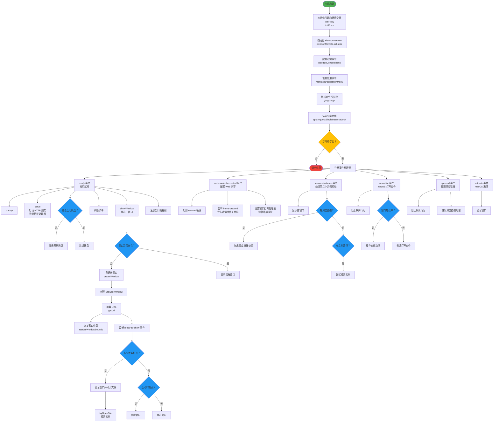
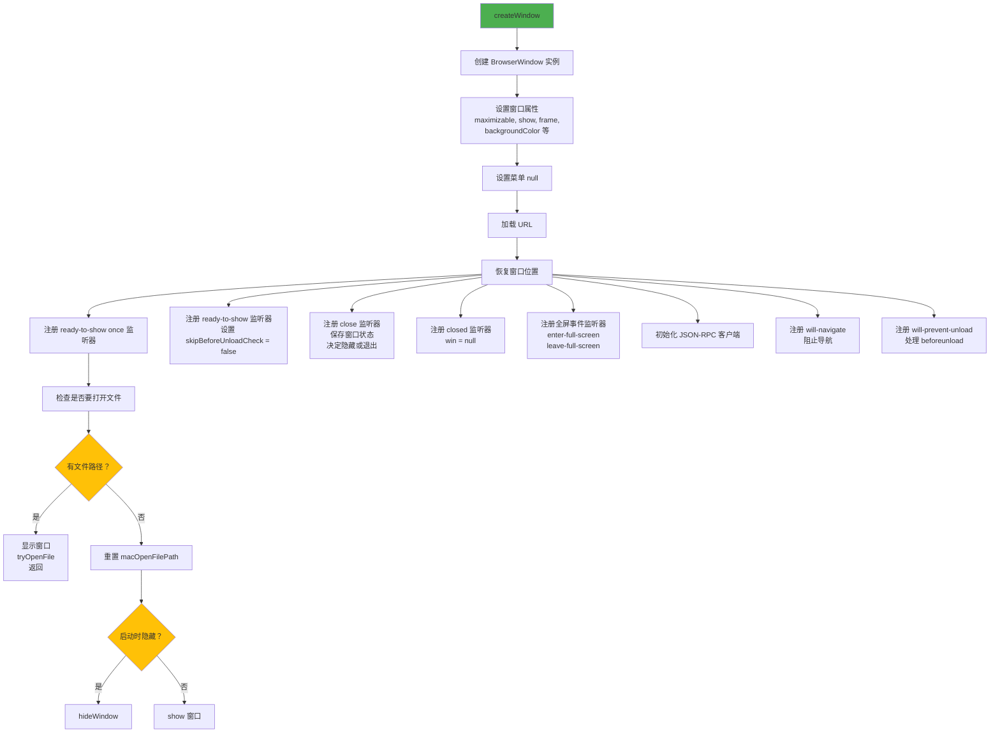
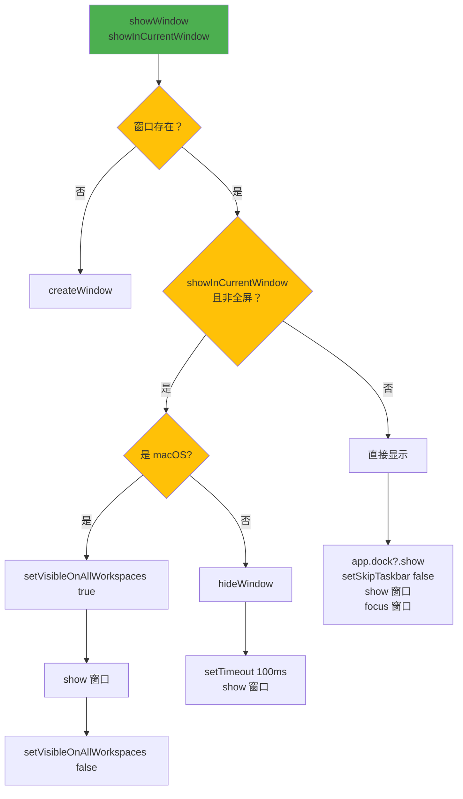
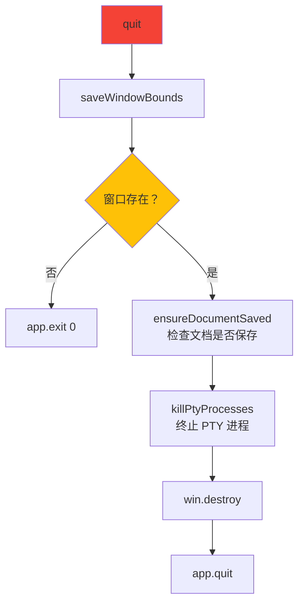
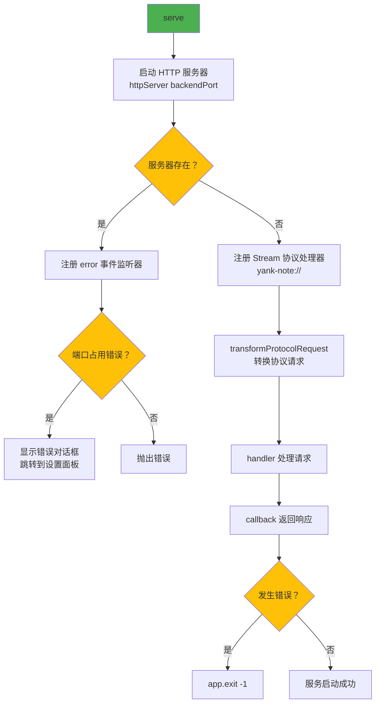
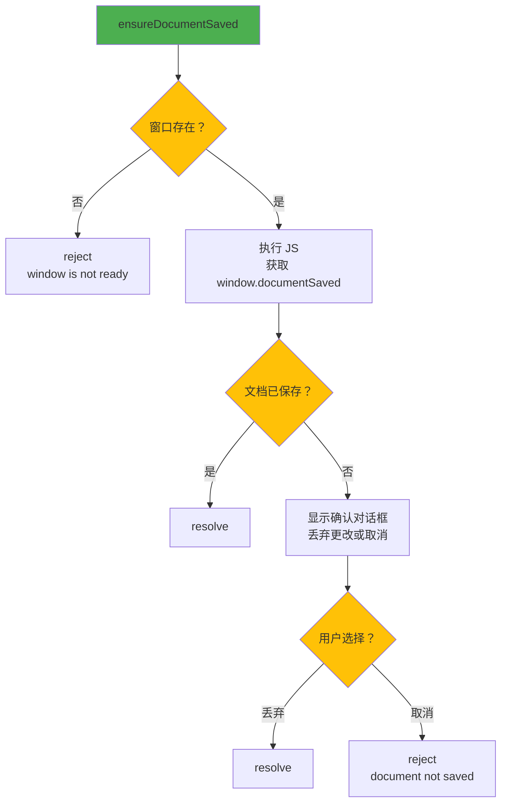
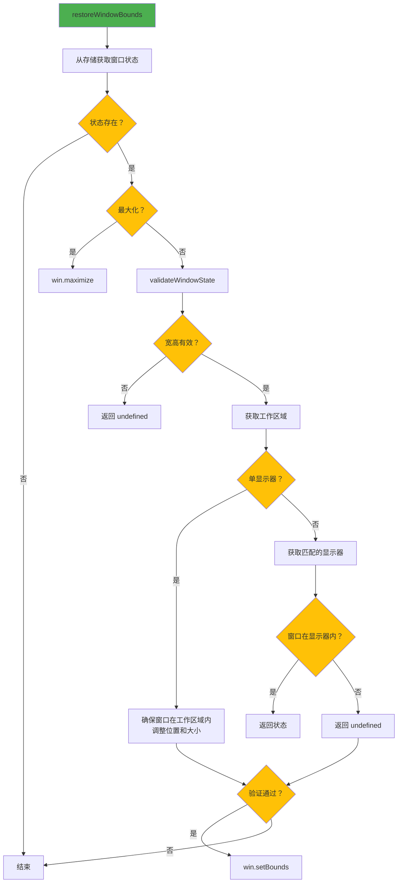
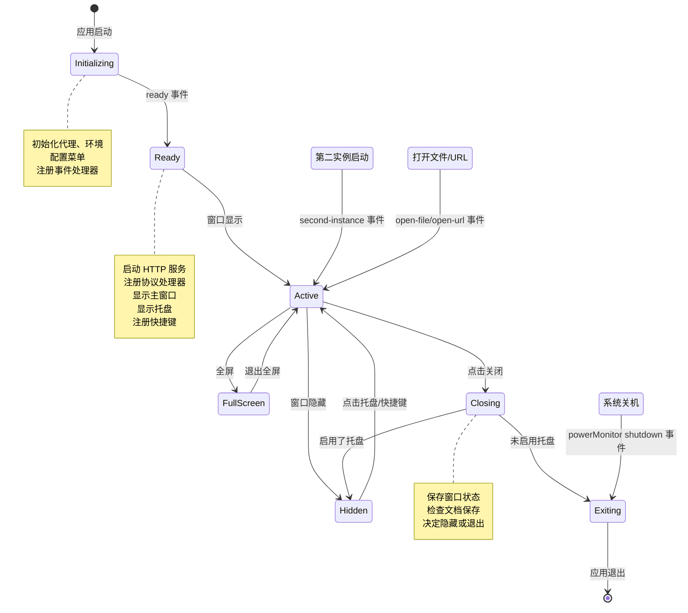

# Cord 应用主进程逻辑流程图

## 整体架构流程



## 核心函数调用流程

### 1. createWindow 函数



### 2. showWindow 函数



### 3. quit 函数



### 4. serve 函数（HTTP 服务）



### 5. ensureDocumentSaved 函数



### 6. restoreWindowBounds 函数



## 事件监听和响应



## 关键数据结构

### WindowState 类型
```
WindowState = {
  maximized: boolean,
  x: number,
  y: number,
  width: number,
  height: number
}
```

### URL 模式
- `scheme`: 使用自定义协议模式 (yank-note://)
- `dev`: 开发模式 (http://localhost:8066)
- `prod`: 生产模式 (http://localhost:backendPort)

### 注册的动作 (Actions)
- `show-main-window`: 显示主窗口
- `hide-main-window`: 隐藏主窗口
- `toggle-fullscreen`: 切换全屏
- `show-main-window-setting`: 显示设置面板
- `reload-main-window`: 重新加载窗口
- `get-main-widow`: 获取窗口实例
- `get-url-mode`: 获取 URL 模式
- `set-url-mode`: 设置 URL 模式
- `get-backend-port`: 获取后端端口
- `get-dev-frontend-port`: 获取开发前端端口
- `open-in-browser`: 在浏览器中打开
- `quit`: 退出应用
- `show-open-dialog`: 显示打开文件对话框
- `refresh-menus`: 刷新菜单
- `get-proxy-dispatcher`: 获取代理分发器
- `new-proxy-dispatcher`: 创建新的代理分发器
