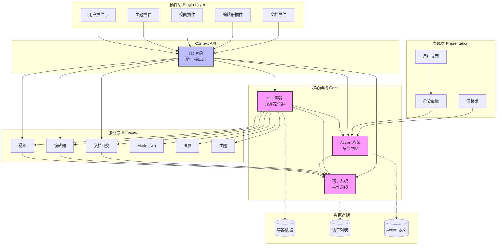
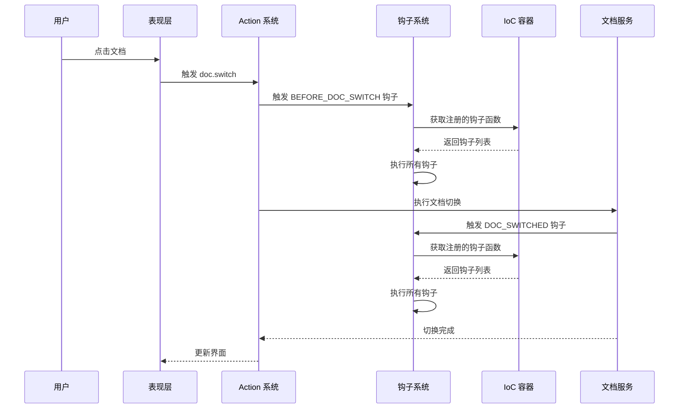
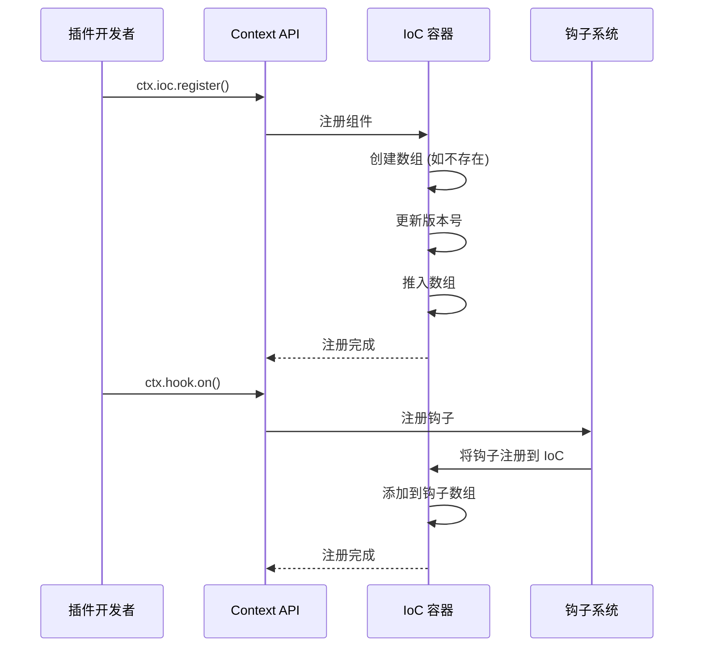
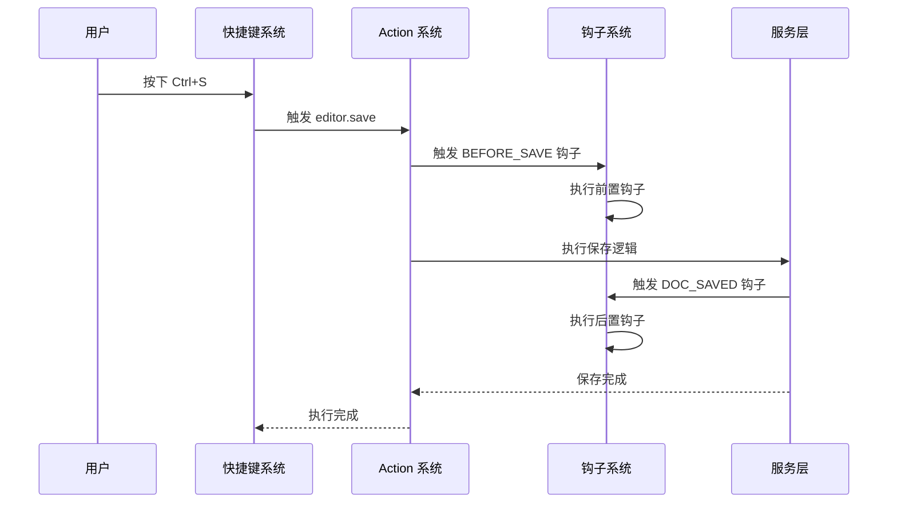

# Yank Note 整体架构图解

## 完整架构视图



## 架构层次说明

### 1. 表现层 (Presentation Layer)
**用户直接交互的界面组件**

- **用户界面 (UI)**: 主窗口、侧边栏、状态栏等
- **快捷键 (KB)**: 键盘快捷键绑定和触发
- **命令面板 (CMD)**: 全局命令搜索和执行入口

**数据流向**: 用户操作 → 命令面板/快捷键 → Action 系统

---

### 2. 插件层 (Plugin Layer)
**可扩展的插件生态系统**

- **文档插件**: 文档管理、导入导出等
- **编辑器插件**: 语法高亮、代码补全等
- **视图插件**: 预览器、大纲视图等
- **主题插件**: 颜色主题、图标主题等
- **用户插件**: 用户自定义插件

**访问方式**: 所有插件通过 `ctx` 对象访问核心功能

```typescript
// 插件示例
export function activate(ctx: Context) {
  // 通过 ctx 访问 IoC、Hook、Action 等
  ctx.ioc.register('VIEW_PREVIEWER', myPreviewer)
  ctx.hook.on('DOC_SWITCHED', myHook)
}
```

---

### 3. Context API (统一接口层)
**插件与核心系统的桥梁**

`ctx` 对象提供统一的访问接口，包含：
- `ctx.ioc`: IoC 容器访问
- `ctx.hook`: 钩子系统访问
- `ctx.action`: Action 系统访问
- `ctx.doc`: 文档服务
- `ctx.editor`: 编辑器实例
- `ctx.view`: 视图管理

**设计目的**:
- 解耦插件与核心系统
- 提供稳定的 API 接口
- 便于测试和 Mock

---

### 4. 核心架构 (Core Architecture)

#### IoC 容器 (服务定位器)
**核心依赖注入容器**

功能：
- 注册和管理所有服务实例
- 支持同类型多实例（数组存储）
- 类型安全的依赖获取
- 版本追踪支持响应式

存储内容：
- 预览器列表
- 代码运行器列表
- 渲染器列表
- 钩子函数列表
- 其他服务实例

#### 钩子系统 (事件总线)
**发布 - 订阅模式实现**

功能：
- 注册生命周期钩子
- 触发事件通知
- 支持异步钩子
- 支持条件移除

典型钩子：
- `DOC_SWITCHED`: 文档切换后
- `EDITOR_READY`: 编辑器就绪
- `VIEW_UPDATED`: 视图更新后

#### Action 系统 (命令中枢)
**统一命令执行框架**

功能：
- 定义和注册命令
- 命令执行和调度
- 支持快捷键绑定
- 支持命令面板搜索

典型 Action：
- `doc.switch`: 切换文档
- `editor.save`: 保存文档
- `view.toggle`: 切换视图

---

### 5. 服务层 (Services Layer)
**具体业务逻辑实现**

- **文档服务 (DOC)**: 文档加载、保存、切换
- **编辑器 (EDIT)**: 文本编辑、语法高亮
- **视图 (VIEW)**: 预览、大纲、搜索等视图
- **Markdown (MD)**: Markdown 解析和渲染
- **设置 (SET)**: 用户配置管理
- **主题 (THEME)**: 主题切换和管理

---

### 6. 数据存储 (Data Storage)

- **容器数据 (D1)**: IoC 容器注册的所有实例
- **钩子列表 (D2)**: 各类型钩子函数数组
- **Action 定义 (D3)**: 已注册的命令定义

---

## 核心交互流程

### 流程 1: 用户切换文档



---

### 流程 2: 插件注册服务



---

### 流程 3: 快捷键触发命令



---

## 设计模式总结

### 1. 服务定位器模式 (Service Locator)
**IoC 容器作为全局服务注册表**

```typescript
// 注册服务
ioc.register('VIEW_PREVIEWER', previewer)

// 获取服务
const previewers = ioc.get('VIEW_PREVIEWER')
```

**优点**:
- 集中管理依赖
- 延迟加载
- 便于替换实现

---

### 2. 发布 - 订阅模式 (Pub/Sub)
**钩子系统作为事件总线**

```typescript
// 订阅事件
hook.on('DOC_SWITCHED', (doc) => {
  console.log('文档已切换:', doc)
})

// 发布事件
hook.emit('DOC_SWITCHED', currentDoc)
```

**优点**:
- 解耦发布者和订阅者
- 支持多个订阅者
- 灵活的事件处理

---

### 3. 命令模式 (Command Pattern)
**Action 系统封装操作**

```typescript
// 定义命令
action.register('doc.save', {
  run: async () => {
    await saveDocument()
  }
})

// 执行命令
action.run('doc.save')
```

**优点**:
- 封装请求对象
- 支持撤销/重做
- 便于日志和追踪

---

### 4. 依赖注入 (Dependency Injection)
**通过 Context 注入依赖**

```typescript
// 插件激活时注入 ctx
export function activate(ctx: Context) {
  // 使用注入的依赖
  ctx.ioc.register(...)
  ctx.hook.on(...)
}
```

**优点**:
- 解耦依赖创建和使用
- 便于测试
- 提高代码可维护性

---

## 架构优势

### 1. 高度解耦
- 插件通过 `ctx` 访问核心功能
- 服务间通过钩子通信
- 无直接依赖关系

### 2. 可扩展性
- 插件系统支持无限扩展
- IoC 容器支持动态注册
- 钩子支持自定义事件

### 3. 可测试性
- 依赖注入便于 Mock
- 钩子支持拦截和验证
- Action 支持单元测试

### 4. 响应式支持
- IoC 容器版本追踪
- 配合 Vue 响应式系统
- 自动触发视图更新

---

## 总结

这个架构设计体现了现代编辑器的最佳实践：

1. **分层清晰**: 表现层 → 插件层 → 核心层 → 服务层
2. **单一职责**: 每个系统专注一个功能领域
3. **开放封闭**: 对扩展开放，对修改封闭
4. **依赖倒置**: 依赖抽象接口而非具体实现

理解这个架构对于开发 Yank Note 插件和贡献核心代码至关重要。
