# Extension.ts 架构关系图

```mermaid
graph TB
    %% 样式定义
    classDef initClass fill:#e1f5ff,stroke:#0066cc,stroke-width:2px
    classDef coreClass fill:#fff4e1,stroke:#cc6600,stroke-width:2px
    classDef manageClass fill:#e8f5e9,stroke:#2e7d32,stroke-width:2px
    classDef queryClass fill:#f3e5f5,stroke:#7b1fa2,stroke-width:2px
    classDef utilClass fill:#fce4ec,stroke:#c2185b,stroke-width:2px
    classDef stateClass fill:#fff9c4,stroke:#fbc02d,stroke-width:2px

    subgraph S1["📌 初始化模块 (Initialization)"]
        direction TB
        INIT["init()
        系统初始化入口"]:::initClass
        GET_INIT["getInitialized()
        检查是否已初始化"]:::initClass
        WHEN_INIT["whenInitialized()
        等待初始化完成"]:::initClass
    end

    subgraph S2["⚙️ 核心加载模块 (Core Loading)"]
        direction TB
        LOAD["load(extension)
        加载扩展核心逻辑"]:::coreClass
        SHOULD_LOAD["shouldLoad(extension)
        判断是否应加载"]:::coreClass
    end

    subgraph S3["🔧 扩展管理模块 (Extension Management)"]
        direction TB
        ENABLE["enable(extension)
        启用扩展"]:::manageClass
        DISABLE["disable(extension)
        禁用扩展"]:::manageClass
        UNINSTALL["uninstall(extension)
        卸载扩展"]:::manageClass
        INSTALL["install(extension, registry)
        安装扩展"]:::manageClass
        ABORT["abortInstallation()
        中止安装"]:::manageClass
        SHOW["showManager(id?)
        显示管理器 UI"]:::manageClass
    end

    subgraph S4["📋 信息查询模块 (Query)"]
        direction TB
        GET_ONE["getInstalledExtension(id)
        获取单个已安装扩展"]:::queryClass
        GET_ALL["getInstalledExtensions()
        获取所有已安装扩展"]:::queryClass
        GET_REG["getRegistryExtensions(registry)
        获取注册表扩展列表"]:::queryClass
    end

    subgraph S5["🛠️ 工具函数模块 (Utilities)"]
        direction TB
        GET_PATH["getExtensionPath(id, ...paths)
        生成扩展路径"]:::utilClass
        GET_URL["getInstalledExtensionFileUrl(id, filename)
        获取扩展文件 URL"]:::utilClass
        GET_STATUS["getLoadStatus(id)
        获取加载状态"]:::utilClass
        GET_COMPAT["getCompatible(engines)
        检查兼容性"]:::utilClass
        READ_INFO["readInfoFromJson(json)
        解析扩展信息"]:::utilClass
        CHANGE_REG["changeRegistryOrigin(hostname, url)
        切换注册表源"]:::utilClass
    end

    subgraph S6["💾 状态存储 (State)"]
        direction TB
        LOADED[("loaded Map
        存储扩展加载状态")]:::stateClass
    end

    %% 主要流程关系
    INIT --> GET_ALL
    GET_ALL --> GET_ONE
    GET_ONE --> READ_INFO
    GET_ALL --> LOAD
    
    LOAD --> SHOULD_LOAD
    LOAD --> LOADED
    
    ENABLE --> LOAD
    INSTALL --> ENABLE
    
    %% 工具函数调用关系
    GET_ONE --> GET_URL
    LOAD --> GET_URL
    LOAD --> GET_STATUS
    LOAD --> GET_PATH
    
    GET_ALL --> FETCH_INSTALLED["api.fetchInstalledExtensions()"]
    GET_ONE --> FETCH_HTTP["api.fetchHttp()"]
    GET_REG --> PROXY_FETCH["api.proxyFetch()"]
    
    ENABLE --> API_ENABLE["api.enableExtension()"]
    DISABLE --> API_DISABLE["api.disableExtension()"]
    UNINSTALL --> API_UNINSTALL["api.uninstallExtension()"]
    INSTALL --> API_INSTALL["api.installExtension()"]
    ABORT --> API_ABORT["api.abortExtensionInstallation()"]
    
    READ_INFO --> GET_COMPAT
    GET_REG --> CHANGE_REG
    
    %% 钩子
    INIT --> TRIGGER["triggerHook('EXTENSION_READY')"]
    ENABLE --> TRIGGER
    
    WHEN_INIT --> CHECK_INIT{"已初始化？"}
    CHECK_INIT -->|是 | RESOLVE["立即 resolve"]
    CHECK_INIT -->|否 | REG_HOOK["registerHook()"]
    
    SHOW --> GET_ACTION["getActionHandler('extension.show-manager')"]

```



## 函数职责详解

### 📌 初始化模块（3 个函数）

| 函数 | 职责 | 调用时机 |
|------|------|----------|
| `init()` | 系统启动时加载所有已安装扩展 | 应用启动 |
| `getInitialized()` | 返回初始化标志位 | 随时检查 |
| `whenInitialized()` | 返回 Promise，等待初始化完成 | 需要确保扩展已加载时 |

### ⚙️ 核心加载模块（2 个函数）

| 函数 | 职责 | 处理内容 |
|------|------|----------|
| `shouldLoad()` | 判断扩展是否应该加载 | 检查 `enabled && compatible` |
| `load()` | 加载扩展的脚本、样式、主题 | 动态插入 script/link 标签 |

### 🔧 扩展管理模块（6 个函数）

| 函数 | 职责 | API 调用 |
|------|------|----------|
| `enable()` | 启用扩展并加载 | `api.enableExtension()` + `load()` |
| `disable()` | 禁用扩展 | `api.disableExtension()` |
| `uninstall()` | 卸载扩展 | `api.uninstallExtension()` |
| `install()` | 安装扩展并启用 | `api.installExtension()` + `enable()` |
| `abortInstallation()` | 中止安装过程 | `api.abortExtensionInstallation()` |
| `showManager()` | 打开扩展管理器界面 | `getActionHandler()` |

### 📋 信息查询模块（3 个函数）

| 函数 | 职责 | 数据来源 |
|------|------|----------|
| `getInstalledExtension()` | 获取单个扩展信息 | 本地 `package.json` |
| `getInstalledExtensions()` | 获取所有已安装扩展 | 本地扩展目录 |
| `getRegistryExtensions()` | 获取远程扩展列表 | npm 注册表（压缩 tar 包） |

### 🛠️ 工具函数模块（6 个函数）

| 函数 | 职责 | 返回值 |
|------|------|--------|
| `getExtensionPath()` | 将扩展 ID 转为路径 | `string` |
| `getInstalledExtensionFileUrl()` | 获取扩展文件访问 URL | `string` |
| `getLoadStatus()` | 获取扩展加载状态 | `ExtensionLoadStatus` |
| `getCompatible()` | 检查版本兼容性 | `ExtensionCompatible` |
| `readInfoFromJson()` | 解析 package.json | `Omit<Extension, 'installed'>` |
| `changeRegistryOrigin()` | 替换注册表域名 | `string` |

### 💾 状态存储

- **`loaded` Map**: 存储每个扩展的加载状态
  - `version`: 版本号
  - `themes`: 主题是否加载
  - `plugin`: 插件是否加载
  - `style`: 样式是否加载
  - `activationTime`: 激活耗时

## 核心流程图

### 1️⃣ 初始化流程
```
init()
  ↓
getInstalledExtensions()
  ↓
遍历每个扩展 → shouldLoad() → load()
  ↓
triggerHook('EXTENSION_READY')
```

### 2️⃣ 安装流程
```
install(extension, registry)
  ↓
api.installExtension(id, url)
  ↓
enable(extension)
  ↓
api.enableExtension(id) + load(extension)
  ↓
triggerHook('EXTENSION_READY')
```

### 3️⃣ 加载流程
```
load(extension)
  ↓
shouldLoad() 检查
  ↓
├─ 加载 JS/MJS 脚本 → 创建 script 标签
├─ 加载 CSS 样式 → theme.addStyleLink() + view.addStyleLink()
└─ 加载主题 → theme.registerThemeStyle()
  ↓
更新 loaded Map
```

### 4️⃣ 获取注册表扩展流程
```
getRegistryExtensions(registry)
  ↓
api.proxyFetch(注册表 URL)
  ↓
下载 tarball → pako.inflate() → untar()
  ↓
解析 index.json → readInfoFromJson()
  ↓
返回 Extension[]
```
