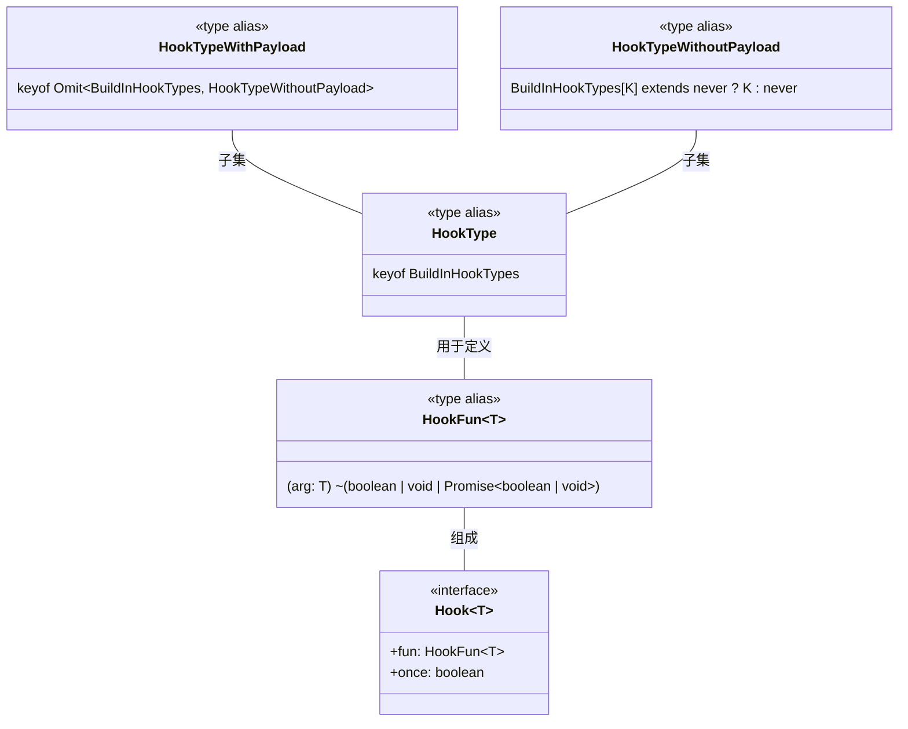
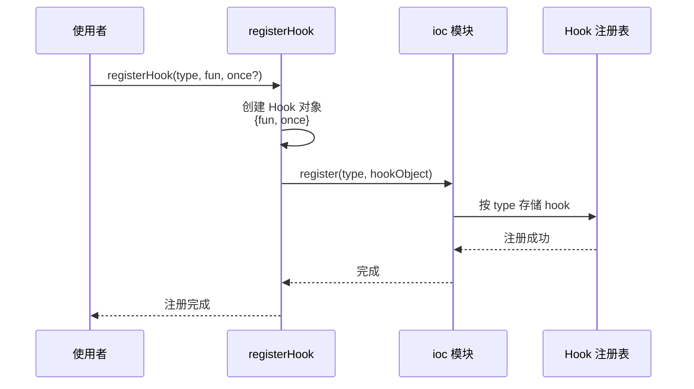
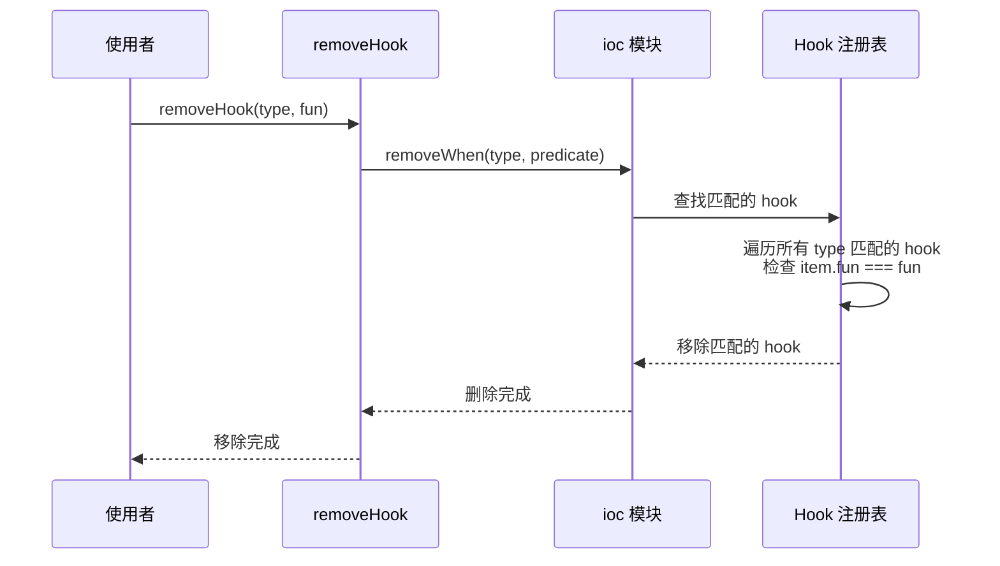
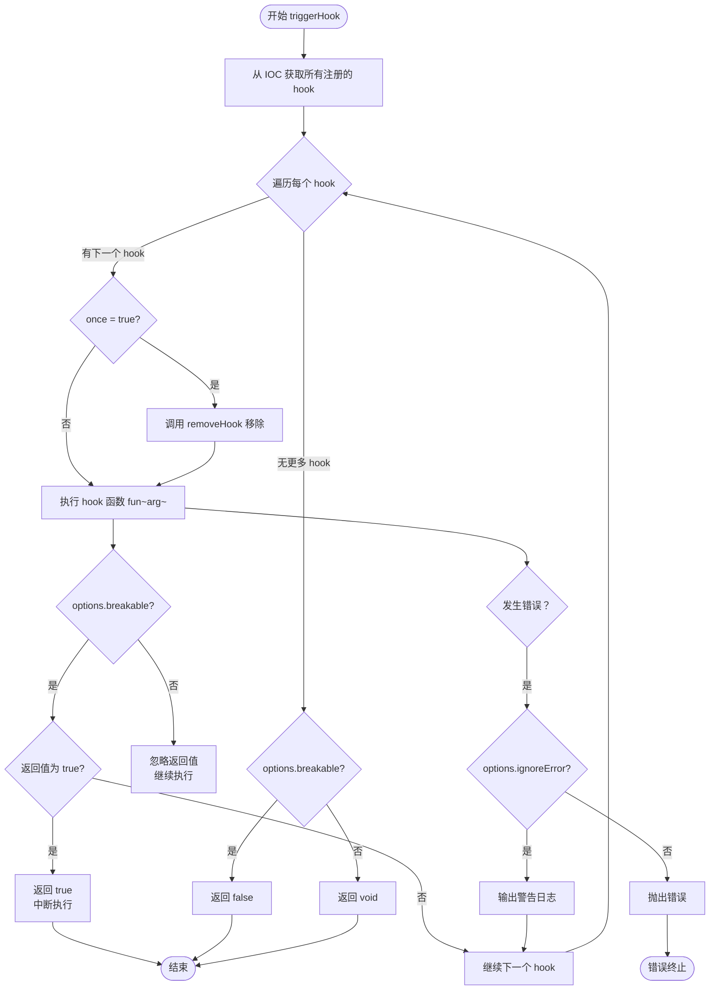
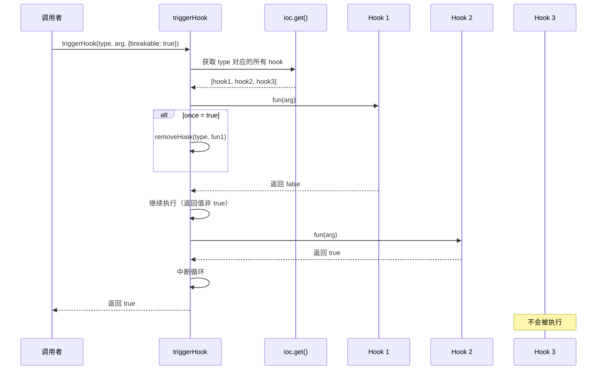
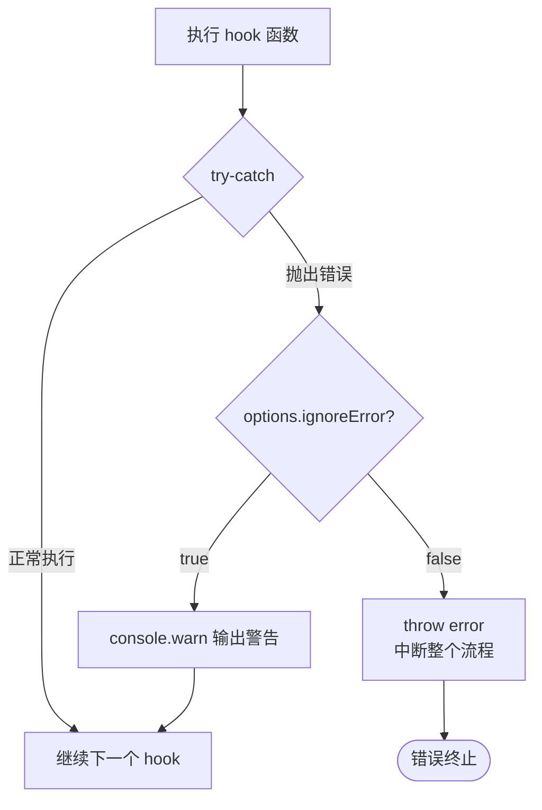
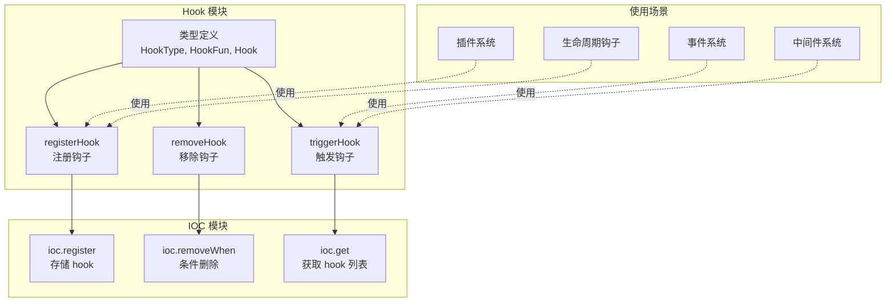
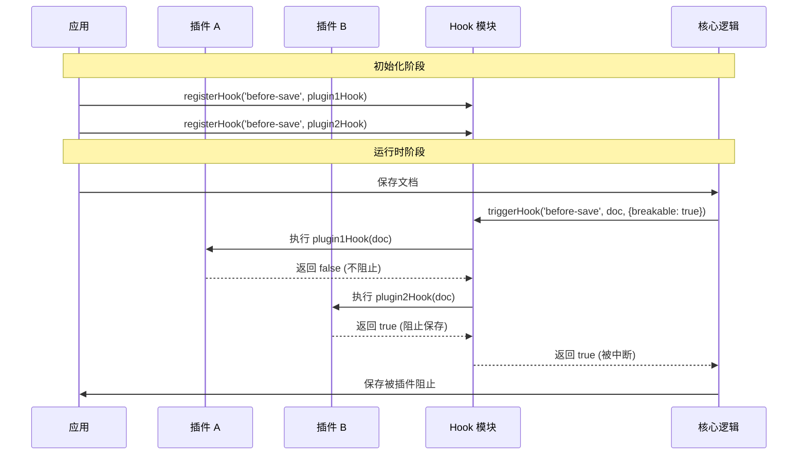

# Hook 模块图形化讲解

本文档使用 Mermaid 图表详细讲解 `hook.ts` 文件的工作机制。

## 1. 类型定义结构

**详细讲解：**

这个模块定义了 5 个核心类型：

1. **HookType**: 从 `BuildInHookTypes` 中提取的所有 hook 类型的键，是所有 hook 的总类型
2. **HookFun<T>**: 钩子函数的类型定义，接收参数 `arg`，返回 `boolean | void` 或其 Promise
3. **Hook<T>**: 钩子对象接口，包含两个属性：
   - `fun`: 实际的钩子函数
   - `once`: 是否只执行一次
4. **HookTypeWithoutPayload**: 没有参数的 hook 类型（payload 为 `never` 的类型）
5. **HookTypeWithPayload**: 有参数的 hook 类型（排除掉无参数的类型）

这种类型设计支持 TypeScript 的类型安全，确保带参数的 hook 必须传入正确的参数。

---

## 2. registerHook 工作流程

**详细讲解：**

`registerHook` 函数用于注册一个钩子：

1. **参数**：
   - `type`: hook 的类型（从 `BuildInHookTypes` 中获取）
   - `fun`: 钩子函数本身
   - `once`: 可选参数，默认为 `false`，表示是否只执行一次

2. **执行流程**：
   - 创建一个包含 `fun` 和 `once` 的 Hook 对象
   - 调用 `ioc.register()` 方法将 hook 注册到依赖注入容器
   - IOC 模块会按照 `type` 对 hook 进行分类存储

3. **特点**：
   - 支持泛型，确保类型安全
   - `once` 参数允许注册一次性 hook

---

## 3. removeHook 工作流程

**详细讲解：**

`removeHook` 函数用于移除已注册的钩子：

1. **参数**：
   - `type`: hook 的类型
   - `fun`: 要移除的钩子函数（通过函数引用匹配）

2. **执行流程**：
   - 调用 `ioc.removeWhen()` 方法
   - 传入一个谓词函数，检查 `item.fun === fun`
   - IOC 模块会遍历所有该类型的 hook
   - 移除函数引用完全匹配的 hook

3. **特点**：
   - 使用函数引用进行精确匹配
   - 只能移除通过相同函数引用注册的 hook

---

## 4. triggerHook 核心流程（带参数版本）

**详细讲解：**

`triggerHook` 是最复杂的函数，有多个重载签名：

### 函数重载：

1. **无参数的 hook**：`triggerHook(type)` - 返回 `Promise<void>`
2. **无参数但可中断**：`triggerHook(type, undefined, {breakable: true})` - 返回 `Promise<void>`
3. **有参数的 hook**：`triggerHook(type, arg)` - 返回 `Promise<void>`
4. **有参数且可中断**：`triggerHook(type, arg, {breakable: true, ignoreError?})` - 返回 `Promise<boolean>`
5. **有参数但不可中断**：`triggerHook(type, arg, {breakable?: false, ignoreError?})` - 返回 `Promise<void>`

### 执行流程：

1. **获取 hook 列表**：从 IOC 容器获取所有指定类型的 hook
2. **遍历执行**：对每个 hook 执行以下操作：
   - 如果 `once=true`，先移除该 hook（执行一次后不再执行）
   - 执行 hook 函数
   - 如果设置了 `breakable: true`：
     - 检查返回值，如果为 `true` 则中断并返回 `true`
   - 如果未设置 `breakable`，忽略返回值继续执行
3. **错误处理**：
   - 如果设置了 `ignoreError: true`，捕获错误并输出警告
   - 否则抛出错误，中断执行
4. **返回值**：
   - `breakable: true` 时：返回 `true`（被中断）或 `false`（正常完成）
   - 否则：返回 `void`

---

## 5. triggerHook 执行时序图

**详细讲解：**

这个时序图展示了 `breakable: true` 时的执行场景：

1. **调用**：调用者传入 `type`、`arg` 和 `{breakable: true}` 选项
2. **获取 hook 列表**：从 IOC 获取所有注册的 hook
3. **执行第一个 hook**：
   - 如果 `once=true`，先移除自己
   - 执行函数，返回 `false`
   - 继续执行下一个
4. **执行第二个 hook**：
   - 执行函数，返回 `true`
   - 触发中断逻辑
   - 立即返回 `true`
5. **第三个 hook**：永远不会被执行（已被中断）

---

## 6. 错误处理流程

**详细讲解：**

错误处理机制：

1. **try-catch 包裹**：每个 hook 的执行都在 try-catch 块中
2. **ignoreError 选项**：
   - `true`: 捕获错误，输出警告日志，继续执行下一个 hook
   - `false` 或未设置：抛出错误，中断整个 hook 链的执行
3. **使用场景**：
   - `ignoreError: true`：用于可选的 hook，即使失败也不影响主流程
   - `ignoreError: false`：用于关键的 hook，失败应该中断流程

---

## 7. 整体架构图

**详细讲解：**

### 模块关系：

1. **Hook 模块核心**：
   - 类型定义：提供类型安全
   - 三个核心函数：注册、移除、触发

2. **依赖 IOC 模块**：
   - `ioc.register()`: 存储 hook
   - `ioc.removeWhen()`: 条件删除 hook
   - `ioc.get()`: 获取 hook 列表

3. **典型使用场景**：
   - **插件系统**：插件注册 hook，在特定时机被触发
   - **事件系统**：触发 hook 通知所有监听者
   - **中间件系统**：使用 `breakable` 实现中间件链
   - **生命周期钩子**：在组件生命周期的关键点触发

### 设计模式：

1. **观察者模式**：hook 作为观察者，在特定事件发生时被通知
2. **责任链模式**：`breakable` 选项支持中断链式调用
3. **依赖注入**：通过 IOC 容器管理 hook 的存储和检索

---

## 8. 使用示例场景

**详细讲解：**

这是一个典型的插件系统使用场景：

### 初始化阶段：
1. 应用启动时，插件 A 和插件 B 分别注册 `before-save` hook
2. 两个 hook 都会被存储到 IOC 容器中

### 运行时阶段：
1. 用户触保存文档操作
2. 核心逻辑在执行保存前触发 `before-save` hook
3. 传入文档数据和 `{breakable: true}` 选项
4. **插件 A**：检查文档，返回 `false`（不阻止）
5. **插件 B**：发现文档不符合规则，返回 `true`（阻止保存）
6. hook 系统立即中断，返回 `true`
7. 核心逻辑收到 `true`，知道保存被阻止，取消保存操作

### 设计优势：
- **解耦**：插件不需要知道核心逻辑的实现
- **可扩展**：可以无限添加插件
- **可控**：通过 `breakable` 选项控制是否允许中断

---

## 总结

这个 `hook.ts` 模块实现了一个完整的钩子系统，具有以下特点：

1. **类型安全**：使用 TypeScript 泛型和条件类型确保类型正确
2. **灵活配置**：支持 `once`、`breakable`、`ignoreError` 等选项
3. **解耦设计**：通过 IOC 容器管理，模块间低耦合
4. **强大功能**：支持一次性 hook、可中断链、错误隔离等高级特性
5. **广泛适用**：可用于插件系统、事件系统、中间件、生命周期管理等多种场景
