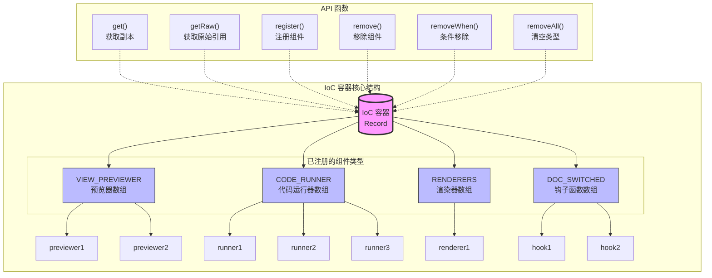
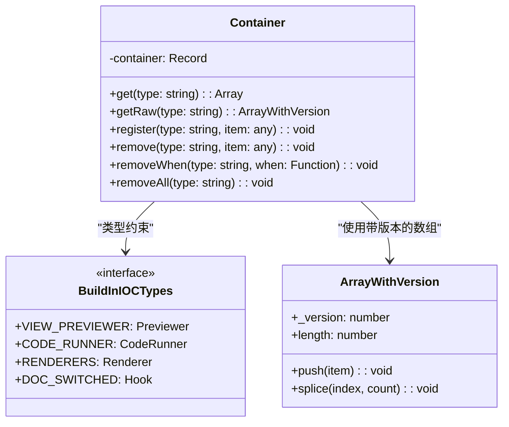
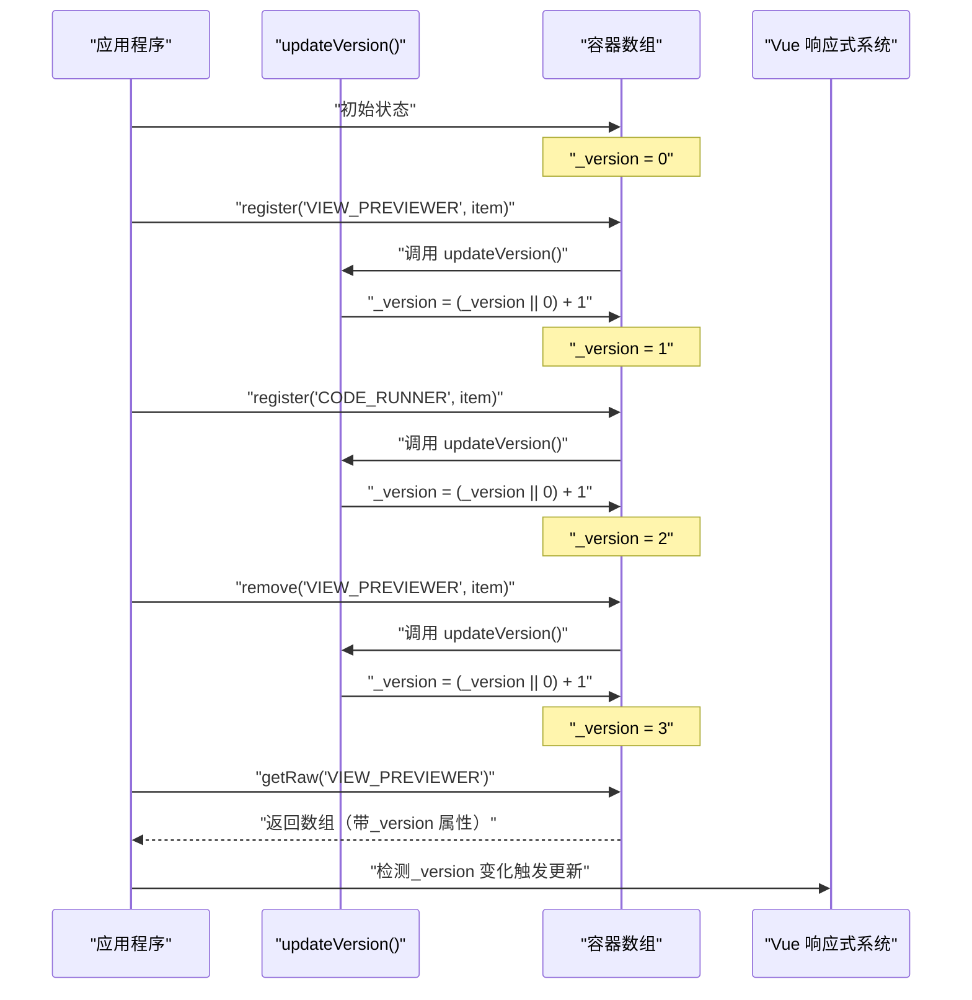
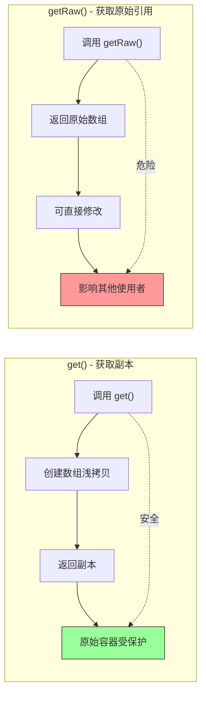
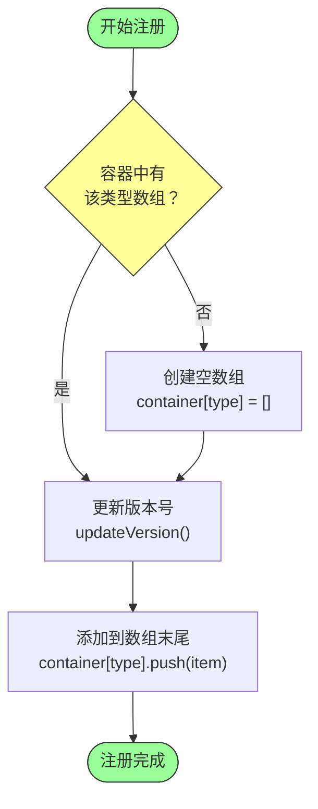
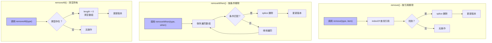
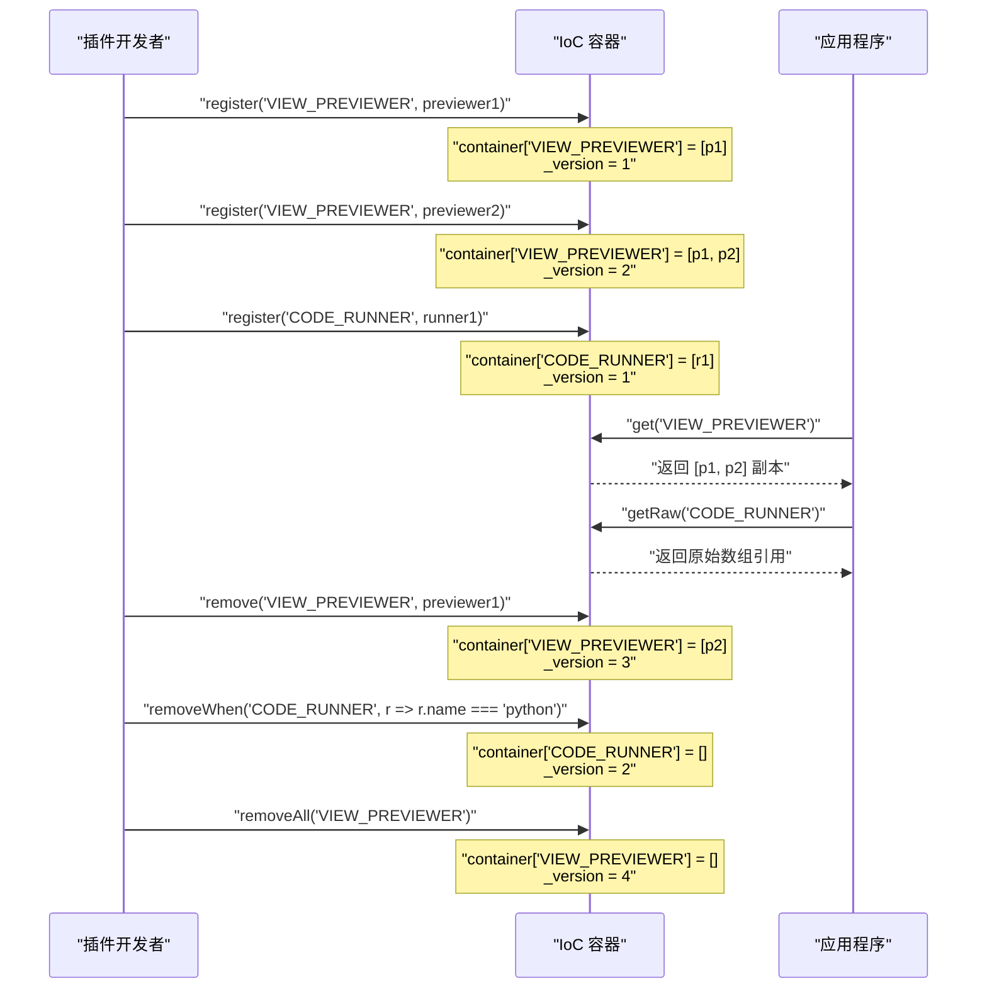
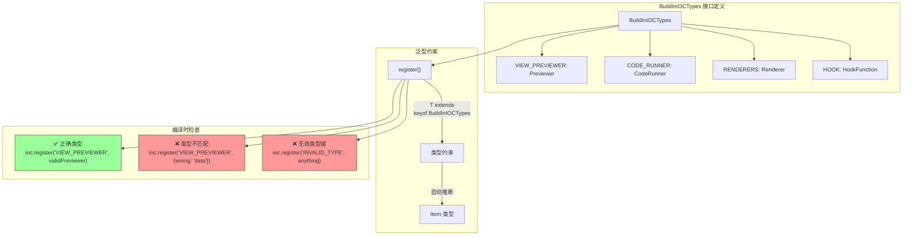
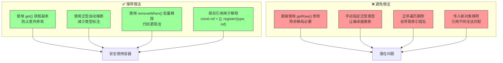

# IoC 容器架构详解

## 1. 整体架构概览



**详细讲解：**

这是 Yank Note 的**核心依赖注入容器**，采用**服务定位器模式**实现。

**核心特点：**
- **多值存储**：同一类型可注册多个组件（使用数组存储）
- **类型安全**：通过 TypeScript 泛型约束键值对应关系
- **版本追踪**：每次修改都更新 `_version`，支持响应式检测

**数据结构：**
- 容器本质是一个 `Record<string, any[]>` 对象
- 键是字符串（如 `'VIEW_PREVIEWER'`）
- 值是数组，存储该类型的所有组件实例
- 虽然类型是 `any[]`，但通过泛型函数保证类型安全

---

## 2. 容器数据结构示例



**详细讲解：**

**容器内部结构示例：**
```typescript
container = {
  'VIEW_PREVIEWER': [previewer1, previewer2],     // 预览器列表
  'CODE_RUNNER': [runner1, runner2, runner3],    // 代码运行器列表
  'RENDERERS': [renderer1],                       // 渲染器列表
  'DOC_SWITCHED': [hook1, hook2],                // 钩子列表
}
```

**类型说明：**
- `Record<string, any[]>`：键是字符串，值是数组
- 每个数组都有一个隐藏的 `_version` 属性用于版本追踪
- 通过 `BuildInIOCTypes` 接口定义所有合法的组件类型

---

## 3. 版本追踪机制



**详细讲解：**

**版本号作用：**
1. **检测容器是否被修改**：通过比较版本号判断内容是否变化
2. **配合 Vue 响应式系统**：触发组件重新渲染

**实现细节：**
```typescript
function updateVersion(items: any) {
  items._version = (items._version || 0) + 1
}
```

- 每次容器变化（注册、移除、清空）都会调用
- 数组会有一个隐藏的 `_version` 属性
- 例如：`container['VIEW_PREVIEWER']._version = 3` 表示修改了 3 次

---

## 4. 获取组件的两种方式



**详细讲解：**

### get() - 获取副本（推荐）

```typescript
export function get<T extends keyof BuildInIOCTypes>(type: T): BuildInIOCTypes[T][] {
  return [...(container[type] || [])]  // [...array] 创建浅拷贝
}
```

**特点：**
- 返回数组副本（浅拷贝）
- 防止调用者意外修改容器
- 遍历时容器被修改不会出问题

**使用示例：**
```typescript
const previewers = ioc.get('VIEW_PREVIEWER')
// previewers: Previewer[]
```

### getRaw() - 获取原始引用（谨慎使用）

```typescript
export function getRaw<T extends keyof BuildInIOCTypes>(type: T) {
  return container[type] as (BuildInIOCTypes[T][] & { _version: number })
}
```

**特点：**
- 返回原始数组引用（带 `_version` 属性）
- 可直接修改原数组
- 可能影响其他使用者

**使用示例：**
```typescript
const renderers = ioc.getRaw('RENDERERS')
renderers?.sort((a, b) => a.order - b.order)  // 直接修改原数组

const version = ioc.getRaw('VIEW_PREVIEWER')?._version  // 检查版本号
```

---

## 5. 注册组件流程



**详细讲解：**

**注册流程：**
1. **检查**：判断该类型是否已有数组
2. **创建**：如果没有，先创建空数组
3. **更新版本**：调用 `updateVersion()` 增加版本号
4. **添加**：将组件推入数组末尾

**类型安全保证：**
```typescript
export function register<T extends keyof BuildInIOCTypes>(
  type: T, 
  item: BuildInIOCTypes[T]
) {
  if (!container[type]) {
    container[type] = []
  }
  
  updateVersion(container[type])
  container[type].push(item)
}
```

**使用示例：**
```typescript
// 注册预览器（item 类型自动推断为 Previewer）
ioc.register('VIEW_PREVIEWER', {
  name: 'my-previewer',
  component: MyPreviewerComponent
})

// 注册代码运行器
ioc.register('CODE_RUNNER', {
  name: 'python',
  match: (lang) => lang === 'python',
  run: async (code) => { /* ... */ }
})
```

---

## 6. 移除组件的三种方式



**详细讲解：**

### remove() - 按引用移除

```typescript
export function remove<T extends keyof BuildInIOCTypes>(type: T, item: BuildInIOCTypes[T]) {
  if (container[type]) {
    const idx = container[type].indexOf(item)  // 引用比较（===）
    if (idx > -1) {
      container[type].splice(idx, 1)  // 删除该位置元素
    }
    updateVersion(container[type])
  }
}
```

**特点：**
- 使用 `indexOf` 进行引用比较（必须是同一个对象）
- 适用于已知具体对象引用的场景

**示例：**
```typescript
const myPreviewer = { name: 'my', component: MyComp }
ioc.register('VIEW_PREVIEWER', myPreviewer)

ioc.remove('VIEW_PREVIEWER', myPreviewer)  // ✅ 成功移除
ioc.remove('VIEW_PREVIEWER', { name: 'my', component: MyComp })  // ❌ 无法移除（引用不同）
```

### removeWhen() - 按条件移除

```typescript
export function removeWhen<T extends keyof BuildInIOCTypes>(
  type: T, 
  when: (item: BuildInIOCTypes[T]) => boolean
) {
  if (container[type]) {
    const items = container[type]
    for (let i = items.length - 1; i >= 0; i--) {  // 倒序遍历
      if (when(items[i])) {
        items.splice(i, 1)
        updateVersion(container[type])
      }
    }
  }
}
```

**特点：**
- **倒序遍历**：从后往前删除，避免索引错乱
- 适用于批量移除符合条件的组件

**为什么倒序遍历？**
- 正序删除 `[A,B,C]` 中的 A 后，B 会变成索引 0，导致跳过 B
- 倒序删除不会影响未遍历的索引

**示例：**
```typescript
// 移除所有 name 为 'temp' 的预览器
ioc.removeWhen('VIEW_PREVIEWER', (item) => item.name === 'temp')

// 移除所有 order 小于 0 的渲染器
ioc.removeWhen('RENDERERS', (item) => (item.order || 0) < 0)
```

### removeAll() - 清空所有

```typescript
export function removeAll<T extends keyof BuildInIOCTypes>(type: T) {
  if (container[type]) {
    container[type].length = 0  // 清空数组
    updateVersion(container[type])
  }
}
```

**特点：**
- 使用 `length = 0` 是清空数组的高效方式
- 保持原数组引用不变，已持有引用的地方会同步更新

---

## 7. 完整使用流程示例



**详细讲解：**

这个序列图展示了 IoC 容器的完整生命周期：

1. **注册阶段**：插件开发者注册各种组件
2. **获取阶段**：应用程序获取并使用这些组件
3. **移除阶段**：根据需要移除特定组件或清空类型

**关键点：**
- 每次操作都会更新版本号
- `get()` 返回副本保护容器
- `getRaw()` 返回原始引用供高级操作
- 移除操作支持引用、条件、清空三种方式

---

## 8. 类型安全机制



**详细讲解：**

**类型定义：**
```typescript
interface BuildInIOCTypes {
  VIEW_PREVIEWER: Previewer
  CODE_RUNNER: CodeRunner
  RENDERERS: Renderer
  DOC_SWITCHED: HookFunction
  // ... 更多类型
}
```

**泛型约束：**
```typescript
export function register<T extends keyof BuildInIOCTypes>(
  type: T, 
  item: BuildInIOCTypes[T]
)
```

- `T extends keyof BuildInIOCTypes`：T 必须是 BuildInIOCTypes 的键
- `item: BuildInIOCTypes[T]`：item 类型由 T 自动推断

**编译时检查示例：**
```typescript
// ✅ 正确 - 类型匹配
ioc.register('VIEW_PREVIEWER', { name: 'my', component: MyComp })

// ❌ 编译错误 - 类型不匹配
ioc.register('VIEW_PREVIEWER', { wrong: 'data' })

// ❌ 编译错误 - 无效的类型键
ioc.register('INVALID_TYPE', anything)
```

---

## 9. 设计模式总结

<!-- markmap: version=0.18.1 -->

# IoC 容器

## 设计模式
### 服务定位器
- 集中管理依赖
- 全局访问点
- 延迟注册
### 依赖注入
- 控制反转
- 解耦组件
- 便于测试

## 核心特性
### 类型安全
- TypeScript 泛型
- 编译时检查
- 自动类型推断
### 多值存储
- 数组存储
- 同类型多实例
- 灵活管理
### 版本追踪
- _version 属性
- 响应式支持
- 变更检测

## API 设计
### 获取
- get() 副本
- getRaw() 原始引用
### 修改
- register() 注册
- remove() 移除
- removeWhen() 条件移除
- removeAll() 清空

## 使用场景
- 插件系统
- 钩子管理
- 渲染器注册
- 预览器管理
- 代码运行器

**详细讲解：**

### 设计模式

**1. 服务定位器模式（Service Locator）**
- 提供集中管理依赖的机制
- 全局访问点获取服务
- 支持延迟注册和按需获取

**2. 依赖注入（Dependency Injection）**
- 控制反转（IoC）：组件不直接创建依赖
- 解耦组件：组件间通过容器通信
- 便于测试：可轻松替换 Mock 对象

### 核心特性

**类型安全：**
- 使用 TypeScript 泛型约束
- 编译时类型检查
- 自动类型推断减少显式标注

**多值存储：**
- 使用数组存储同类型多个实例
- 灵活的组件管理
- 支持插件系统的多实例需求

**版本追踪：**
- 每次修改更新 `_version` 属性
- 配合 Vue 响应式系统
- 高效的变更检测机制

### 实际应用场景

- **插件系统**：插件注册和卸载
- **钩子管理**：生命周期钩子的添加和移除
- **渲染器注册**：Markdown 渲染器的动态注册
- **预览器管理**：不同文件类型的预览组件
- **代码运行器**：多语言代码执行环境

---

## 10. 最佳实践建议



**详细讲解：**

### ✅ 推荐做法

**1. 使用 get() 获取副本**
```typescript
// ✅ 推荐
const previewers = ioc.get('VIEW_PREVIEWER')
previewers.forEach(p => console.log(p.name))
```

**2. 使用泛型自动推断**
```typescript
// ✅ 推荐 - 类型自动推断
ioc.register('VIEW_PREVIEWER', {
  name: 'my',
  component: MyComp
})
```

**3. 使用 removeWhen() 批量移除**
```typescript
// ✅ 推荐 - 简洁清晰
ioc.removeWhen('VIEW_PREVIEWER', item => item.name === 'temp')
```

**4. 保存引用用于移除**
```typescript
// ✅ 推荐
const myHook = { fun: () => {} }
ioc.register('DOC_SWITCHED', myHook)
// ... 稍后
ioc.remove('DOC_SWITCHED', myHook)
```

### ❌ 避免做法

**1. 直接使用 getRaw() 修改**
```typescript
// ❌ 避免 - 除非确有必要
const raw = ioc.getRaw('RENDERERS')
raw?.push(something)  // 直接影响容器
```

**2. 手动指定泛型类型**
```typescript
// ❌ 避免 - 冗余且易错
ioc.register<BuildInIOCTypes['VIEW_PREVIEWER']>('VIEW_PREVIEWER', item)

// ✅ 推荐 - 自动推断
ioc.register('VIEW_PREVIEWER', item)
```

**3. 正序遍历删除**
```typescript
// ❌ 错误 - 会导致索引错乱
for (let i = 0; i < items.length; i++) {
  if (shouldRemove(items[i])) {
    items.splice(i, 1)  // 删除后索引变化，跳过下一个元素
  }
}

// ✅ 正确 - 倒序遍历
for (let i = items.length - 1; i >= 0; i--) {
  if (shouldRemove(items[i])) {
    items.splice(i, 1)
  }
}
```

**4. 传入新对象移除**
```typescript
// ❌ 错误 - 引用不同
ioc.remove('VIEW_PREVIEWER', { name: 'my', component: MyComp })

// ✅ 正确 - 保存引用
const ref = { name: 'my', component: MyComp }
ioc.register('VIEW_PREVIEWER', ref)
ioc.remove('VIEW_PREVIEWER', ref)
```

---

## 总结

这个 IoC 容器是 Yank Note 的核心基础设施，通过精心设计的 API 和类型系统，实现了：

1. **灵活的组件管理**：支持注册、获取、移除的完整生命周期
2. **类型安全**：TypeScript 泛型保证编译时检查
3. **响应式支持**：版本追踪机制配合 Vue 响应式系统
4. **易于使用**：简洁的 API 和自动类型推断
5. **高性能**：高效的数组操作和版本更新机制

理解这个容器的设计和使用方式，对于开发 Yank Note 插件和扩展功能至关重要。
