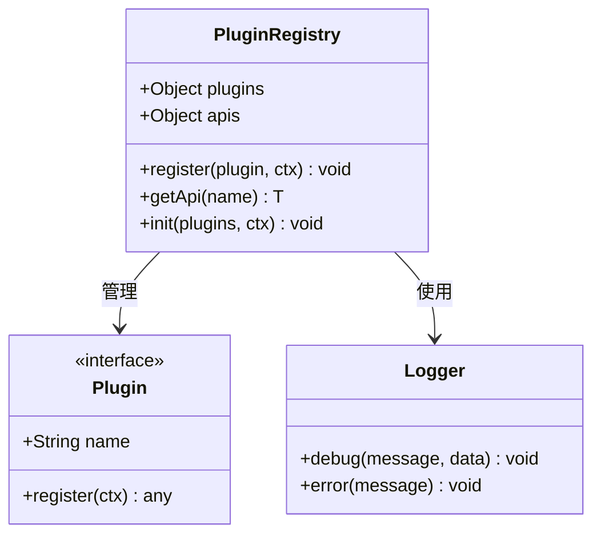
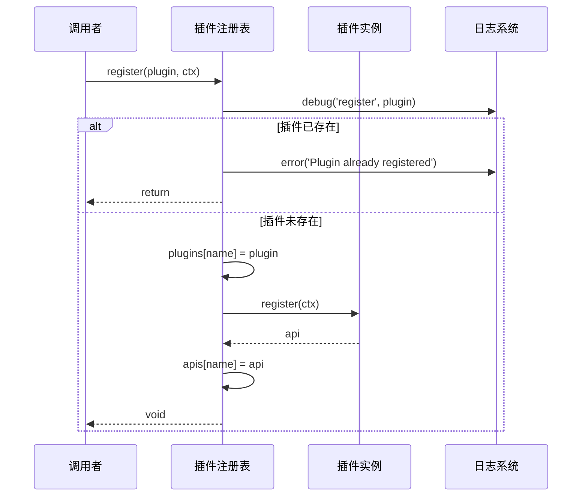
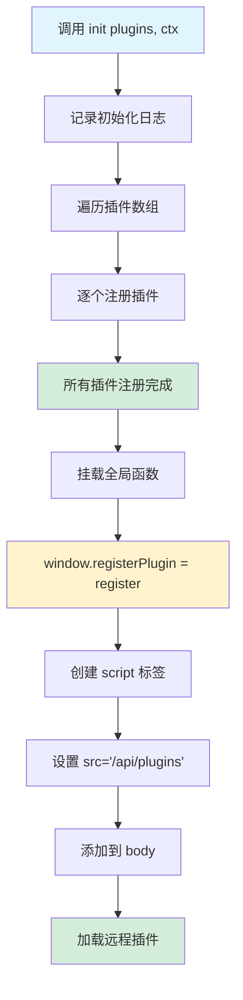
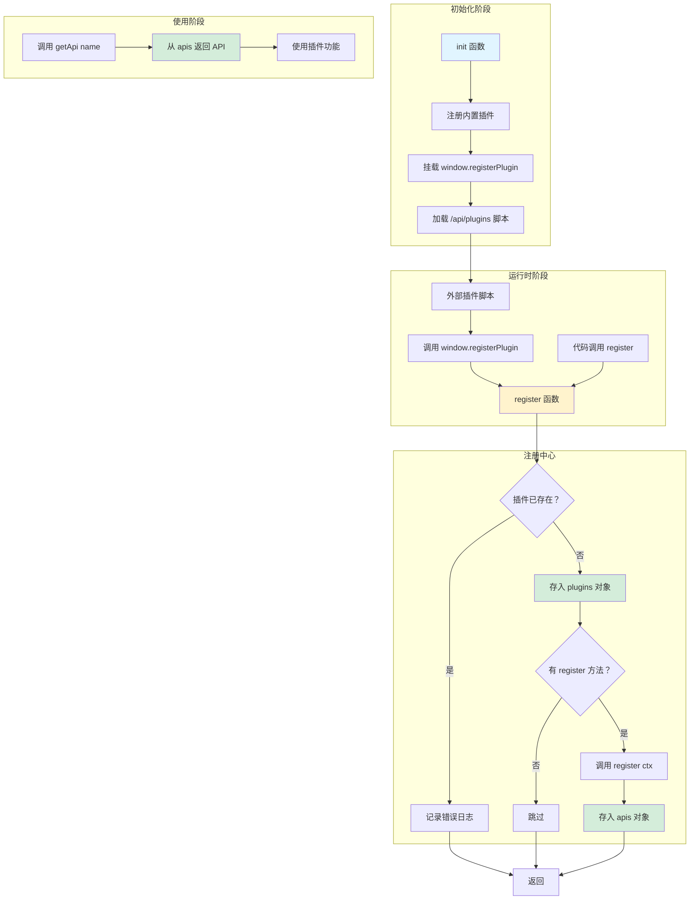
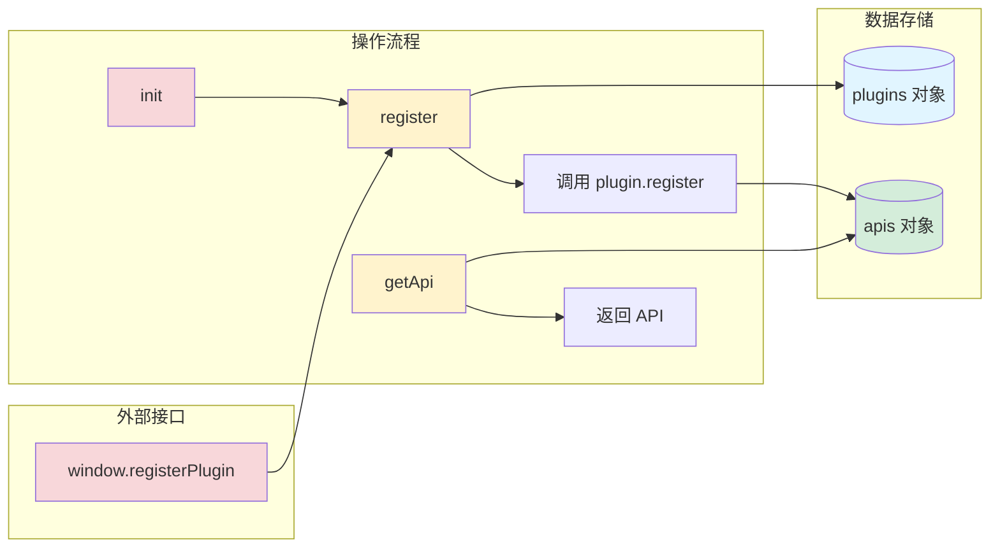

# 插件系统架构详解

## 1. 核心数据结构



**详细说明：**
- **Plugin 接口**：定义了插件的基本结构，包含 `name` 属性用于标识插件，可选的 `register` 方法用于初始化插件并返回 API
- **PluginRegistry**：插件注册表，维护两个核心对象：
  - `plugins`：存储所有已注册的插件实例
  - `apis`：存储插件注册后返回的 API 对象
- **Logger**：日志记录器，用于记录插件系统的运行状态

---

## 2. 插件注册流程



**详细说明：**
1. **调用 register 函数**：传入插件对象和上下文
2. **日志记录**：记录调试信息，包含插件详情
3. **重复检查**：检查插件名是否已注册，防止重复
4. **注册插件**：
   - 将插件存入 `plugins` 对象
   - 如果插件有 `register` 方法，调用它并传入上下文
   - 将 `register` 方法的返回值存入 `apis` 对象
5. **错误处理**：如果插件已存在，记录错误并直接返回

---

## 3. 获取插件 API

```mermaid
flowchart TD
    A[调用 getApi name] --> B{查找 apis[name]}
    B -->|存在 | C[返回 API 对象]
    B -->|不存在 | D[返回 undefined]
    C --> E[调用者使用插件功能]
    D --> F[调用者处理未找到情况]
    
    style A fill:#e1f5ff
    style C fill:#d4edda
    style D fill:#fff3cd
    style E fill:#d4edda
    style F fill:#fff3cd
```

**详细说明：**
- **getApi 函数**：简单的键值查找，通过插件名获取对应的 API
- **返回类型**：使用泛型 `T`，允许调用者指定期望的返回类型
- **使用场景**：其他模块通过 `getApi('pluginName')` 获取插件导出的功能
- **注意事项**：如果插件未注册或没有 `register` 方法，返回 `undefined`

---

## 4. 插件系统初始化流程



**详细说明：**
初始化过程分为三个阶段：

1. **内置插件注册**：
   - 记录初始化日志
   - 遍历传入的插件数组
   - 调用 `register` 函数逐个注册

2. **暴露全局 API**：
   - 在 `window` 对象上挂载 `registerPlugin` 函数
   - 允许外部脚本动态注册插件
   - 自动绑定当前上下文 `ctx`

3. **加载远程插件**：
   - 创建 `<script>` 标签
   - 设置源为 `/api/plugins`
   - 动态加载并执行远程插件代码
   - 远程插件可通过 `window.registerPlugin()` 注册自己

---

## 5. 完整系统交互图



**详细说明：**

这是一个完整的插件生命周期管理系统：

**初始化阶段**：
- 应用启动时调用 `init()` 初始化插件系统
- 注册内置插件（通过参数传入）
- 暴露全局注册接口给外部脚本
- 动态加载远程插件脚本

**运行时阶段**：
- 外部插件脚本加载后，通过 `window.registerPlugin()` 注册自己
- 代码中也可以直接调用 `register()` 函数注册插件
- 注册中心进行统一管理和验证

**注册中心**：
- 检查插件是否重复注册
- 存储插件实例到 `plugins` 对象
- 调用插件的 `register` 方法并存储返回的 API

**使用阶段**：
- 通过 `getApi()` 获取插件导出的功能
- 使用插件提供的 API 完成特定功能

---

## 6. 数据流向图



**详细说明：**

**数据存储结构**：
- `plugins` 对象：键为插件名，值为 Plugin 对象
- `apis` 对象：键为插件名，值为插件 register 方法的返回值

**数据写入流程**：
- `register` 函数同时写入两个对象
- 先存储插件实例，再调用 register 方法获取 API
- `init` 函数批量调用 register

**数据读取流程**：
- `getApi` 函数从 `apis` 对象中读取
- 返回插件暴露的功能接口

**外部接口**：
- `window.registerPlugin` 提供给外部脚本使用
- 内部调用同一个 `register` 函数

---

## 总结

这个插件系统具有以下特点：

1. **简单灵活**：基于对象存储，API 设计简洁
2. **支持热插拔**：可通过动态脚本加载远程插件
3. **类型安全**：使用 TypeScript 泛型提供类型提示
4. **日志完善**：关键操作都有日志记录
5. **防重复注册**：注册前检查，避免冲突
6. **全局可访问**：通过 window 对象暴露注册接口

适用场景：
- 需要扩展功能的应用
- 支持第三方插件的系统
- 模块化架构的前端应用
