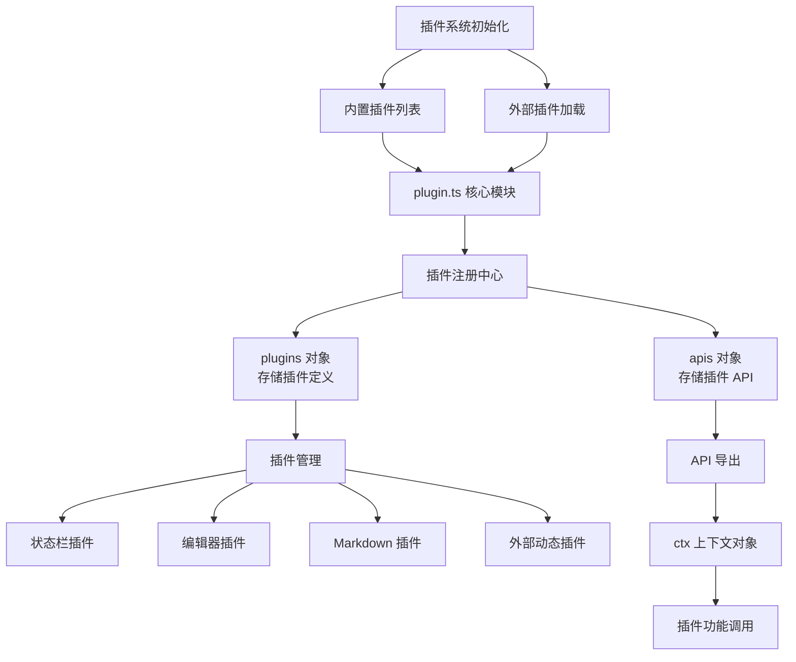
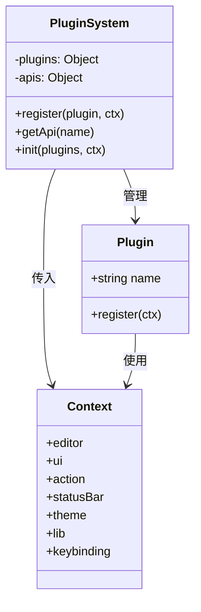
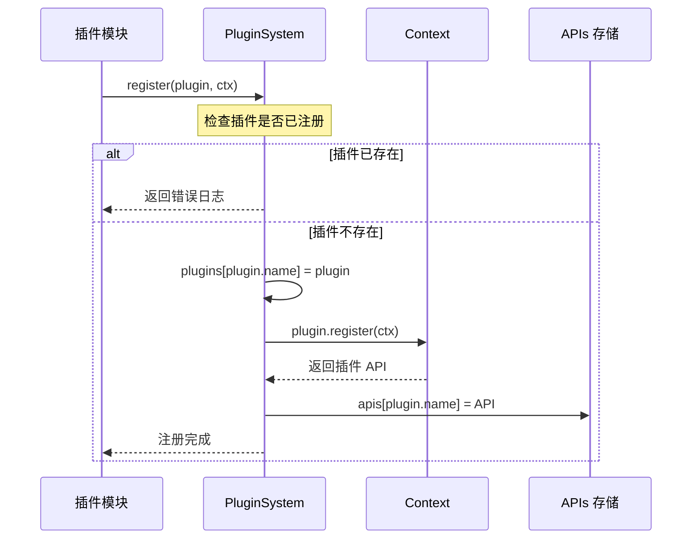
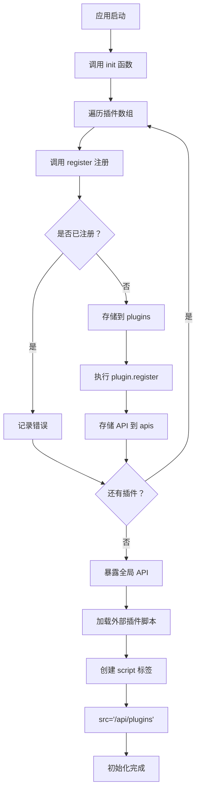
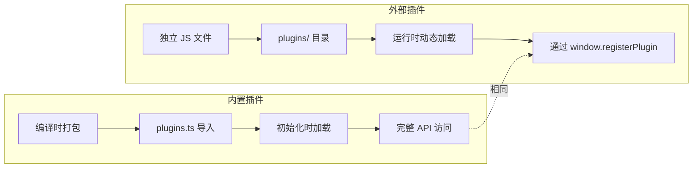
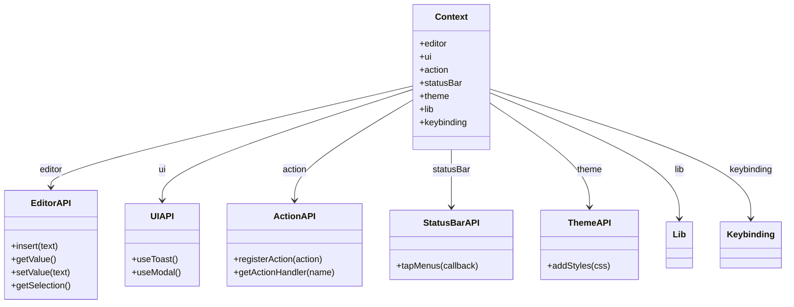
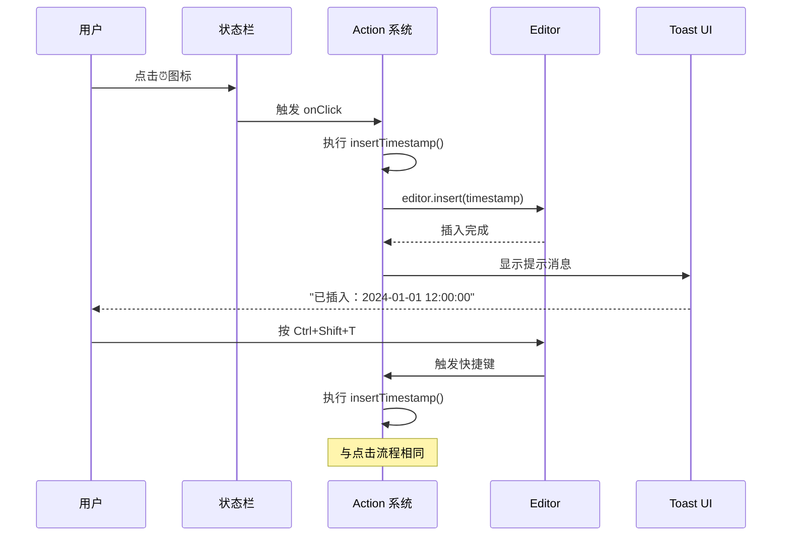
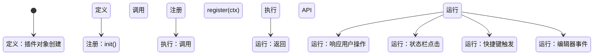

# Cord 插件系统工作原理详解

本文档通过项目中的实际例子，详细讲解 Cord 插件系统的工作原理。

## 目录

- [核心架构](#核心架构)
- [插件注册流程](#插件注册流程)
- [插件初始化过程](#插件初始化过程)
- [内置插件与外部插件](#内置插件与外部插件)
- [插件 API 详解](#插件-api-详解)
- [实战示例分析](#实战示例分析)

---

## 核心架构

### 插件系统整体架构图



### 核心数据结构



**文字讲解：**

插件系统的核心由三个主要部分组成：

1. **Plugin 接口**：每个插件必须包含 `name` 属性和可选的 `register` 方法。`name` 用于唯一标识插件，`register` 方法在插件注册时执行，接收上下文对象并返回插件 API。

2. **PluginSystem 模块**：位于 [`plugin.ts`](file:///c:/LW/code/creator/Cord/src/renderer/core/plugin.ts)，维护两个核心对象：
   - `plugins`：存储所有已注册的插件定义
   - `apis`：存储每个插件通过 `register` 方法返回的 API

3. **Context 上下文对象**：包含插件可以使用的所有功能，如编辑器操作、UI 组件、动作系统等。

---

## 插件注册流程

### 单个插件注册时序图



**文字讲解：**

注册流程分为以下步骤：

1. **调用注册函数**：插件模块调用 `register(plugin, ctx)` 函数，传入插件对象和上下文。

2. **重复检查**：系统首先检查 `plugins[plugin.name]` 是否已存在，防止重复注册。如果已存在，记录错误日志并返回。

3. **存储插件定义**：将插件对象存入 `plugins` 对象，以插件名为键。

4. **执行注册方法**：调用插件的 `register` 方法，传入上下文对象 `ctx`。插件在此阶段可以：
   - 注册 Action（快捷键命令）
   - 添加状态栏菜单
   - 注入自定义样式
   - 使用编辑器 API

5. **保存 API**：将 `register` 方法的返回值存入 `apis` 对象，供其他模块调用。

### 代码示例

查看内置插件列表：[`plugins.ts`](file:///c:/LW/code/creator/Cord/src/renderer/plugins.ts)

```typescript
// 导出所有内置插件
export default [
  buildInRenderers,
  customStyles,
  editorMarkdown,
  markdownMermaid,
  // ... 更多插件
]
```

---

## 插件初始化过程

### 系统初始化流程图



**文字讲解：**

初始化过程是插件系统的启动阶段，包含以下关键步骤：

1. **遍历内置插件**：`init` 函数接收插件数组和上下文对象，遍历所有内置插件。

2. **逐个注册**：对每个插件调用 `register` 函数，执行上述注册流程。

3. **暴露全局 API**：在 `window` 对象上添加 `registerPlugin` 函数，允许外部插件动态注册：
   ```typescript
   window.registerPlugin = (plugin: Plugin) => register(plugin, ctx)
   ```

4. **加载外部插件**：创建 `<script>` 标签，从 `/api/plugins` 路径加载外部插件脚本。这是外部插件机制的核心，允许用户将自定义插件文件放在指定目录，系统自动加载。

5. **异步执行**：外部插件脚本加载后自动执行，调用 `window.registerPlugin` 完成注册。

---

## 内置插件与外部插件

### 插件类型对比图



**文字讲解：**

Cord 支持两种类型的插件：

#### 内置插件

- **位置**：在 [`plugins.ts`](file:///c:/LW/code/creator/Cord/src/renderer/plugins.ts) 中导入并导出
- **加载时机**：应用启动时随主程序一起加载
- **开发流程**：需要修改源代码并重新编译
- **适用场景**：核心功能、官方插件

示例（内置插件结构）：
```typescript
// @fe/plugins/editor-markdown.ts
export default {
  name: 'editor-markdown',
  register: (ctx) => {
    // 插件逻辑
  }
}
```

#### 外部插件

- **位置**：`plugins/` 目录下的独立 `.js` 文件
- **加载时机**：运行时通过 HTTP 请求加载
- **开发流程**：直接编辑 JS 文件，重新加载即可
- **适用场景**：用户自定义功能、第三方扩展

示例（外部插件结构）：见 [`plugin-insert-timestamp.js`](file:///c:/LW/code/creator/Cord/example-plugins/plugin-insert-timestamp.js)

---

## 插件 API 详解

### Context 上下文对象结构图



**文字讲解：**

`ctx` 上下文对象是插件与系统交互的桥梁，包含以下核心 API：

#### 1. editor - 编辑器操作
- `insert(text)`：在光标位置插入文本
- `getValue()`：获取编辑器全部内容
- `setValue(text)`：设置编辑器内容
- `getSelection()`：获取选中文本

#### 2. ui - UI 组件
- `useToast().show(type, message)`：显示提示消息
- `useModal().alert(options)`：显示对话框

#### 3. action - 动作系统
- `registerAction({name, description, keys, handler})`：注册快捷键命令
- `getActionHandler(name)`：获取动作处理函数

#### 4. statusBar - 状态栏
- `tapMenus(callback)`：添加状态栏菜单项

#### 5. theme - 主题样式
- `addStyles(css)`：注入自定义 CSS

#### 6. lib - 工具库
- `dayjs`：日期时间处理
- 其他实用工具

#### 7. keybinding - 快捷键定义
- `Ctrl`、`Shift`、`Alt` 等修饰键

---

## 实战示例分析

### 示例 1：时间戳插件工作流程



**文字讲解：**

[`plugin-insert-timestamp.js`](file:///c:/LW/code/creator/Cord/example-plugins/plugin-insert-timestamp.js) 展示了完整的插件开发模式：

1. **多格式支持**：定义了 5 种时间格式，用户可以切换选择。

2. **双触发方式**：
   - 状态栏菜单点击
   - 快捷键 `Ctrl+Shift+T`

3. **用户反馈**：插入后通过 Toast 显示确认消息。

4. **状态栏集成**：
   ```javascript
   ctx.statusBar.tapMenus(menus => {
     menus['insert-timestamp'] = {
       id: 'insert-timestamp',
       title: '⏰',
       list: formats.map(...)  // 下拉菜单
     }
   })
   ```

### 示例 2：字数统计插件工作流程

```mermaid
flowchart TD
    Start[文档打开/编辑] --> Trigger[触发统计]
    
    Trigger --> Click{触发方式？}
    Click -->|状态栏点击 | GetVal[ctx.editor.getValue]
    Click -->|快捷键 Ctrl+Shift+W | GetVal
    
    GetVal --> Count[调用 countWords]
    
    Count --> Chinese[统计中文字符<br/>/[\u4e00-\u9fa5]/g]
    Count --> English[统计英文单词<br/>/[a-zA-Z]+/g]
    Count --> Total[计算总字符数]
    Count --> Time[估算阅读时间]
    
    Chinese --> Result[返回统计结果]
    English --> Result
    Total --> Result
    Time --> Result
    
    Result --> Show[显示模态框]
    Show --> End[用户查看]
```

**文字讲解：**

[`plugin-word-counter.js`](file:///c:/LW/code/creator/Cord/example-plugins/plugin-word-counter.js) 展示了数据处理类插件的开发模式：

1. **正则表达式统计**：
   - 中文字符：`/[\u4e00-\u9fa5]/g`
   - 英文单词：`/[a-zA-Z]+/g`

2. **阅读时间估算**：
   - 中文：400 字/分钟
   - 英文：200 词/分钟
   - 公式：`Math.ceil((chinese / 400) + (english / 200))`

3. **模态框展示**：使用 `ctx.ui.useModal().alert()` 显示详细统计。

4. **状态栏快捷入口**：点击状态栏直接打开统计。

---

## 插件开发最佳实践

### 插件生命周期图



**文字讲解：**

插件的生命周期包含以下阶段：

1. **定义阶段**：创建包含 `name` 和 `register` 的对象。

2. **注册阶段**：系统调用 `register` 函数，传入上下文。

3. **执行阶段**：在 `register` 方法中完成初始化：
   - 注册 Action
   - 添加状态栏菜单
   - 注入样式
   - 绑定事件监听器

4. **运行阶段**：插件持续响应用户操作，如快捷键、菜单点击等。

### 命名规范

```mermaid
graph TD
    A[插件命名] --> B[内置插件<br/>kebab-case]
    A --> C[外部插件<br/>plugin-xxx.js]
    
    B --> D[@fe/plugins/xxx]
    B --> E[name: 'xxx']
    
    C --> F[plugins/xxx.js]
    C --> G[name: 'plugin-xxx']
    
    H[Action 命名] --> I[内置<br/>module.action]
    H --> J[外部<br/>plugin.xxx.action]
```

**文字讲解：**

1. **插件名称**：
   - 内置插件使用模块名，如 `editor-markdown`
   - 外部插件建议以 `plugin-` 前缀，避免冲突

2. **Action 名称**：
   - 内置插件：`module.action`（如 `editor.insert`）
   - 外部插件：`plugin.xxx.action`（如 `plugin.insert-timestamp.now`）

3. **文件命名**：
   - 内置插件：`@fe/plugins/xxx.ts`
   - 外部插件：`plugins/plugin-xxx.js`

---

## 总结

Cord 的插件系统设计遵循以下核心原则：

1. **简单性**：插件只需定义 `name` 和 `register` 方法
2. **一致性**：内置和外部插件使用相同的 API
3. **扩展性**：通过 `window.registerPlugin` 支持动态加载
4. **隔离性**：每个插件有独立的命名空间
5. **易用性**：提供丰富的上下文 API

通过本文档的学习，您应该能够：
- ✅ 理解插件系统的整体架构
- ✅ 掌握插件注册和初始化流程
- ✅ 区分内置插件和外部插件的使用场景
- ✅ 使用 Context API 开发自定义插件
- ✅ 参考示例创建自己的插件

下一步，您可以尝试修改示例插件或创建全新的插件来实践所学知识！
