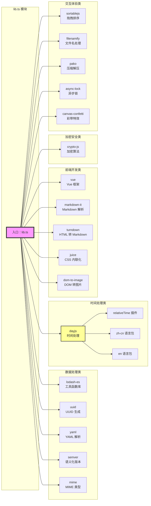
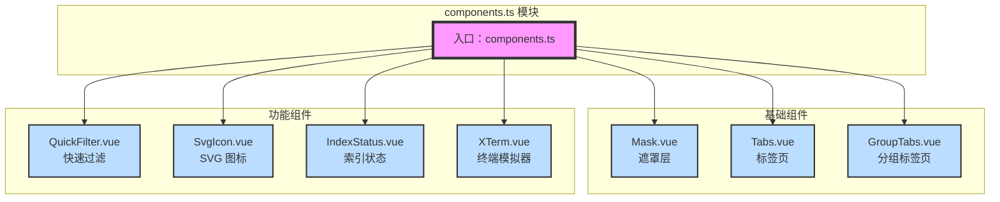
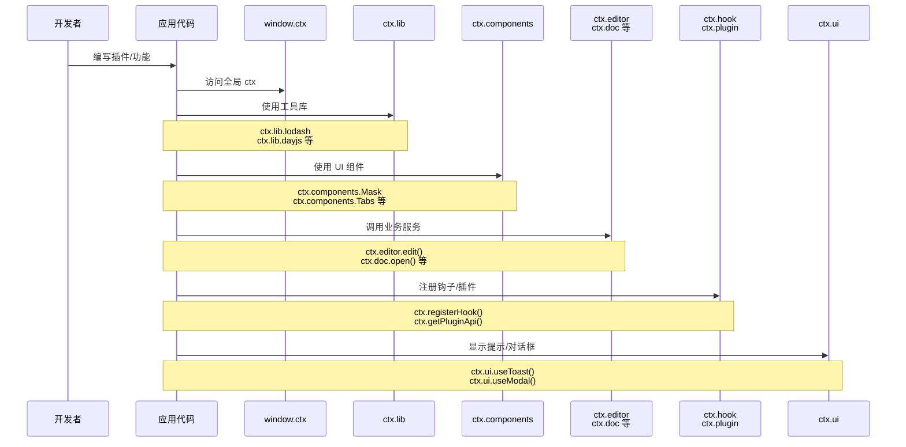
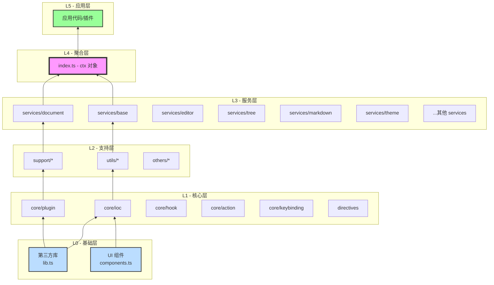

# Cord Context 模块架构讲解

## 1. 整体架构图

```mermaid
graph TB
    subgraph "Context 入口 (index.ts)"
        ctx[ctx 对象 - 全局上下文]
        win[window.ctx]
    end

    subgraph "工具库模块 (lib.ts)"
        lib[lib 导出对象]
        lodash[lodash-es]
        vue[vue]
        uuid[uuid]
        yaml[yaml]
        semver[semver]
        dayjs[dayjs]
        cryptojs[crypto-js]
        turndown[turndown]
        juice[juice]
        sortablejs[sortablejs]
        filenamify[filenamify]
        mime[mime]
        markdownit[markdown-it]
        domtoimage[dom-to-image]
        pako[pako]
        asynclock[async-lock]
        confetti[canvas-confetti]
    end

    subgraph "组件模块 (components.ts)"
        comp[components 导出对象]
        Mask[Mask.vue]
        Tabs[Tabs.vue]
        GroupTabs[GroupTabs.vue]
        QuickFilter[QuickFilter.vue]
        SvgIcon[SvgIcon.vue]
        IndexStatus[IndexStatus.vue]
        XTerm[Xterm.vue]
    end

    subgraph "核心服务层"
        ioc[core/ioc - 控制反转]
        plugin[core/plugin - 插件系统]
        hook[core/hook - 钩子系统]
        action[core/action - 动作系统]
        keybinding[core/keybinding - 键位绑定]
        directives[directives - 指令集]
    end

    subgraph "服务层"
        base[services/base]
        workbench[services/workbench]
        doc[services/document]
        view[services/view]
        tree[services/tree]
        markdown[services/markdown]
        statusBar[services/status-bar]
        layout[services/layout]
        editor[services/editor]
        theme[services/theme]
        setting[services/setting]
        i18n[services/i18n]
        runner[services/runner]
        renderer[services/renderer]
        exportDoc[services/export]
        routines[services/routines]
        indexer[services/indexer]
        repo[services/repo]
    end

    subgraph "支持模块"
        storage[utils/storage]
        utils[utils/index]
        env[support/env]
        store[support/store]
        api[support/api]
        embed[support/embed]
        args[support/args]
    end

    subgraph "UI 工具"
        ui[UI 工具集]
        toast[useToast]
        modal[useModal]
        quickFilter[useQuickFilter]
        fixedFloat[useFixedFloat]
        contextMenu[useContextMenu]
    end

    subgraph "其他模块"
        premium[others/premium]
        extension[others/extension]
    end

    ctx --> lib
    ctx --> comp
    ctx --> directives
    ctx --> ioc
    ctx --> base
    ctx --> api
    ctx --> args
    ctx --> store
    ctx --> action
    ctx --> doc
    ctx --> keybinding
    ctx --> tree
    ctx --> workbench
    ctx --> markdown
    ctx --> statusBar
    ctx --> runner
    ctx --> renderer
    ctx --> layout
    ctx --> editor
    ctx --> view
    ctx --> theme
    ctx --> storage
    ctx --> embed
    ctx --> setting
    ctx --> i18n
    ctx --> env
    ctx --> utils
    ctx --> routines
    ctx --> indexer
    ctx --> repo
    ctx --> ui
    ctx --> premium
    ctx --> extension

    win -.->|Object.defineProperty| ctx

    lib --> lodash
    lib --> vue
    lib --> uuid
    lib --> yaml
    lib --> semver
    lib --> dayjs
    lib --> cryptojs
    lib --> turndown
    lib --> juice
    lib --> sortablejs
    lib --> filenamify
    lib --> mime
    lib --> markdownit
    lib --> domtoimage
    lib --> pako
    lib --> asynclock
    lib --> confetti

    comp --> Mask
    comp --> Tabs
    comp --> GroupTabs
    comp --> QuickFilter
    comp --> SvgIcon
    comp --> IndexStatus
    comp --> XTerm

    ui --> toast
    ui --> modal
    ui --> quickFilter
    ui --> fixedFloat
    ui --> contextMenu

    style ctx fill:#f9f,stroke:#333,stroke-width:4px
    style win fill:#bbf,stroke:#333,stroke-width:2px
    style lib fill:#bdf,stroke:#333,stroke-width:2px
    style comp fill:#bdf,stroke:#333,stroke-width:2px
    style ui fill:#bdf,stroke:#333,stroke-width:2px
```



### 架构图讲解

这是一个典型的**前端应用上下文（Context）架构**，采用了**模块化设计**和**全局单例模式**。

**核心设计理念：**

1. **全局访问点**：通过 `window.ctx` 提供一个全局不变的上下文对象，所有模块都可以通过 `ctx` 访问
2. **模块化组织**：将功能分为多个明确的模块类别（工具库、组件、服务、UI 等）
3. **不可变性**：使用 `Object.freeze()` 确保 ctx 对象不会被意外修改
4. **类型安全**：导出 `Ctx` 和 `Plugin` 类型定义，支持 TypeScript 类型检查

**模块层次：**
- **基础层**：lib（第三方库）、components（UI 组件）、directives（Vue 指令）
- **核心层**：ioc、plugin、hook、action、keybinding（框架核心功能）
- **服务层**：各种 services（文档、编辑器、主题等业务服务）
- **支持层**：utils、store、api、env（工具和支持功能）
- **UI 层**：toast、modal 等 UI 工具
- **其他**：premium（付费功能）、extension（扩展管理）

---

## 2. Lib 模块（第三方工具库）结构图



### Lib 模块讲解

**lib.ts** 是一个**第三方工具库聚合模块**，提供了 19 个常用的 JavaScript 库。

**模块分类：**

1. **数据处理类**（5 个库）：
   - `lodash-es`：JavaScript 工具函数库，提供数组、对象、字符串等常用操作
   - `uuid`：生成 UUID（通用唯一标识符）
   - `yaml`：YAML 文件的解析和序列化
   - `semver`：语义化版本号比较和解析
   - `mime`：MIME 类型识别和处理

2. **时间处理类**（1 个核心库 + 插件）：
   - `dayjs`：轻量级时间处理库
   - 配置了 `relativeTime` 插件（相对时间显示）
   - 支持中英文语言包（zh-cn、en）
   - **特殊处理**：根据应用语言自动切换 dayjs 语言，并注册了语言变更钩子

3. **前端开发类**（5 个库）：
   - `vue`：Vue.js 框架核心
   - `markdown-it`：Markdown 解析器
   - `turndown`：HTML 转 Markdown 工具
   - `juice`：将 CSS 样式内联到 HTML 标签（用于邮件等场景）
   - `dom-to-image`：将 DOM 节点转换为图片

4. **加密安全类**（1 个库）：
   - `crypto-js`：加密算法库（MD5、SHA、AES 等）

5. **交互体验类**（5 个库）：
   - `sortablejs`：拖拽排序功能
   - `filenamify`：将字符串转换为合法文件名
   - `pako`：Gzip 压缩/解压库
   - `async-lock`：异步锁，控制并发
   - `canvas-confetti`：彩带庆祝特效

**设计亮点：**
- 所有库都使用 `export * as` 或 `export { default as }` 统一导出
- dayjs 做了特殊配置：自动根据应用语言切换，并监听语言变更事件
- 使用 ES 模块版本（如 lodash-es）支持 tree-shaking

---

## 3. Components 模块（UI 组件）结构图



### Components 模块讲解

**components.ts** 是一个**UI 组件聚合模块**，导出 7 个可复用的 Vue 组件。

**组件分类：**

1. **基础组件**（3 个）：
   - `Mask.vue`：遮罩层组件，用于模态框、加载状态等场景的背景遮罩
   - `Tabs.vue`：标签页组件，实现多标签切换功能
   - `GroupTabs.vue`：分组标签页，支持标签分组的增强版 Tabs

2. **功能组件**（4 个）：
   - `QuickFilter.vue`：快速过滤组件，提供搜索过滤 UI
   - `SvgIcon.vue`：SVG 图标组件，统一管理 SVG 图标
   - `IndexStatus.vue`：索引状态组件，显示文档索引状态
   - `XTerm.vue`：终端模拟器组件，基于 xterm.js 的终端界面

**设计特点：**
- 所有组件都来自 `@fe/components` 路径
- 使用默认导出（`export { default as }`）
- 组件命名采用 PascalCase（大驼峰命名法）
- 覆盖了基础 UI、交互、状态展示、终端等多个场景

---

## 4. Index.ts 核心模块依赖关系图

```mermaid
graph TB
    subgraph "导入模块"
        A1[utils/storage]
        A2[utils/index]
        A3[others/premium]
        A4[others/extension]
        A5[core/ioc]
        A6[core/plugin]
        A7[core/hook]
        A8[core/action]
        A9[core/keybinding]
        A10[support/ui/toast]
        A11[support/ui/modal]
        A12[support/ui/quick-filter]
        A13[support/ui/fixed-float]
        A14[support/ui/context-menu]
        A15[support/env]
        A16[support/store]
        A17[services/base]
        A18[services/workbench]
        A19[support/api]
        A20[support/embed]
        A21[support/args]
        A22[services/document]
        A23[services/view]
        A24[services/tree]
        A25[services/markdown]
        A26[services/status-bar]
        A27[services/layout]
        A28[services/editor]
        A29[services/theme]
        A30[services/setting]
        A31[services/i18n]
        A32[services/runner]
        A33[services/renderer]
        A34[services/export]
        A35[services/routines]
        A36[directives]
        A37[services/indexer]
        A38[services/repo]
        A39[./lib]
        A40[./components]
    end

    subgraph "ctx 对象构建"
        B[ctx 对象<br/>Object.freeze]
    end

    subgraph "全局注册"
        C[window.ctx<br/>Object.defineProperty]
    end

    subgraph "类型导出"
        D1[Ctx 类型]
        D2[Plugin 类型]
    end

    A1 --> B
    A2 --> B
    A3 --> B
    A4 --> B
    A5 --> B
    A6 --> B
    A7 --> B
    A8 --> B
    A9 --> B
    A10 --> B
    A11 --> B
    A12 --> B
    A13 --> B
    A14 --> B
    A15 --> B
    A16 --> B
    A17 --> B
    A18 --> B
    A19 --> B
    A20 --> B
    A21 --> B
    A22 --> B
    A23 --> B
    A24 --> B
    A25 --> B
    A26 --> B
    A27 --> B
    A28 --> B
    A29 --> B
    A30 --> B
    A31 --> B
    A32 --> B
    A33 --> B
    A34 --> B
    A35 --> B
    A36 --> B
    A37 --> B
    A38 --> B
    A39 --> B
    A40 --> B

    B --> C
    B --> D1
    B --> D2

    style B fill:#f9f,stroke:#333,stroke-width:4px
    style C fill:#bbf,stroke:#333,stroke-width:3px
    style D1 fill:#9f9,stroke:#333,stroke-width:2px
    style D2 fill:#9f9,stroke:#333,stroke-width:2px
```



### Index.ts 核心模块讲解

**index.ts** 是整个 context 模块的**核心入口**，负责整合所有模块并暴露给全局。

**代码流程：**

1. **导入阶段**（39 个导入）：
   - 工具类：storage、utils
   - 核心模块：ioc、plugin、hook、action、keybinding、directives
   - UI 工具：toast、modal、quick-filter、fixed-float、context-menu
   - 服务层：21 个 services（文档、编辑器、主题等）
   - 支持模块：env、store、api、embed、args
   - 其他：premium、extension
   - 本地模块：lib、components

2. **构建 ctx 对象**：
   ```typescript
   const ctx = Object.freeze({
     lib,
     components,
     directives,
     ioc,
     base,
     api,
     // ... 等 40+ 个模块
     ui: { useToast, useModal, useQuickFilter, useFixedFloat, useContextMenu },
     registerHook: hook.registerHook,
     removeHook: hook.removeHook,
     triggerHook: hook.triggerHook,
     showPremium,
     getPremium: () => getPurchased(),
     showExtensionManager: extension.showManager,
     getExtensionLoadStatus: extension.getLoadStatus,
     getExtensionInitialized: extension.getInitialized,
     whenExtensionInitialized: extension.whenInitialized,
     getPluginApi: plugin.getApi,
     version: __APP_VERSION__,
   })
   ```

3. **全局注册**：
   ```typescript
   Object.defineProperty(window, 'ctx', {
     configurable: false,
     writable: false,
     value: ctx,
   })
   ```

4. **类型导出**：
   - `Ctx`：ctx 对象的 TypeScript 类型
   - `Plugin`：插件类型定义

**特殊处理：**
- `ui` 对象：将 5 个 UI hook 函数组合成一个对象
- `registerHook/removeHook/triggerHook`：直接暴露 hook 模块的核心函数
- `showPremium/getPremium`：付费功能的快捷访问
- `getExtension*` 系列：扩展管理的快捷访问
- `getPluginApi`：获取插件 API
- `version`：应用版本号

**设计模式：**
- **单例模式**：ctx 对象全局唯一
- **外观模式**：提供统一的简化接口访问复杂子系统
- **不可变模式**：使用 Object.freeze() 防止意外修改

---

## 5. 数据流和调用关系图



### 数据流讲解

这是一个**典型的插件化应用调用流程**。

**调用层次：**

1. **开发者**：编写插件或应用功能代码
2. **应用代码**：通过 `ctx` 访问各种功能
3. **ctx 对象**：作为统一入口，分发到各个模块
4. **具体模块**：
   - **工具库层**：提供基础能力（lodash、dayjs 等）
   - **组件层**：提供 UI 组件（Mask、Tabs 等）
   - **服务层**：提供业务逻辑（editor、doc、tree 等）
   - **核心层**：提供框架能力（hook、plugin、ioc 等）
   - **UI 工具层**：提供便捷 UI（toast、modal 等）

**使用示例：**
```typescript
// 1. 使用工具库
const result = ctx.lib.lodash.map([1, 2, 3], x => x * 2)
const time = ctx.lib.dayjs().format('YYYY-MM-DD')

// 2. 使用组件（在 Vue 中）
import { Mask } from 'ctx.components'

// 3. 调用服务
await ctx.editor.setContent('new content')
ctx.tree.selectNode('file-id')

// 4. 注册钩子
ctx.registerHook('DOCUMENT_SAVE', async (doc) => {
  // 保存前的处理
})

// 5. 显示 UI 提示
ctx.ui.useToast().show({ message: '保存成功', type: 'success' })
```

---

## 6. 模块依赖层次图



### 模块依赖层次讲解

整个 context 模块采用了**清晰的分层架构**，共分为 6 层：

**L0 - 基础层**：
- 第三方库和 UI 组件
- 不依赖其他内部模块
- 提供最基础的能力

**L1 - 核心层**：
- 框架核心功能（IOC、插件、钩子等）
- 依赖基础层
- 提供扩展机制

**L2 - 支持层**：
- 工具函数、状态管理、环境配置等
- 为核心层和服务层提供支持
- 包含扩展管理、付费功能等

**L3 - 服务层**：
- 业务服务层
- 实现具体业务逻辑
- 依赖下层提供的基础和核心能力

**L4 - 聚合层**：
- index.ts 整合所有模块
- 创建 ctx 对象
- 注册到全局 window

**L5 - 应用层**：
- 应用代码和插件
- 通过 ctx 访问所有功能

**依赖规则：**
- 上层可以依赖下层
- 下层不能依赖上层
- 同层之间尽量避免循环依赖

这种分层设计确保了：
- ✅ 清晰的职责划分
- ✅ 易于维护和测试
- ✅ 良好的可扩展性
- ✅ 避免循环依赖

---

## 总结

**Cord Context 模块**是一个设计精良的前端应用架构，具有以下特点：

1. **统一入口**：通过 `window.ctx` 提供全局访问点
2. **模块化**：清晰的模块划分（lib、components、services 等）
3. **类型安全**：完整的 TypeScript 类型定义
4. **不可变性**：使用 Object.freeze() 保护核心对象
5. **分层架构**：6 层清晰的依赖关系
6. **插件化**：内置完善的插件系统（hook、plugin、ioc）
7. **丰富的工具集**：集成 19+ 个第三方库
8. **UI 组件化**：7 个可复用 UI 组件
9. **服务化**：21+ 个业务服务模块

这种设计使得应用具有**高内聚、低耦合**的特性，便于开发、维护和扩展。
