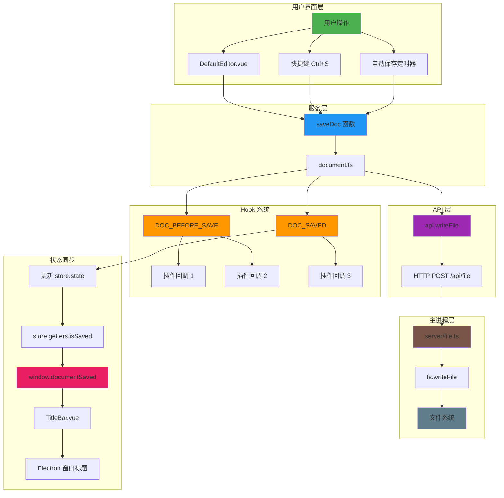
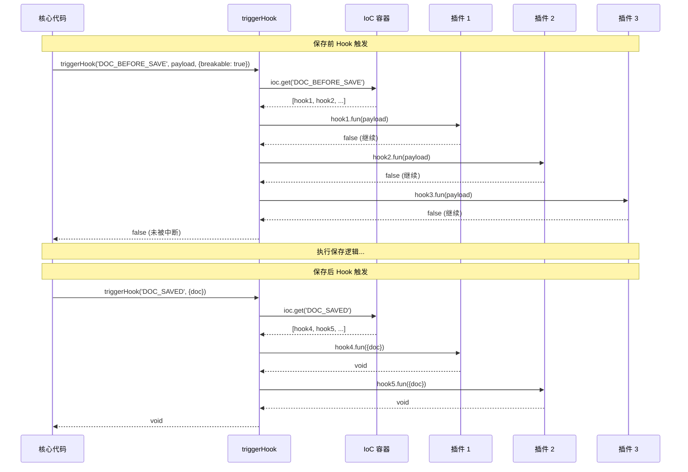

# 保存文档插件全链路实现详解

> 本文档深入讲解 Cord 项目中保存文档插件的完整实现，从用户界面层到底层文件系统，涵盖所有核心技术点。

## 目录

- [一、整体架构概览](#一整体架构概览)
- [二、核心服务层详细流程](#二核心服务层详细流程)
- [三、Hook 机制和插件系统](#三 hook 机制和插件系统)
- [四、底层 API 和文件系统交互](#四底层 api 和文件系统交互)
- [五、Dirty State 检测机制](#五 dirty-state-检测机制)
- [六、完整实现总结](#六完整实现总结)

---

## 一、整体架构概览

### 架构图



### 架构层次说明

这个架构图展示了保存文档的完整流程，分为 6 个层次：

1. **用户界面层**：用户通过三种方式触发保存
   - 直接在 [DefaultEditor.vue](file://c:\LW\code\creator\Cord\src\renderer\components\DefaultEditor.vue) 组件中调用保存函数
   - 按下 Ctrl+S 快捷键
   - 自动保存定时器触发

2. **服务层**：[saveDoc](file://c:\LW\code\creator\Cord\src\renderer\services\document.ts#L645-L654) 函数是核心入口，位于 [`document.ts`](c:\LW\code\creator\Cord\src\renderer\services\document.ts) 中，负责协调整个保存流程

3. **Hook 系统**：在保存前后触发钩子，允许插件系统介入
   - `DOC_BEFORE_SAVE`：保存前，可修改内容或阻止保存
   - `DOC_SAVED`：保存后，通知插件进行后续处理

4. **API 层**：通过 HTTP 请求与主进程通信

5. **主进程层**：实际执行文件系统写入操作

6. **状态同步**：保存完成后更新全局状态，同步到 UI 和 Electron 窗口

---

## 二、核心服务层详细流程

### 流程图

```mermaid
flowchart TD
    Start[用户触发保存] --> A[saveDoc 函数]
    A --> B[获取 AsyncLock 锁]
    B --> C[_saveDoc 内部函数]
    
    C --> D{doc.plain?}
    D -->|否 | E[记录警告日志]
    E --> F[直接返回]
    
    D -->|是 | G[创建 payload 对象<br/>{doc, content}]
    G --> H[触发 DOC_BEFORE_SAVE hook]
    
    H --> I{hook 返回 true?<br/>breakable: true}
    I -->|是 | J[中断保存流程]
    I -->|否 | K[从 payload 提取<br/>doc 和 content]
    
    K --> L{isEncrypted?}
    L -->|是 | M[弹出密码输入框]
    M --> N{用户取消？}
    N -->|是 | O[返回]
    N -->|否 | P[encrypt 加密内容]
    P --> Q{passwordHash 匹配？}
    Q -->|否 | R[确认对话框]
    R --> S{用户确认？}
    S -->|否 | O
    S -->|是 | T[准备发送内容]
    Q -->|是 | T
    L -->|否 | T
    
    T --> U[api.writeFile<br/>写入文件]
    U --> V{写入成功？}
    V -->|否 | W[设置 status='save-failed']
    W --> X[显示错误 Toast]
    X --> Y[抛出错误]
    
    V -->|是 | Z[更新 doc 对象<br/>stat/content/passwordHash<br/>contentHash/status='saved']
    Z --> AA[触发 DOC_SAVED hook]
    AA --> AB[释放锁]
    AB --> AC[保存完成]
    
    Y --> AD[catch 错误]
    AD --> AB
    
    style Start fill:#4CAF50
    style A fill:#2196F3
    style C fill:#2196F3
    style H fill:#FF9800
    style U fill:#9C27B0
    style Z fill:#4CAF50
    style AA fill:#FF9800
    style AC fill:#607D8B
```

### 1. saveDoc 函数（第 645-654 行）

**文件位置**: [`document.ts`](c:\LW\code\creator\Cord\src\renderer\services\document.ts#L645-L654)

```typescript
export async function saveDoc (doc: Doc, content: string): Promise<void> {
  return lock.acquire('saveDoc', async (done) => {
    try {
      await _saveDoc(doc, content)
      done()
    } catch (e: any) {
      done(e)
    }
  })
}
```

**核心作用**:
- 使用 `AsyncLock` 确保同一时间只有一个保存操作在进行
- 防止并发保存导致的数据竞争
- 包装 [_saveDoc](file://c:\LW\code\creator\Cord\src\renderer\services\document.ts#L585-L638) 内部函数，提供错误处理

**为什么需要锁？**

场景 1：用户快速连续按 Ctrl+S
```
t=0ms: 用户按下 Ctrl+S → saveDoc 调用
t=10ms: 第二次按下 Ctrl+S → 如果无锁，会并发执行
t=50ms: 第一次保存完成
t=60ms: 第二次保存完成 → 可能覆盖第一次的修改
```

场景 2：自动保存 + 手动保存冲突
```
t=0ms: 自动保存定时器触发
t=5ms: 用户按下 Ctrl+S
t=10ms: 两个保存操作同时执行 → 数据竞争
```

### 2. _saveDoc 内部函数（第 585-638 行）

这是保存逻辑的核心实现，分为以下几个阶段：

#### 阶段 1：前置检查

```typescript
if (!doc.plain) {
  logger.warn('saveDoc', 'is not plain doc')
  return
}
```

- 只保存纯文本文件（`plain = true`）
- 非纯文本文件（如二进制文件）不处理

#### 阶段 2：DOC_BEFORE_SAVE Hook

```typescript
const payload = { doc, content }
await triggerHook('DOC_BEFORE_SAVE', payload, { breakable: true })
doc = payload.doc
content = payload.content
```

**为什么 payload 是对象引用？**
- Hook 可以修改 `payload.doc` 和 `payload.content`
- 实现保存前的内容拦截和修改
- `breakable: true` 允许 Hook 返回 `true` 中断保存

#### 阶段 3：加密处理

```typescript
if (isEncrypted(doc)) {
  const password = await inputPassword(t('document.password-save'), doc.name)
  if (!password) {
    return
  }

  const encrypted = encrypt(sendContent, password)
  if (doc.passwordHash !== encrypted.passwordHash) {
    if (!(await useModal().confirm({...}))) {
      return
    }
  }

  sendContent = encrypted.content
  passwordHash = encrypted.passwordHash
}
```

**加密流程**:
1. 检测文件是否为 `.c.md` 加密文件
2. 弹出密码输入框
3. 使用密码加密内容
4. 如果密码哈希值变化，显示确认对话框（防止用户忘记密码）
5. 发送加密后的内容和新的密码哈希

#### 阶段 4：文件写入

```typescript
const { hash, stat } = await api.writeFile(doc, sendContent)
Object.assign(doc, {
  stat,
  content,
  passwordHash,
  contentHash: hash,
  status: 'saved'
})
```

**更新 doc 对象的属性**:
- `stat`: 文件统计信息（大小、修改时间等）
- `content`: 原始内容（用于后续比较）
- `passwordHash`: 密码哈希（用于验证）
- `contentHash`: MD5 哈希值（用于检测文件变化）
- `status`: 设置为 `'saved'`

#### 阶段 5：DOC_SAVED Hook

```typescript
triggerHook('DOC_SAVED', { doc: store.state.currentFile! })
```

**通知插件系统**:
- 文件已成功保存
- 插件可以执行后续操作（如记录最近文档、同步到云端等）

#### 阶段 6：错误处理

```typescript
catch (error: any) {
  Object.assign(doc, { status: 'save-failed' })
  useToast().show('warning', error.message)
  throw error
}
```

---

## 三、Hook 机制和插件系统

### 时序图



### 1. Hook 系统核心实现

**文件位置**: [`hook.ts`](c:\LW\code\creator\Cord\src\renderer\core\hook.ts)

```typescript
export async function triggerHook<T extends HookTypeWithPayload> (
  type: T, 
  arg: BuildInHookTypes[T], 
  options?: { breakable?: boolean, ignoreError?: boolean }
): Promise<boolean | void> {
  const items: Hook<any>[] = ioc.get(type)
  
  for (const { fun, once } of items) {
    once && removeHook<any>(type, fun)
    
    try {
      if (options?.breakable) {
        if (await fun(arg)) {
          logger.debug('triggerHook', 'break', fun)
          return true  // 被中断
        }
      } else {
        fun(arg)
      }
    } catch (error) {
      if (options?.ignoreError) {
        console.warn('triggerHook', error)
      } else {
        throw error
      }
    }
  }

  if (options?.breakable) {
    return false  // 未被中断
  }
}
```

**关键点**:
- 从 IoC 容器获取指定类型的所有 Hook
- 依次执行每个 Hook 函数
- `once: true` 的 Hook 执行后立即移除
- `breakable: true` 时，Hook 返回 `true` 会中断链式调用
- 错误处理：根据 `ignoreError` 选项决定是否抛出

### 2. 插件注册示例

#### 示例 1：记录最近文档插件

**文件位置**: [`record-recent-document.ts`](c:\LW\code\creator\Cord\src\renderer\plugins\record-recent-document.ts)

```typescript
export default {
  name: 'record-recent-document',
  register: (ctx) => {
    if (!ctx.env.isElectron) {
      return
    }

    ctx.registerHook('DOC_SAVED', ({ doc }) => {
      setTimeout(() => {
        if (ctx.doc.isMarkdownFile(doc) && doc.absolutePath) {
          let path = doc.absolutePath

          if (ctx.env.isWindows) {
            path = path.replaceAll('/', '\\')
          }

          ctx.env.getElectronRemote().app.addRecentDocument(path)
        }
      }, 0)
    })
  }
} as Plugin
```

**功能**:
- 在文件保存后，将文件添加到 Electron 的最近文档列表
- 仅在 Electron 环境下运行
- Windows 系统需要转换路径分隔符

#### 示例 2：编辑器状态恢复插件

**文件位置**: [`editor-restore-state.ts`](c:\LW\code\creator\Cord\src\renderer\plugins\editor-restore-state.ts)

```typescript
registerHook('DOC_BEFORE_SWITCH', () => {
  ctx.editor.whenEditorReady().then(({ editor }) => {
    const uri = editor.getModel()?.uri
    if (!uri) return
    const viewState = editor.saveViewState()
    saveState(uri, viewState)
  })
})
```

**功能**:
- 在文档切换前保存编辑器视图状态（滚动位置、光标位置等）
- 使用 localStorage 持久化存储
- 下次打开时恢复视图状态

### 3. Hook 类型定义

Hook 的类型安全由 `BuildInHookTypes` 保证：

```typescript
type BuildInHookTypes = {
  DOC_BEFORE_SAVE: { doc: Doc, content: string },
  DOC_SAVED: { doc: Doc },
  DOC_BEFORE_SWITCH: { doc: Doc | null, opts?: SwitchDocOpts },
  DOC_SWITCHED: { doc: Doc | null, opts?: SwitchDocOpts },
  // ... 更多 hook 类型
}
```

**类型安全的优势**:
- IDE 自动补全 Hook 名称
- 回调参数类型自动推断
- 触发时参数类型检查

---

## 四、底层 API 和文件系统交互

### 时序图

```mermaid
sequenceDiagram
    participant Renderer as 渲染进程
    participant API as api.writeFile
    participant HTTP as HTTP 客户端
    participant Server as 主进程服务器
    participant FS as 文件系统

    Renderer->>API: writeFile(doc, content)
    API->>API: 构建请求参数<br/>{repo, path, content,<br/>oldHash: contentHash, asBase64}
    
    API->>HTTP: POST /api/file<br/>JSON payload
    
    HTTP->>Server: Koa 中间件处理
    Server->>Server: wrapper 包装函数
    
    Server->>Server: file.write(repo, path, content)
    
    Note over Server: withRepo 解析路径
    Server->>Server: 根据 repo 名称<br/>解析到本地实际路径
    
    Server->>FS: fs.ensureFile(filePath)
    FS-->>Server: 创建文件（如不存在）
    
    Server->>FS: fs.writeFile(filePath, content)
    FS-->>Server: 写入成功
    
    Note over Server: Markdown 文件历史记录
    Server->>Server: isMarkdownFile(filePath)?
    Server->>Server: content.length < MAX_LENGTH?
    Server->>FS: writeHistory(filePath, content)
    
    Server->>Server: crypto.createHash('md5')<br/>.update(content)<br/>.digest('hex')
    Server-->>HTTP: 返回 MD5 哈希值
    
    HTTP-->>Renderer: { hash, stat }
    
    Renderer->>Renderer: 更新 doc 对象<br/>contentHash = hash<br/>stat = stat<br/>status = 'saved'
    
    style Renderer fill:#4CAF50
    style API fill:#2196F3
    style Server fill:#9C27B0
    style FS fill:#607D8B
```

### 1. 渲染进程 API 层

**文件位置**: [`api.ts`](c:\LW\code\creator\Cord\src\renderer\support\api.ts)

```typescript
export async function writeFile (
  file: Pick<Doc, 'repo' | 'path' | 'contentHash'>, 
  content = '', 
  asBase64 = false
): Promise<{ hash: string, stat: FileStat }> {
  const { repo, path, contentHash } = file
  const { data } = await fetchHttp('/api/file', {
    method: 'POST',
    headers: { 'Content-Type': 'application/json' },
    body: JSON.stringify({ repo, path, content, oldHash: contentHash, asBase64 })
  })

  return data
}
```

**请求参数**:
- `repo`: 仓库名称（如 'default', 'system' 等）
- `path`: 文件在仓库中的相对路径
- `content`: 文件内容
- `oldHash`: 原内容的 MD5 哈希（用于冲突检测）
- `asBase64`: 是否使用 Base64 编码（用于二进制文件）

### 2. 主进程服务器层

**文件位置**: [`server/file.ts`](c:\LW\code\creator\Cord\src\main\server\file.ts)

```typescript
export function write (repo: string, p: string, content: any): Promise<string> {
  if (readonly) throw new Error('Readonly')

  return withRepo(repo, async (_, filePath) => {
    // 创建目录（如果是目录路径）
    if (filePath.endsWith(path.sep)) {
      await fs.ensureDir(filePath)
      return ''
    }

    // 确保文件存在
    await fs.ensureFile(filePath)
    
    // 写入文件
    await fs.writeFile(filePath, content)

    // Markdown 文件历史记录
    if (isMarkdownFile(filePath) && typeof content === 'string') {
      if (content.length > DOC_HISTORY_MAX_CONTENT_LENGTH) {
        console.log('skip write history for large file', filePath, content.length)
      } else {
        setTimeout(() => writeHistory(filePath, content), 0)
      }
    }

    // 返回 MD5 哈希值
    return crypto.createHash('md5').update(content).digest('hex')
  }, p)
}
```

**核心功能**:

1. **只读模式检查**: 如果应用处于只读模式，抛出错误

2. **withRepo 路径解析**:
   ```typescript
   function withRepo(repo, callback, path) {
     // 根据 repo 名称解析到实际路径
     // 例如：'default' -> '/home/user/Documents/YankNote/default'
     // 然后调用 callback(repo, targetPath)
   }
   ```

3. **文件写入**:
   - `fs.ensureFile()`: 如果文件不存在则创建
   - `fs.writeFile()`: 实际写入内容

4. **历史记录**:
   - 仅对 Markdown 文件
   - 内容长度不超过限制
   - 异步写入历史记录（不阻塞主流程）

5. **MD5 哈希计算**:
   - 用于内容完整性校验
   - 返回给渲染进程更新 `contentHash`

### 3. 文件历史记录机制

```typescript
if (isMarkdownFile(filePath) && typeof content === 'string') {
  if (content.length > DOC_HISTORY_MAX_CONTENT_LENGTH) {
    console.log('skip write history for large file', filePath, content.length)
  } else {
    setTimeout(() => writeHistory(filePath, content), 0)
  }
}
```

**历史记录特点**:
- 存储位置：`.history` 目录
- 版本管理：按时间戳保存多个版本
- 大文件跳过：避免历史记录占用过多空间
- 异步写入：不阻塞保存流程

---

## 五、Dirty State 检测机制

### 状态流转图

```mermaid
stateDiagram-v2
    [*] --> 初始化：应用启动
    
    初始化 --> 已保存：加载文件
    已保存 --> 未保存：用户编辑内容
    
    state "编辑器内容变化" as Edit {
        编辑器 --> Monaco 事件：onDidChangeModelContent
        Monaco 事件 --> triggerHook: EDITOR_CONTENT_CHANGE
        triggerHook --> setCurrentValue: DefaultEditor.vue
        setCurrentValue --> 更新 Store: store.state.currentContent = value
    }
    
    未保存 --> 已保存：保存成功
    已保存 --> 未保存：内容比较不一致
    
    state "isSaved 计算逻辑" as Check {
        state "currentFile.status" as StatusCheck
        state "currentContent === currentFile.content" as ContentCheck
        
        [*] --> StatusCheck: 进入检查
        StatusCheck --> 返回 false: status === 'unsaved'
        StatusCheck --> ContentCheck: status 存在
        ContentCheck --> 返回 true: 内容相同
        ContentCheck --> 返回 false: 内容不同
    }
    
    未保存 --> Check: store.getters.isSaved
    已保存 --> Check
    
    Check --> TitleBar: watch(isSaved)
    TitleBar --> window.documentSaved: 暴露全局变量
    TitleBar --> Electron: win.setDocumentEdited(!val)
    
    state "关闭应用检查" as CloseCheck {
        用户关闭 --> ensureDocumentSaved: 主进程
        ensureDocumentSaved --> 执行 JS: window.documentSaved
        执行 JS --> 已保存检查：值为 true?
        已保存检查 --> 允许关闭：是
        已保存检查 --> 确认对话框：否
        确认对话框 --> 丢弃更改：用户选择丢弃
        确认对话框 --> 取消关闭：用户选择取消
    }
    
    CloseCheck --> [*]
    
    style 已保存 fill:#4CAF50
    style 未保存 fill:#f44336
    style Edit fill:#2196F3
    style Check fill:#FF9800
    style TitleBar fill:#9C27B0
    style CloseCheck fill:#607D8B
```

### 1. 编辑器内容变化检测

**文件位置**: [`editor.ts`](c:\LW\code\creator\Cord\src\renderer\services\editor.ts)

```typescript
registerHook('MONACO_READY', (payload) => {
  monaco = payload.monaco
  editor = payload.editor

  editor.onDidChangeModelContent(() => {
    const model = editor.getModel()!
    const uri = model.uri.toString()
    const value = model.getValue()

    triggerHook('EDITOR_CONTENT_CHANGE', { uri, value })
  })
})
```

**工作原理**:
- Monaco 编辑器提供 `onDidChangeModelContent` 事件
- 每次内容变化时触发（包括单个字符）
- 触发 `EDITOR_CONTENT_CHANGE` Hook，携带 URI 和新内容

### 2. DefaultEditor 组件监听

**文件位置**: [`DefaultEditor.vue`](c:\LW\code\creator\Cord\src\renderer\components\DefaultEditor.vue)

```typescript
function setCurrentValue ({ uri, value }: { uri: string; value: any}) {
  if (toUri(currentFile.value) === uri && isDefault()) {
    store.state.currentContent = value
  }
}

onMounted(() => {
  registerHook('EDITOR_CONTENT_CHANGE', setCurrentValue)
})
```

**关键逻辑**:
- 只更新当前文件的 content
- 检查 URI 是否匹配
- 更新 `store.state.currentContent`（响应式变量）

### 3. isSaved Getter 实现

**文件位置**: [`store.ts`](c:\LW\code\creator\Cord\src\renderer\support\store.ts)

```typescript
getters: {
  isSaved: computed(() => {
    if (!state.currentFile?.status) {
      return true
    }

    if (state.currentFile.status === 'unsaved') {
      return false
    }

    return state.currentContent === state.currentFile?.content
  })
}
```

**三种判断逻辑**:

1. **没有当前文件**: 返回 `true`（无需保存）
2. **状态为 'unsaved'**: 返回 `false`（新建文件未保存）
3. **内容比较**:
   - `currentContent`: 编辑器当前内容（实时变化）
   - `currentFile.content`: 上次保存的内容
   - 两者相等表示已保存

### 4. window.documentSaved 暴露

**文件位置**: [`TitleBar.vue`](c:\LW\code\creator\Cord\src\renderer\components\TitleBar.vue)

```typescript
watch(isSaved, (val: boolean) => {
  // expose save state for electron usage.
  window.documentSaved = val
  if (win && isMacOS) {
    win.setDocumentEdited(!val)
  }
}, { immediate: true })
```

**作用**:

1. **全局变量暴露**:
   - `window.documentSaved` 可在任何地方访问
   - 用于 [isDirty()](file://c:\LW\code\creator\Cord\src\renderer\services\editor.ts#L564-L576) 函数检测编辑器状态

2. **macOS 窗口标题点**:
   - `win.setDocumentEdited(true)` 在标题显示黑点
   - 提示用户文档已修改未保存

### 5. isDirty 函数

**文件位置**: [`editor.ts`](c:\LW\code\creator\Cord\src\renderer\services\editor.ts#L564-L576)

```typescript
export async function isDirty (): Promise<boolean> {
  // default editor, check documentSaved. TODO refactor
  if (isDefault()) {
    return !window.documentSaved
  }

  try {
    return currentEditor?.getIsDirty ? (await currentEditor.getIsDirty()) : false
  } catch (error) {
    console.error(error)
    return true
  }
}
```

**两种检测方式**:

1. **默认编辑器**: 直接检查 `window.documentSaved`
2. **自定义编辑器**: 调用编辑器的 `getIsDirty` 方法

### 6. 应用退出检查

**文件位置**: [`app.ts`](c:\LW\code\creator\Cord\src\main\app.ts)

```typescript
const ensureDocumentSaved = () => {
  return new Promise((resolve, reject) => {
    const contents = win!.webContents
    contents.executeJavaScript('window.documentSaved', true).then(val => {
      if (val) {
        resolve(undefined)
        return
      }

      dialog.showMessageBox(win!, {
        type: 'question',
        title: $t('quit-check-dialog.title'),
        message: $t('quit-check-dialog.desc'),
        buttons: [
          $t('quit-check-dialog.buttons.cancel'),
          $t('quit-check-dialog.buttons.discard')
        ],
      }).then(choice => {
        if (choice.response === 1) {
          resolve(undefined)
        } else {
          reject(new Error('document not saved'))
        }
      }, reject)
    })
  })
}
```

**工作流程**:
1. 用户点击关闭按钮
2. 主进程执行 JS 获取 `window.documentSaved`
3. 如果为 `false`，显示确认对话框
4. 用户选择：
   - **丢弃**: 允许关闭（resolve）
   - **取消**: 阻止关闭（reject）

---

## 六、完整实现总结

### 技术栈层次结构

```
┌─────────────────────────────────────────────────────────┐
│  用户界面层 (Vue 3 组件)                                  │
│  - DefaultEditor.vue (编辑器容器)                         │
│  - MonacoEditor.vue (Monaco 封装)                        │
│  - TitleBar.vue (状态显示)                               │
│  - FileTabs.vue (标签页状态)                             │
└─────────────────────────────────────────────────────────┘
                        ↕
┌─────────────────────────────────────────────────────────┐
│  服务层 (TypeScript)                                      │
│  - editor.ts (编辑器服务)                                 │
│  - document.ts (文档管理服务)                             │
│  - store.ts (Vue 3 响应式状态)                            │
└─────────────────────────────────────────────────────────┘
                        ↕
┌─────────────────────────────────────────────────────────┐
│  Hook 系统 (事件总线)                                      │
│  - hook.ts (registerHook, triggerHook)                  │
│  - ioc.ts (依赖注入容器)                                 │
│  - 插件注册和回调机制                                     │
└─────────────────────────────────────────────────────────┘
                        ↕
┌─────────────────────────────────────────────────────────┐
│  API 层 (HTTP 客户端)                                       │
│  - api.ts (fetchHttp 封装)                               │
│  - 跨进程通信 (渲染进程 → 主进程)                          │
└─────────────────────────────────────────────────────────┘
                        ↕
┌─────────────────────────────────────────────────────────┐
│  主进程层 (Node.js)                                       │
│  - server/file.ts (Koa 中间件)                           │
│  - fs 模块 (文件系统操作)                                  │
│  - crypto 模块 (MD5 哈希计算)                             │
└─────────────────────────────────────────────────────────┘
```

### 关键技术点详解

#### 1. 响应式状态管理（Vue 3）

**文件位置**: [`store.ts`](c:\LW\code\creator\Cord\src\renderer\support\store.ts)

```typescript
// store.ts
const state = reactive({
  currentFile: null as Doc | null,
  currentContent: ''  // 编辑器实时内容
})

const isSaved = computed(() => {
  if (state.currentFile.status === 'unsaved') return false
  return state.currentContent === state.currentFile.content
})
```

**技术原理**:
- 使用 Vue 3 的 `reactive` 创建响应式对象
- `computed` 自动追踪依赖变化
- 当 `currentContent` 或 `currentFile.content` 变化时，`isSaved` 自动重新计算
- 通过 `watch` 监听 `isSaved`，同步到 `window.documentSaved`

**优势**:
- 自动依赖追踪，无需手动触发更新
- 类型安全的状态管理
- 组件间共享状态

#### 2. Monaco 编辑器事件系统

**文件位置**: [`editor.ts`](c:\LW\code\creator\Cord\src\renderer\services\editor.ts)

```typescript
editor.onDidChangeModelContent(() => {
  const model = editor.getModel()!
  const uri = model.uri.toString()
  const value = model.getValue()

  triggerHook('EDITOR_CONTENT_CHANGE', { uri, value })
})
```

**技术细节**:
- Monaco 提供细粒度的内容变化事件
- 每次按键、粘贴、撤销等操作都会触发
- 事件包含完整的模型 URI 和内容
- 通过 Hook 系统解耦，避免硬编码

**性能优化**:
- 事件处理是异步的，不阻塞编辑器输入
- 只更新匹配 URI 的文件内容
- 使用 Hook 系统实现观察者模式

#### 3. AsyncLock 并发控制

**文件位置**: [`document.ts`](c:\LW\code\creator\Cord\src\renderer\services\document.ts#L645-L654)

```typescript
export async function saveDoc (doc: Doc, content: string): Promise<void> {
  return lock.acquire('saveDoc', async (done) => {
    try {
      await _saveDoc(doc, content)
      done()
    } catch (e: any) {
      done(e)
    }
  })
}
```

**为什么需要锁？**

场景 1：用户快速按 Ctrl+S
```
t=0ms: 用户按下 Ctrl+S → saveDoc 调用
t=10ms: 第二次按下 Ctrl+S → 如果无锁，会并发执行
t=50ms: 第一次保存完成
t=60ms: 第二次保存完成 → 可能覆盖第一次的修改
```

场景 2：自动保存 + 手动保存冲突
```
t=0ms: 自动保存定时器触发
t=5ms: 用户按下 Ctrl+S
t=10ms: 两个保存操作同时执行 → 数据竞争
```

**锁的工作机制**:
```typescript
// 伪代码展示锁逻辑
const locks = {}

async function acquire(key, fn) {
  while (locks[key]) {
    await sleep(10)  // 等待锁释放
  }
  locks[key] = true
  try {
    await fn()
  } finally {
    delete locks[key]
  }
}
```

#### 4. Hook 系统的类型安全设计

**文件位置**: [`hook.ts`](c:\LW\code\creator\Cord\src\renderer\core\hook.ts)

```typescript
// 类型定义
type BuildInHookTypes = {
  DOC_BEFORE_SAVE: { doc: Doc, content: string },
  DOC_SAVED: { doc: Doc },
  DOC_BEFORE_SWITCH: { doc: Doc | null, opts?: SwitchDocOpts },
  // ...
}

// 泛型函数
export async function triggerHook<T extends HookTypeWithPayload> (
  type: T, 
  arg: BuildInHookTypes[T], 
  options?: { breakable?: boolean }
): Promise<boolean | void>
```

**类型推断示例**:

```typescript
// ✅ 正确：IDE 自动补全参数
registerHook('DOC_SAVED', ({ doc }) => {
  console.log(doc.name)  // 自动补全 doc 的属性
})

// ❌ 错误：类型检查不通过
registerHook('DOC_SAVED', ({ user }) => {
  // Error: 'user' does not exist in type '{ doc: Doc }'
})

// ✅ 正确：触发时参数检查
triggerHook('DOC_SAVED', { doc: currentDoc })

// ❌ 错误：缺少必需参数
triggerHook('DOC_SAVED')  // Error: Argument of type 'string' is not assignable
```

**实现原理**:
1. 使用 `keyof` 提取 Hook 类型
2. 使用条件类型判断是否有 payload
3. 使用 `Omit` 排除无 payload 的类型
4. 函数重载提供不同的返回类型

#### 5. 跨进程通信（IPC）

```
渲染进程                          主进程
   │                                │
   │  POST /api/file                │
   ├───────────────────────────────>│
   │  {repo, path, content}         │
   │                                │  Koa 中间件处理
   │                                │  file.write(repo, path, content)
   │                                │  fs.writeFile(filePath, content)
   │                                │
   │  {hash, stat}                  │
   │<───────────────────────────────┤
   │                                │
   更新 doc.contentHash = hash
```

**技术实现**:

渲染进程 - [`api.ts`](c:\LW\code\creator\Cord\src\renderer\support\api.ts):
```typescript
async function fetchHttp(url, options) {
  const response = await fetch(url, options)
  return response.json()
}

export async function writeFile(file, content) {
  const { data } = await fetchHttp('/api/file', {
    method: 'POST',
    body: JSON.stringify({ repo, path, content, oldHash })
  })
  return data
}
```

主进程 - [`server/index.ts`](c:\LW\code\creator\Cord\src\main\server\index.ts):
```typescript
app.use(async (ctx: any, next: any) => await wrapper(ctx, next, file))

// server/file.ts
async function file(ctx) {
  const { repo, path, content, oldHash } = ctx.request.body
  const hash = await fileModule.write(repo, path, content)
  ctx.body = { status: 'ok', data: { hash, stat } }
}
```

#### 6. 文件冲突检测

```typescript
// api.writeFile 请求参数
{
  repo: 'default',
  path: 'note.md',
  content: '# Hello',
  oldHash: 'abc123...'  // 保存前的 MD5
}

// 主进程检测
async function write(repo, path, content, oldHash) {
  const currentHash = await hash(repo, path)
  
  if (oldHash && currentHash !== oldHash) {
    throw new Error('File has been modified by another process')
  }
  
  // ... 继续写入
}
```

**冲突场景**:
1. 用户在 A 编辑器打开文件
2. 在 B 编辑器修改并保存
3. 回到 A 编辑器保存时检测到冲突

**解决方案**:
- 保存时比较 `oldHash` 和当前文件哈希
- 如果不一致，提示用户文件已被修改
- 提供重新加载或强制保存选项

### 设计模式应用

#### 1. 观察者模式（Hook 系统）

```typescript
// 订阅者注册
registerHook('DOC_SAVED', callback1)
registerHook('DOC_SAVED', callback2)

// 发布者通知
triggerHook('DOC_SAVED', { doc })
```

**优势**:
- 解耦发布者和订阅者
- 支持多个订阅者
- 动态添加/删除订阅者

#### 2. 责任链模式（breakable Hook）

```typescript
registerHook('DOC_BEFORE_SAVE', (payload) => {
  if (!validate(payload.doc)) {
    return true  // 中断后续 Hook
  }
  return false
})
```

**应用场景**:
- 权限验证
- 数据校验
- 条件拦截

#### 3. 单例模式（Store）

```typescript
// store.ts
const state = reactive(initState)
export default { state, getters }

// 任何地方导入
import store from '@fe/support/store'
store.state.currentFile  // 同一个实例
```

### 性能优化策略

#### 1. 防抖动的自动保存

**文件位置**: [`DefaultEditor.vue`](c:\LW\code\creator\Cord\src\renderer\components\DefaultEditor.vue)

```typescript
watch(currentContent, restartTimer)

function restartTimer () {
  clearTimer()
  const autoSave = getSetting('auto-save', 2000)
  timer = window.setTimeout(() => {
    saveFile()
  }, autoSave)
}
```

**效果**:
- 用户停止输入 2 秒后才触发保存
- 避免频繁保存造成的性能问题
- 减少磁盘 IO 和网络请求

#### 2. 异步非阻塞

```typescript
// 历史记录异步写入
setTimeout(() => writeHistory(filePath, content), 0)
```

**原理**:
- 将非关键操作推到下一个事件循环
- 主流程不等待历史记录完成
- 提升用户体验

#### 3. 懒加载

**文件位置**: [`MonacoEditor.vue`](c:\LW\code\creator\Cord\src\renderer\components\MonacoEditor.vue)

```typescript
onMounted(() => {
  if (!window.require) {
    const loaderScript = document.createElement('script')
    loaderScript.src = 'vs/loader.js'
    loaderScript.addEventListener('load', onGotAmdLoader)
    document.body.appendChild(loaderScript)
  } else {
    onGotAmdLoader()
  }
})
```

**优势**:
- 减少初始加载时间
- 按需加载编辑器资源
- 节省内存占用

### 安全性考虑

#### 1. 加密文件处理

**文件位置**: [`document.ts`](c:\LW\code\creator\Cord\src\renderer\services\document.ts#L604-L622)

```typescript
if (isEncrypted(doc)) {
  const password = await inputPassword(...)
  if (!password) return
  
  const encrypted = encrypt(content, password)
  sendContent = encrypted.content
  passwordHash = encrypted.passwordHash
}
```

**安全特性**:
- 密码不在内存中明文存储
- 使用 PBKDF2 派生密钥
- 内容使用 AES-256 加密
- 密码哈希用于验证（非加密）

#### 2. 只读模式

```typescript
// 主进程
if (readonly) throw new Error('Readonly')

// 渲染进程
const readOnly = FLAG_READONLY || !current || !current.plain
editor.updateOptions({ readOnly })
```

**应用场景**:
- 系统文件禁止修改
- 权限不足的文件
- 用户主动设置只读

### 扩展性设计

#### 1. 自定义编辑器支持

**文件位置**: [`editor.ts`](c:\LW\code\creator\Cord\src\renderer\services\editor.ts)

```typescript
// 注册自定义编辑器
registerCustomEditor({
  name: 'my-editor',
  component: MyEditorComponent,
  when: ({ doc }) => doc.type === 'special',
  getIsDirty: () => myEditor.isDirty()
})
```

**支持场景**:
- 思维导图编辑器
- 表格编辑器
- 表单设计器
- 任何自定义 UI

#### 2. 插件系统

```typescript
// 插件示例
export default {
  name: 'cloud-sync',
  register: (ctx) => {
    ctx.registerHook('DOC_SAVED', async ({ doc }) => {
      await uploadToCloud(doc)
    })
  }
}
```

**插件能力**:
- 监听所有 Hook 事件
- 调用所有 Context API
- 注册新的 Action
- 添加 UI 组件

### 调试技巧

#### 1. 日志输出

**文件位置**: [`document.ts`](c:\LW\code\creator\Cord\src\renderer\services\document.ts)

```typescript
// 使用 getLogger
const logger = getLogger('document')
logger.debug('saveDoc', doc)
logger.warn('saveDoc', 'is not plain doc')
logger.error('saveDoc', error)
```

**日志级别**:
- `debug`: 调试信息
- `info`: 一般信息
- `warn`: 警告
- `error`: 错误

#### 2. 状态检查

```typescript
// 在 Vue DevTools 中查看
store.state.currentFile
store.state.currentContent
store.getters.isSaved.value

// 在控制台检查
window.documentSaved
```

### 常见问题排查

#### Q1: 保存后标签页仍显示未保存标记

**可能原因**:
1. `DOC_SAVED` Hook 被某个插件中断
2. `store.state.currentContent` 未正确更新
3. `currentFile.content` 未正确赋值

**排查步骤**:
```typescript
// 1. 检查 Hook 是否被中断
registerHook('DOC_SAVED', () => {
  console.log('DOC_SAVED triggered')
})

// 2. 检查状态
console.log(store.state.currentContent)
console.log(store.state.currentFile.content)
console.log(store.getters.isSaved.value)
```

#### Q2: 自动保存不工作

**可能原因**:
1. 设置中 `auto-save` 为 0
2. 文件是加密文件
3. 文件没有 repo 或 path

**排查代码**:
```typescript
const autoSave = !isEncrypted(currentFile) && getSetting('auto-save', 2000)
console.log('autoSave:', autoSave)
console.log('isEncrypted:', isEncrypted(currentFile))
console.log('currentFile.repo:', currentFile.repo)
```

#### Q3: 关闭应用时总是提示未保存

**可能原因**:
1. `window.documentSaved` 未正确设置
2. `isSaved` 计算逻辑错误

**检查点**:
```typescript
// TitleBar.vue
watch(isSaved, (val) => {
  console.log('isSaved changed:', val)
  window.documentSaved = val
})

// 检查 watch 是否注册
// 检查 isSaved 的依赖是否正确
```

---

## 总结

保存文档插件实现展示了现代 Electron 应用的最佳实践，包括：

✅ **分层架构** - 清晰的 6 层架构，职责分离  
✅ **事件驱动** - Hook 系统实现解耦  
✅ **类型安全** - TypeScript 泛型和条件类型  
✅ **性能优化** - 防抖、异步、懒加载  
✅ **安全性** - 加密文件、只读模式、冲突检测  
✅ **可扩展** - 插件系统、自定义编辑器  

这套实现是学习现代前端架构的绝佳案例！

---

*文档生成时间：2026-03-23*
