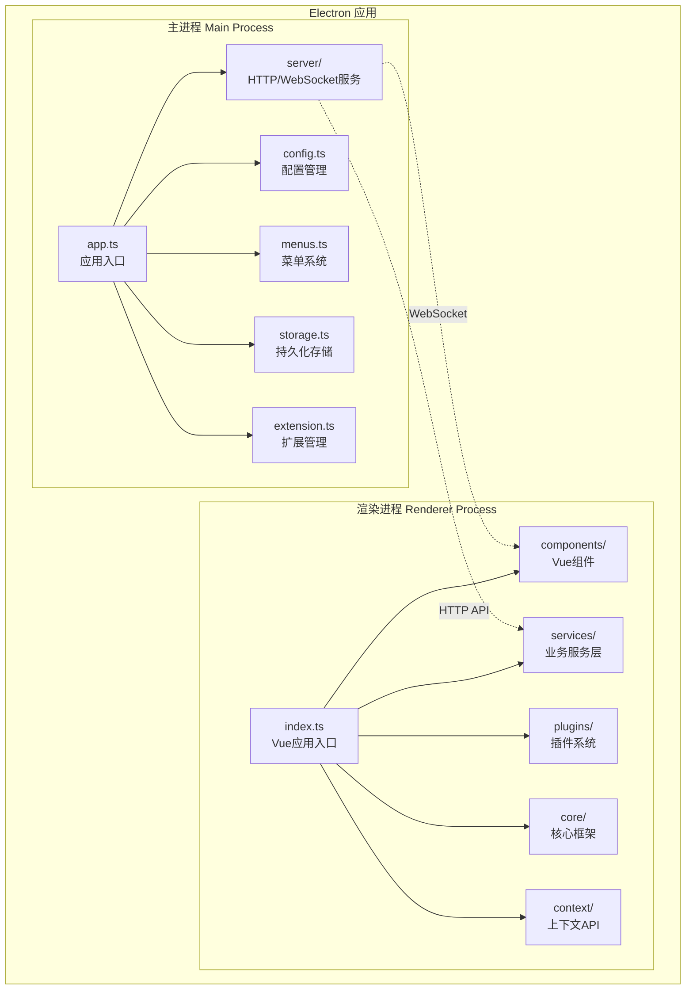
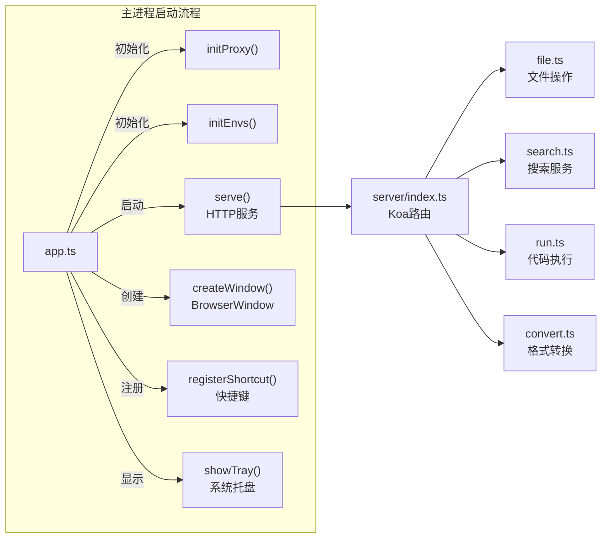
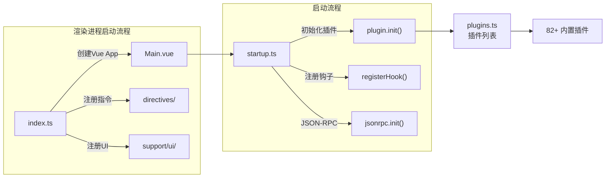
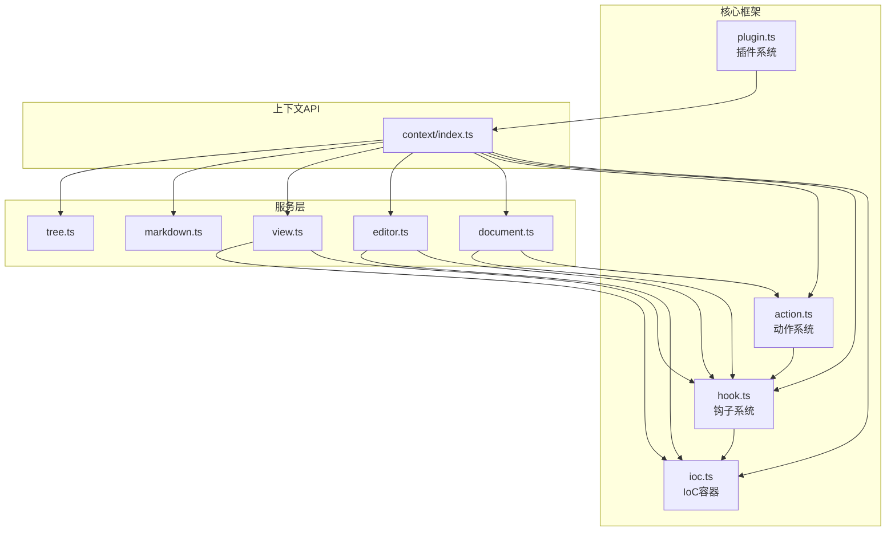
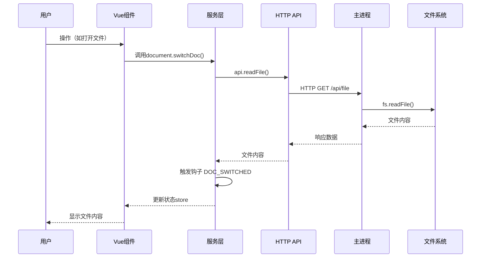
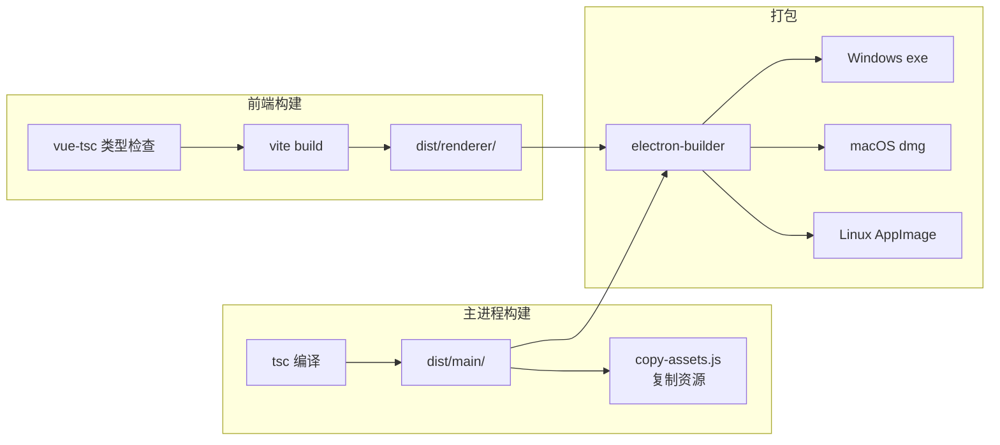

# 阶段1：项目架构梳理

## 1. 项目概述

**Yank Note** 是一个高度可扩展的 Markdown 编辑器，专为提高生产力而设计。项目基于 **Electron + Vue 3 + TypeScript** 技术栈构建，采用前后端分离架构。

### 项目基本信息

| 属性 | 值 |
|------|-----|
| 项目名称 | yank.note |
| 版本 | 3.86.1 |
| 许可证 | AGPL-3.0 |
| 主要技术栈 | Electron + Vue 3 + TypeScript + Monaco Editor |
| 构建工具 | Vite + tsc |

---

## 2. 目录结构总览

```markmap
# Yank Note 项目结构
## src/ (源代码)
### main/ (主进程)
- app.ts (应用入口)
- config.ts (配置管理)
- server/ (HTTP服务)
- menus.ts (菜单管理)
### renderer/ (渲染进程)
- components/ (Vue组件)
- services/ (业务服务)
- plugins/ (插件系统)
- core/ (核心模块)
- context/ (上下文API)
### share/ (共享模块)
- i18n/ (国际化)
- types.ts (类型定义)
## build/ (构建资源)
- icon.ico/icns/png
- appx/ (Windows商店)
## scripts/ (脚本)
- copy-assets.js
- download-pandoc.js
## help/ (帮助文档)
- README.md
- FEATURES.md
## dist/ (构建输出)
### main/ (主进程输出)
### renderer/ (渲染进程输出)
```

---

## 3. 分层架构详解

### 3.1 整体架构图



### 3.2 主进程层 (Main Process)

主进程是 Electron 应用的后端部分，负责系统级操作和服务提供。

| 文件 | 核心功能 |
|------|----------|
| `app.ts` | 应用程序入口，窗口管理，生命周期控制 |
| `config.ts` | 配置文件读写，缓存管理 |
| `server/index.ts` | Koa HTTP 服务器，API 路由 |
| `server/file.ts` | 文件系统操作（读写、移动、删除） |
| `server/search.ts` | 全文搜索服务 |
| `server/run.ts` | 代码执行服务 |
| `server/convert.ts` | 文档格式转换（Pandoc） |
| `server/plantuml.ts` | PlantUML 图表生成 |
| `menus.ts` | 应用菜单和系统托盘菜单 |
| `shortcut.ts` | 全局快捷键注册 |
| `storage.ts` | electron-store 持久化 |
| `extension.ts` | 扩展/插件加载管理 |
| `jwt.ts` | JWT 令牌验证 |
| `shell.ts` | Shell 命令执行 |
| `protocol.ts` | 自定义协议处理 |
| `proxy.ts` | 网络代理配置 |
| `updater.ts` | 应用自动更新 |
| `wsl.ts` | WSL (Windows Subsystem for Linux) 支持 |

### 3.3 渲染进程层 (Renderer Process)

渲染进程是用户界面部分，基于 Vue 3 构建。

#### 3.3.1 核心模块 (core/)

| 文件 | 核心功能 |
|------|----------|
| `plugin.ts` | 插件注册与管理系统 |
| `hook.ts` | 钩子（Hook）事件系统 |
| `ioc.ts` | IoC 依赖注入容器 |
| `action.ts` | 动作（Action）注册与执行 |
| `keybinding.ts` | 键盘快捷键绑定 |

#### 3.3.2 服务层 (services/)

| 文件 | 核心功能 |
|------|----------|
| `document.ts` | 文档管理（创建、打开、保存、切换） |
| `editor.ts` | Monaco 编辑器封装 |
| `view.ts` | 预览视图管理 |
| `markdown.ts` | Markdown 解析与渲染 |
| `tree.ts` | 文件树管理 |
| `repo.ts` | 仓库（Repository）管理 |
| `setting.ts` | 设置管理 |
| `theme.ts` | 主题切换 |
| `i18n.ts` | 国际化 |
| `indexer.ts` | 文件索引服务 |
| `runner.ts` | 代码运行器 |
| `export.ts` | 文档导出 |
| `layout.ts` | 布局管理 |
| `workbench.ts` | 工作台管理 |
| `status-bar.ts` | 状态栏管理 |
| `renderer.ts` | 自定义渲染器管理 |
| `routines.ts` | 常用操作封装 |
| `base.ts` | 基础服务 |

#### 3.3.3 组件层 (components/)

| 组件 | 功能描述 |
|------|----------|
| `Layout.vue` | 主布局容器 |
| `Editor.vue` | 编辑器容器 |
| `MonacoEditor.vue` | Monaco 编辑器封装 |
| `Previewer.vue` | 预览器容器 |
| `DefaultPreviewer.vue` | 默认 Markdown 预览器 |
| `Tree.vue` | 文件树组件 |
| `FileTabs.vue` | 文件标签页 |
| `StatusBar.vue` | 状态栏 |
| `Terminal.vue` | 终端组件 |
| `Outline.vue` | 文档大纲 |
| `QuickOpen.vue` | 快速打开面板 |
| `Setting.vue` | 设置面板 |
| `ExtensionManager.vue` | 扩展管理器 |
| `DocHistory.vue` | 文档历史版本 |
| `ControlCenter.vue` | 控制中心 |

#### 3.3.4 插件层 (plugins/)

项目包含 **82+ 个内置插件**，按功能分类：

```markmap
# 插件分类
## 编辑器插件 (editor-*)
- editor-markdown.ts (Markdown编辑)
- editor-paste.ts (粘贴处理)
- editor-attachment.ts (附件处理)
- editor-md-list.ts (列表自动完成)
- editor-words.ts (单词计数)
- editor-folding.ts (代码折叠)
## Markdown渲染插件 (markdown-*)
- markdown-katex.ts (数学公式)
- markdown-mermaid.ts (Mermaid图表)
- markdown-plantuml.ts (PlantUML图表)
- markdown-echarts.ts (ECharts图表)
- markdown-drawio.ts (Drawio绘图)
- markdown-code-run.ts (代码运行)
- markdown-toc.ts (目录生成)
- markdown-mind-map.ts (思维导图)
## 状态栏插件 (status-bar-*)
- status-bar-view.ts (视图控制)
- status-bar-setting.ts (设置入口)
- status-bar-terminal.ts (终端控制)
- status-bar-theme.ts (主题切换)
## 功能插件
- ai-copilot.ts (AI助手)
- image-viewer.tsx (图片查看)
- sync-scroll.ts (同步滚动)
- history-stack.ts (历史导航)
```

### 3.4 共享层 (share/)

| 文件 | 核心功能 |
|------|----------|
| `types.ts` | 共享类型定义（Doc, Repo, PathItem等） |
| `misc.ts` | 通用工具函数 |
| `i18n/` | 多语言资源（en, zh-CN, zh-TW, ru） |

---

## 4. 关键文件功能标注

### 4.1 主进程关键文件



### 4.2 渲染进程关键文件



---

## 5. 模块依赖关系

### 5.1 核心模块依赖图



### 5.2 数据流向



---

## 6. 构建与打包

### 6.1 构建流程



### 6.2 关键脚本

| 脚本 | 用途 |
|------|------|
| `yarn dev` | 启动开发服务器 |
| `yarn build` | 构建前端和主进程 |
| `yarn start` | 构建主进程并启动应用 |
| `yarn lint` | 代码检查 |
| `yarn test` | 运行测试 |

---

## 7. 技术栈依赖

### 7.1 核心依赖

| 依赖 | 版本 | 用途 |
|------|------|------|
| electron | 38.7.1 | 桌面应用框架 |
| vue | 3.5.13 | UI框架 |
| monaco-editor | 0.49.0 | 代码编辑器 |
| markdown-it | 14.1.0 | Markdown解析 |
| koa | 2.16.2 | HTTP服务器 |
| socket.io | 4.7.2 | WebSocket通信 |
| node-pty | 1.1.0-beta39 | 终端模拟 |
| chokidar | 3.6.0 | 文件监听 |

### 7.2 Markdown 扩展

| 插件 | 用途 |
|------|------|
| markdown-it-katex | 数学公式 |
| markdown-it-emoji | 表情符号 |
| markdown-it-multimd-table | 增强表格 |
| markdown-it-container | 自定义容器 |
| markdown-it-footnote | 脚注 |

---

## 8. 总结

Yank Note 采用典型的 Electron 应用架构：

1. **主进程**：负责系统级操作，包括文件读写、HTTP服务、窗口管理
2. **渲染进程**：基于 Vue 3 的用户界面，采用插件化架构
3. **通信机制**：通过 HTTP API 和 JSON-RPC 实现进程间通信
4. **插件系统**：高度可扩展，支持用户自定义插件
5. **IoC容器**：统一的依赖注入和事件分发机制

项目的核心设计理念是 **可扩展性** 和 **高性能**，通过插件系统实现功能模块化，通过 Monaco Editor 提供专业级编辑体验。
