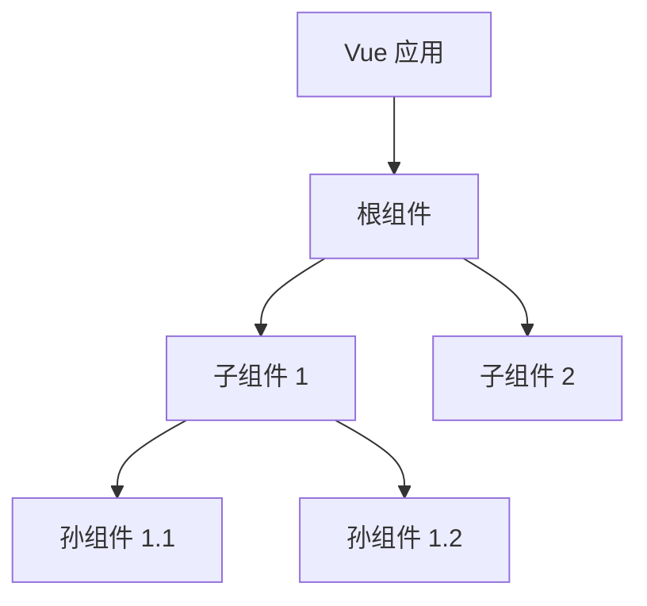
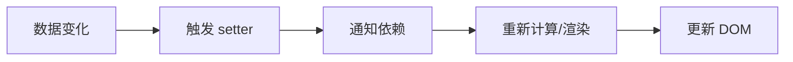
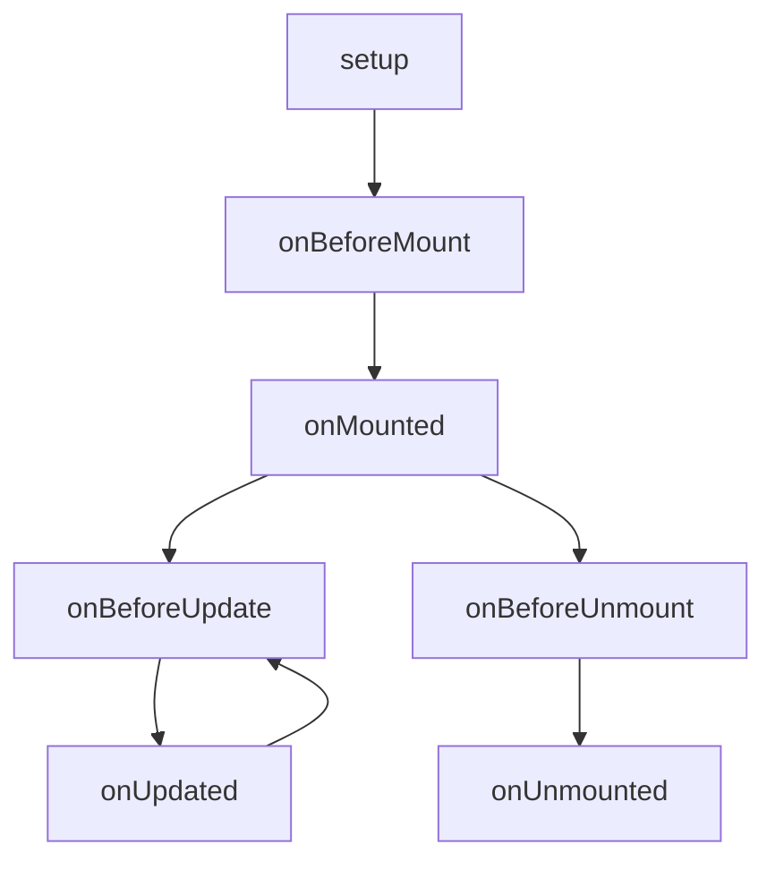
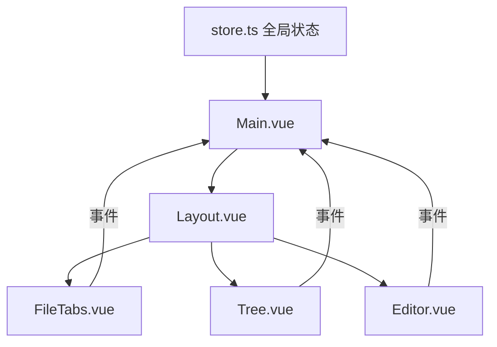

# Vue 3 组件化开发与响应式系统学习指南

> 本文档结合 Yank Note 项目的实际代码，帮助你理解 Vue 3 的核心概念

## 目录

1. [Vue 3 核心概念概览](#1-vue-3-核心概念概览)
2. [单文件组件（SFC）结构](#2-单文件组件sfc结构)
3. [组合式 API（Composition API）](#3-组合式-apicomposition-api)
4. [响应式系统](#4-响应式系统)
5. [生命周期钩子](#5-生命周期钩子)
6. [组件通信](#6-组件通信)
7. [插槽（Slots）](#7-插槽slots)
8. [计算属性与侦听器](#8-计算属性与侦听器)
9. [项目实战分析](#9-项目实战分析)
10. [练习任务](#10-练习任务)

---

## 1. Vue 3 核心概念概览

Vue 3 是一个用于构建用户界面的渐进式 JavaScript 框架。核心特点包括：

| 特性 | 说明 |
|------|------|
| **响应式** | 数据变化时自动更新 DOM |
| **组件化** | UI 拆分为独立、可复用的组件 |
| **组合式 API** | 更灵活的逻辑复用方式 |
| **虚拟 DOM** | 高效的 DOM 更新机制 |



---

## 2. 单文件组件（SFC）结构

Vue 的单文件组件（`.vue` 文件）由三个部分组成：

```vue
<template>
  <!-- HTML 模板 -->
</template>

<script lang="ts">
// TypeScript/JavaScript 逻辑
</script>

<style scoped>
/* CSS 样式 */
</style>
```

### 2.1 项目示例：StatusBar.vue

来看一个简单的组件 `src/renderer/components/StatusBar.vue`：

```vue
<template>
  <div class="status-bar">
    <StatusBarMenu class="left" position="left" />
    <StatusBarMenu class="right" position="right" />
  </div>
</template>

<script lang="ts">
import { defineComponent } from 'vue'
import StatusBarMenu from './StatusBarMenu.vue'

export default defineComponent({
  name: 'status-bar',
  components: { StatusBarMenu },  // 注册子组件
})
</script>

<style scoped>
.status-bar {
  display: flex;
  justify-content: space-between;
}
</style>
```

### 2.2 关键知识点

| 部分 | 作用 | 注意事项 |
|------|------|----------|
| `<template>` | 定义组件的 HTML 结构 | 必须有一个根元素 |
| `<script lang="ts">` | 组件逻辑（TypeScript） | 使用 `defineComponent` 获得类型推断 |
| `<style scoped>` | 组件私有样式 | `scoped` 确保样式只影响当前组件 |

---

## 3. 组合式 API（Composition API）

组合式 API 是 Vue 3 的核心特性，通过 `setup()` 函数组织组件逻辑。

### 3.1 基本结构

```typescript
import { defineComponent, ref, computed, onMounted } from 'vue'

export default defineComponent({
  name: 'my-component',
  setup() {
    // 1. 响应式数据
    const count = ref(0)
    
    // 2. 计算属性
    const doubleCount = computed(() => count.value * 2)
    
    // 3. 方法
    function increment() {
      count.value++
    }
    
    // 4. 生命周期
    onMounted(() => {
      console.log('组件已挂载')
    })
    
    // 5. 返回给模板使用
    return {
      count,
      doubleCount,
      increment
    }
  }
})
```

### 3.2 项目示例：SvgIcon.vue

`src/renderer/components/SvgIcon.vue` 是一个简单的图标组件：

```typescript
export default defineComponent({
  name: 'svg-icon',
  props: {
    name: String,      // 图标名称
    title: String,     // 提示文字
    color: String,     // 颜色
    width: String,     // 宽度
    height: String,    // 高度
  },
  setup(props) {
    // 使用 computed 根据 props 计算 HTML
    const html = computed(() => {
      const name = props.name
      if (name && name.length < 30 && icons[name]) {
        return icons[name] || name
      } else {
        return name
      }
    })

    return { html }  // 返回给模板使用
  }
})
```

**模板中使用**：
```html
<template>
  <div class="svg-icon" 
       :style="{color, width, height}" 
       v-html="html" 
       :title="title">
  </div>
</template>
```

---

## 4. 响应式系统

Vue 3 的响应式系统是其核心，理解它对于开发至关重要。

### 4.1 ref - 基本类型响应式

```typescript
import { ref } from 'vue'

// 创建响应式数据
const count = ref(0)
const message = ref('Hello')

// 读取值（需要 .value）
console.log(count.value)  // 0

// 修改值
count.value++
message.value = 'World'

// 在模板中无需 .value
// <span>{{ count }}</span>
```

### 4.2 reactive - 对象响应式

```typescript
import { reactive } from 'vue'

// 创建响应式对象
const state = reactive({
  count: 0,
  user: {
    name: 'Tom',
    age: 18
  }
})

// 直接访问（无需 .value）
console.log(state.count)
state.count++
state.user.name = 'Jerry'
```

### 4.3 项目示例：全局状态管理

`src/renderer/support/store.ts` 展示了响应式系统的实际应用：

```typescript
import { computed, reactive, watch, watchEffect } from 'vue'

// 定义初始状态
export const initState = {
  tree: null,
  showSide: storage.get('showSide', true),
  showView: storage.get('showView', true),
  showEditor: storage.get('showEditor', true),
  currentFile: getCurrentFile(),
  tabs: storage.get<Components.FileTabs.Item[]>('tabs', []),
  // ... 更多状态
}

// 使用 reactive 创建响应式状态
const state = reactive(initState)

export default {
  state,
  watch,
  watchEffect,
  getters: {
    // 计算属性：判断文件是否已保存
    isSaved: computed(() => {
      if (!state.currentFile?.status) {
        return true
      }
      if (state.currentFile.status === 'unsaved') {
        return false
      }
      return state.currentContent === state.currentFile?.content
    })
  }
}

// 监听状态变化，自动保存到本地存储
watchEffect(() => {
  storage.set('showSide', state.showSide)
})

watchEffect(() => {
  storage.set('tabs', state.tabs)
})
```

### 4.4 toRefs - 解构响应式对象

当你需要从响应式对象中解构出单独的响应式引用时：

```typescript
import { toRefs } from 'vue'
import store from '@fe/support/store'

// 在组件中使用
setup() {
  // 解构出响应式引用
  const { showView, showXterm, showSide, showEditor } = toRefs(store.state)
  
  // 现在这些都是响应式的 Ref
  console.log(showView.value)
  
  return { showView, showXterm, showSide, showEditor }
}
```

### 4.5 响应式原理图



---

## 5. 生命周期钩子

Vue 3 提供了一组生命周期钩子函数，让你在组件的不同阶段执行代码。

### 5.1 生命周期图



### 5.2 常用生命周期钩子

| 钩子 | 触发时机 | 常见用途 |
|------|----------|----------|
| `onBeforeMount` | 挂载前 | 准备工作 |
| `onMounted` | 挂载后 | DOM 操作、API 调用 |
| `onBeforeUpdate` | 更新前 | 访问更新前的状态 |
| `onUpdated` | 更新后 | 访问更新后的 DOM |
| `onBeforeUnmount` | 卸载前 | 清理工作 |
| `onUnmounted` | 卸载后 | 最终清理 |

### 5.3 项目示例：Layout.vue

`src/renderer/components/Layout.vue` 展示了生命周期的使用：

```typescript
import { onMounted, onBeforeUnmount } from 'vue'

setup() {
  // 组件挂载后注册事件监听
  onMounted(() => {
    window.addEventListener('resize', emitResize)
    window.document.addEventListener('mousemove', resizeFrame)
    window.document.addEventListener('mouseup', resizeDone)
  })

  // 组件卸载前移除事件监听（防止内存泄漏）
  onBeforeUnmount(() => {
    window.removeEventListener('resize', emitResize)
    window.document.removeEventListener('mousemove', resizeFrame)
    window.document.removeEventListener('mouseup', resizeDone)
  })
}
```

### 5.4 项目示例：Main.vue

`src/renderer/Main.vue` 展示了更复杂的生命周期使用：

```typescript
import { onBeforeUnmount, onMounted } from 'vue'
import startup from '@fe/startup'
import { registerHook, removeHook } from '@fe/core/hook'

setup() {
  // 组件挂载后执行应用初始化
  onMounted(startup)

  // 注册自定义 Hook
  registerHook('EDITOR_CURRENT_EDITOR_CHANGE', onEditorChange)

  // 组件卸载前移除 Hook
  onBeforeUnmount(() => {
    removeHook('EDITOR_CURRENT_EDITOR_CHANGE', onEditorChange)
  })
}
```

---

## 6. 组件通信

Vue 组件之间的通信方式有多种。

### 6.1 Props（父传子）

```typescript
// 子组件定义 props
export default defineComponent({
  props: {
    title: String,
    count: {
      type: Number,
      required: true,
      default: 0
    },
    items: {
      type: Array as PropType<string[]>,
      default: () => []
    }
  },
  setup(props) {
    // 通过 props 参数访问
    console.log(props.title)
  }
})
```

```html
<!-- 父组件使用 -->
<ChildComponent 
  title="Hello" 
  :count="10" 
  :items="['a', 'b', 'c']" 
/>
```

### 6.2 Emits（子传父）

```typescript
// 子组件
export default defineComponent({
  emits: ['update', 'delete'],  // 声明事件
  setup(props, { emit }) {
    function handleClick() {
      // 触发事件，传递数据
      emit('update', { id: 1, name: 'test' })
    }
    return { handleClick }
  }
})
```

```html
<!-- 父组件监听事件 -->
<ChildComponent 
  @update="handleUpdate" 
  @delete="handleDelete" 
/>
```

### 6.3 项目示例：FileTabs.vue

`src/renderer/components/FileTabs.vue` 展示了完整的组件通信：

```html
<template>
  <Tabs
    ref="refTabs"
    class="file-tabs"
    :list="fileTabs"           <!-- Props: 传递数据 -->
    :value="current"
    :filter-btn-title="filterBtnTitle"
    :action-btns="actionBtns"
    @remove="removeTabs"        <!-- Events: 监听事件 -->
    @switch="switchTab"
    @change-list="setTabs"
    @dblclick-item="makeTabPermanent"
    @dblclick-blank="onDblclickBlank"
  />
</template>
```

---

## 7. 插槽（Slots）

插槽允许父组件向子组件传递模板内容。

### 7.1 默认插槽

```html
<!-- 子组件 Card.vue -->
<template>
  <div class="card">
    <slot></slot>  <!-- 插槽出口 -->
  </div>
</template>

<!-- 父组件使用 -->
<Card>
  <p>这是卡片内容</p>
</Card>
```

### 7.2 具名插槽

```html
<!-- 子组件 Layout.vue -->
<template>
  <div class="layout">
    <header><slot name="header"></slot></header>
    <main><slot></slot></main>
    <footer><slot name="footer"></slot></footer>
  </div>
</template>

<!-- 父组件使用 -->
<Layout>
  <template v-slot:header>
    <h1>标题</h1>
  </template>
  
  <p>默认内容</p>
  
  <template v-slot:footer>
    <p>页脚</p>
  </template>
</Layout>
```

### 7.3 项目示例：Main.vue 的插槽使用

`src/renderer/Main.vue` 大量使用了具名插槽：

```html
<template>
  <Layout :class="classes">
    <!-- 头部插槽 -->
    <template v-slot:header>
      <TitleBar />
    </template>
    
    <!-- 底部插槽 -->
    <template v-slot:footer>
      <StatusBar />
    </template>
    
    <!-- 左侧插槽 -->
    <template v-slot:left>
      <ActionBar />
      <Outline v-if="showOutline" show-filter enable-collapse />
      <Tree v-show="!showOutline" />
      <SearchPanel />
    </template>
    
    <!-- 终端插槽 -->
    <template v-slot:terminal>
      <Terminal @hide="hideXterm" />
    </template>
    
    <!-- 编辑器插槽 -->
    <template v-slot:editor>
      <Editor />
    </template>
    
    <!-- 预览插槽 -->
    <template v-slot:preview>
      <Previewer />
    </template>
    
    <!-- 文件标签页插槽 -->
    <template v-slot:right-before>
      <FileTabs />
    </template>
  </Layout>
</template>
```

### 7.4 Layout.vue 中的插槽定义

```html
<template>
  <div class="layout">
    <div class="header">
      <slot name="header"></slot>
    </div>
    <div class="main">
      <div class="left">
        <slot name="left"></slot>
      </div>
      <div class="right">
        <div class="right-before">
          <slot name="right-before" />
        </div>
        <div class="content">
          <div class="editor">
            <slot name="editor"></slot>
          </div>
          <div class="preview">
            <slot name="preview"></slot>
          </div>
        </div>
        <div class="terminal">
          <slot name="terminal"></slot>
        </div>
      </div>
    </div>
    <div class="footer">
      <slot name="footer"></slot>
    </div>
  </div>
</template>
```

---

## 8. 计算属性与侦听器

### 8.1 computed（计算属性）

计算属性会缓存结果，只有依赖变化时才重新计算。

```typescript
import { ref, computed } from 'vue'

setup() {
  const firstName = ref('John')
  const lastName = ref('Doe')
  
  // 只读计算属性
  const fullName = computed(() => {
    return `${firstName.value} ${lastName.value}`
  })
  
  // 可写计算属性
  const fullNameWritable = computed({
    get() {
      return `${firstName.value} ${lastName.value}`
    },
    set(newValue) {
      const [first, last] = newValue.split(' ')
      firstName.value = first
      lastName.value = last
    }
  })
  
  return { firstName, lastName, fullName }
}
```

### 8.2 项目示例：FileTabs.vue 的计算属性

```typescript
setup() {
  const { currentFile, tabs } = toRefs(store.state)
  const isSaved = store.getters.isSaved
  
  // 计算文件标签列表，添加保存状态标记
  const fileTabs = computed(() => (tabs.value as Components.FileTabs.Item[]).map(tab => {
    if (currentFile.value && tab.key === toUri(currentFile.value)) {
      const { type, status, writeable } = currentFile.value

      let mark = ''
      if (!isSaved.value) {
        mark = '*'           // 未保存
      } else if (writeable === false) {
        mark = '🔒'          // 只读
      } else if (status === 'save-failed') {
        mark = '!'           // 保存失败
      } else if (type === 'file') {
        mark = '…'           // 加载中
      }

      tab.label = mark + currentFile.value.name
    }
    return tab
  }))
  
  return { fileTabs }
}
```

### 8.3 watch（侦听器）

用于在数据变化时执行异步或开销较大的操作。

```typescript
import { ref, watch } from 'vue'

setup() {
  const count = ref(0)
  const message = ref('')
  
  // 侦听单个值
  watch(count, (newValue, oldValue) => {
    console.log(`count 从 ${oldValue} 变为 ${newValue}`)
  })
  
  // 侦听多个值
  watch([count, message], ([newCount, newMessage], [oldCount, oldMessage]) => {
    console.log('count 或 message 发生变化')
  })
  
  // 立即执行 + 深度监听
  watch(
    () => someObject,
    (newValue) => {
      // 处理变化
    },
    { immediate: true, deep: true }
  )
}
```

### 8.4 watchEffect（自动追踪依赖）

```typescript
import { watchEffect, ref } from 'vue'

setup() {
  const count = ref(0)
  const message = ref('')
  
  // 自动追踪 count 和 message 的变化
  watchEffect(() => {
    console.log(`count: ${count.value}, message: ${message.value}`)
  })
}
```

### 8.5 项目示例：store.ts 的 watchEffect

```typescript
// 自动保存状态到本地存储
watchEffect(() => {
  storage.set('treeSort', state.treeSort)
})

watchEffect(() => {
  storage.set('showSide', state.showSide)
})

watchEffect(() => {
  storage.set('tabs', state.tabs)
})

// 使用 watch 监听特定变化
watch(() => state.currentRepo, () => {
  state.currentRepoIndexStatus = null
})
```

### 8.6 项目示例：FileTabs.vue 的 watch

```typescript
setup() {
  // 监听当前文件变化
  watch(currentFile, (file, oldFile) => {
    if (file === undefined) {
      return
    }

    lastKey = toUri(oldFile)
    
    const uri = toUri(file)
    const item = {
      key: uri,
      label: file ? file.name : t('get-started.get-started'),
      description: file ? `[${file.repo}] ${file.path}` : '',
      temporary: getSetting('editor.enable-preview', true),
      payload: { file },
    }

    addTab(item)
  }, { immediate: true })  // 立即执行一次
  
  // 监听标签页列表变化
  watch(tabs, list => {
    const tab = list.find(x => x.key === current.value)
    if (!tab) {
      const currentFile = list.length > 0 ? list[list.length - 1].payload.file : null
      switchFile(currentFile)
    }
  })
}
```

---

## 9. 项目实战分析

### 9.1 组件层次结构

```
Main.vue（根组件）
├── Layout.vue（布局容器）
│   ├── TitleBar.vue（标题栏）
│   ├── StatusBar.vue（状态栏）
│   │   └── StatusBarMenu.vue
│   ├── ActionBar.vue（操作栏）
│   ├── Tree.vue（文件树）
│   │   └── TreeNode.vue
│   ├── FileTabs.vue（文件标签页）
│   │   └── Tabs.vue
│   ├── Editor.vue（编辑器）
│   │   └── MonacoEditor.vue
│   ├── Previewer.vue（预览器）
│   └── Terminal.vue（终端）
├── SettingPanel.vue（设置面板）
├── ExportPanel.vue（导出面板）
└── ...
```

### 9.2 数据流动



### 9.3 核心模式总结

| 模式 | 说明 | 项目应用 |
|------|------|----------|
| **全局状态** | `reactive` 创建响应式状态 | `store.ts` |
| **计算属性** | 派生状态，自动缓存 | `fileTabs`、`isSaved` |
| **事件通信** | 子组件向父组件传递信息 | `@remove`、`@switch` |
| **插槽** | 组件内容的灵活组合 | `Layout.vue` |
| **生命周期** | 组件各阶段的处理 | 事件监听/清理 |

---

## 10. 练习任务

### 练习 1：创建简单组件（入门）

创建一个计数器组件 `Counter.vue`：

```vue
<template>
  <div class="counter">
    <button @click="decrement">-</button>
    <span>{{ count }}</span>
    <button @click="increment">+</button>
  </div>
</template>

<script lang="ts">
import { defineComponent, ref } from 'vue'

export default defineComponent({
  name: 'counter',
  setup() {
    const count = ref(0)
    
    function increment() {
      count.value++
    }
    
    function decrement() {
      count.value--
    }
    
    return { count, increment, decrement }
  }
})
</script>
```

### 练习 2：使用计算属性

扩展计数器，添加一个显示奇偶性的计算属性：

```typescript
setup() {
  const count = ref(0)
  
  // 添加计算属性
  const parity = computed(() => count.value % 2 === 0 ? '偶数' : '奇数')
  
  return { count, parity, /* ... */ }
}
```

### 练习 3：组件通信

创建父子组件通信：

```vue
<!-- Parent.vue -->
<template>
  <Child :message="parentMessage" @update="handleUpdate" />
</template>

<script lang="ts">
setup() {
  const parentMessage = ref('来自父组件的消息')
  
  function handleUpdate(newMessage: string) {
    parentMessage.value = newMessage
  }
  
  return { parentMessage, handleUpdate }
}
</script>
```

```vue
<!-- Child.vue -->
<template>
  <div>
    <p>{{ message }}</p>
    <button @click="sendMessage">发送消息</button>
  </div>
</template>

<script lang="ts">
export default defineComponent({
  props: {
    message: String
  },
  emits: ['update'],
  setup(props, { emit }) {
    function sendMessage() {
      emit('update', '来自子组件的消息')
    }
    return { sendMessage }
  }
})
</script>
```

### 练习 4：阅读项目代码

尝试阅读并理解以下组件：

1. **简单组件**：`src/renderer/components/SvgIcon.vue`
2. **中等复杂**：`src/renderer/components/StatusBar.vue`
3. **复杂组件**：`src/renderer/components/FileTabs.vue`

---

## 参考资源

- [Vue 3 官方中文文档](https://cn.vuejs.org/)
- [Vue 3 组合式 API](https://cn.vuejs.org/guide/extras/composition-api-faq.html)
- [Vue 3 响应式原理](https://cn.vuejs.org/guide/extras/reactivity-in-depth.html)

---

## 学习检查清单

完成本文档学习后，你应该能够：

- [ ] 理解 Vue 单文件组件的结构
- [ ] 使用 `ref` 和 `reactive` 创建响应式数据
- [ ] 使用 `computed` 创建计算属性
- [ ] 使用 `watch` 和 `watchEffect` 监听数据变化
- [ ] 使用 `props` 和 `emit` 进行组件通信
- [ ] 使用插槽（slots）组合组件内容
- [ ] 正确使用生命周期钩子
- [ ] 阅读并理解 Yank Note 项目中的 Vue 组件

