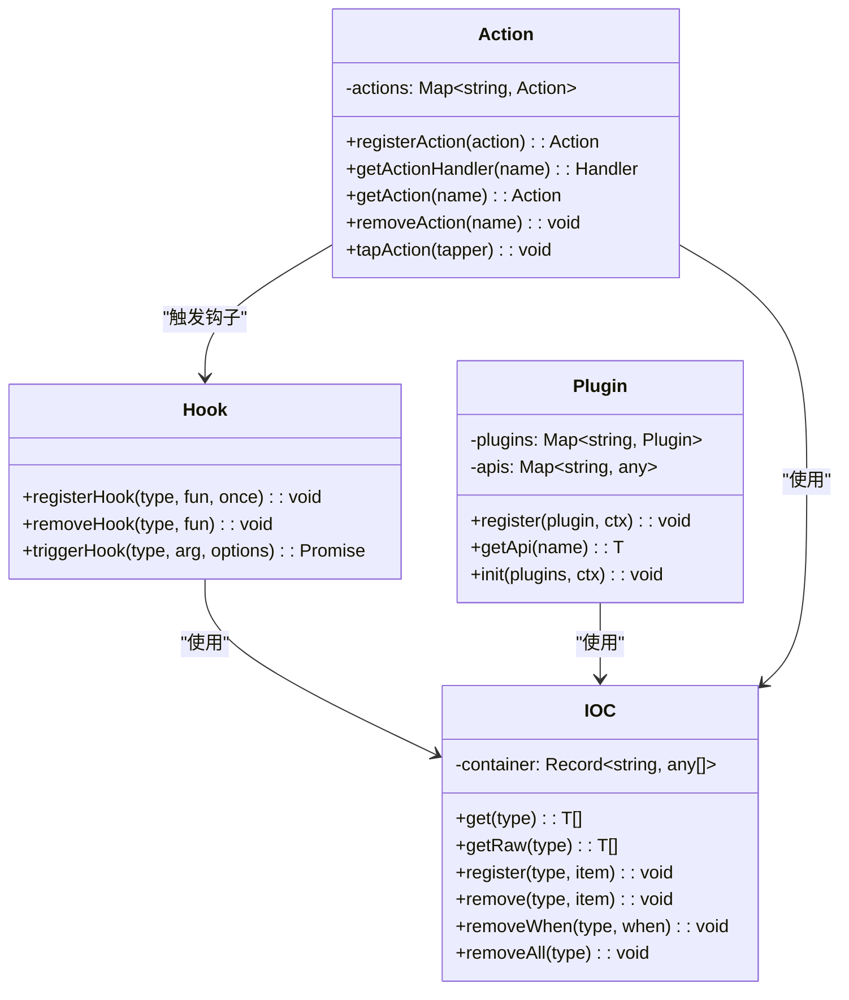
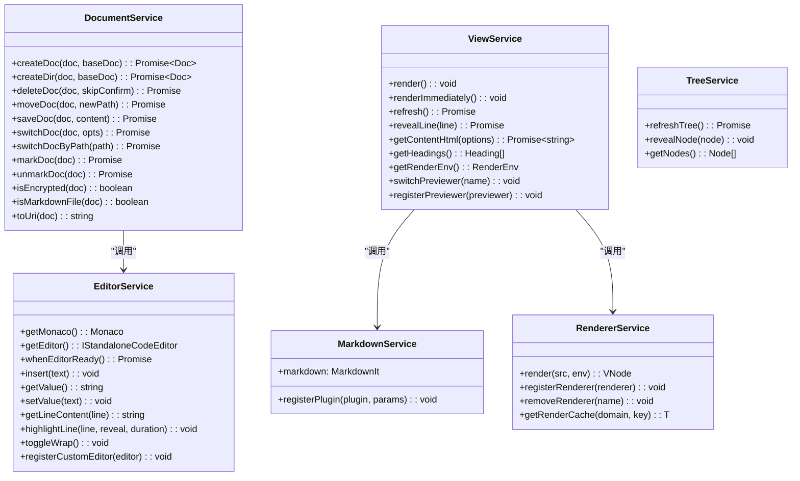
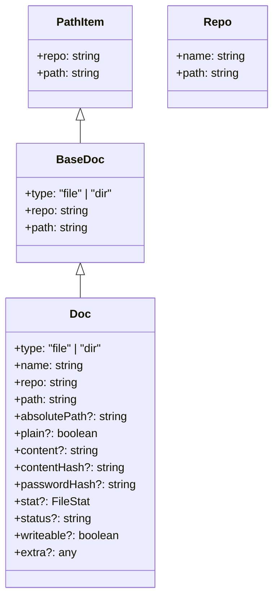
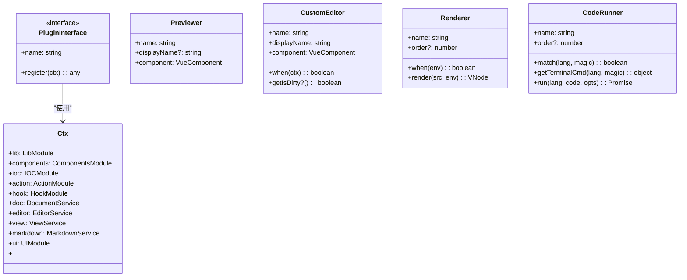
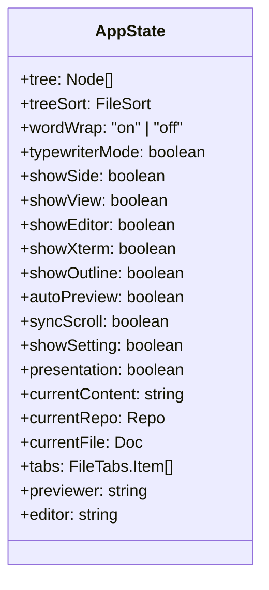
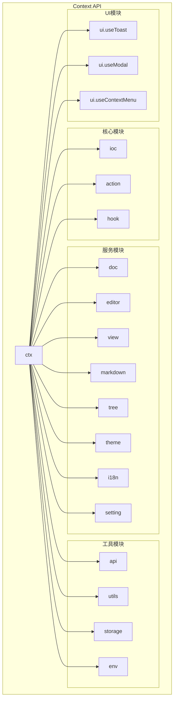

# 阶段2：类/函数分析

## 1. 核心模块分析

### 1.1 核心框架类图



### 1.2 服务层类图



---

## 2. 核心接口/类型定义

### 2.1 文档相关类型



### 2.2 插件系统类型



### 2.3 Hook 类型定义

| Hook 名称 | 触发时机 | Payload 类型 |
|-----------|----------|--------------|
| `STARTUP` | 应用启动 | never |
| `DOC_CREATED` | 文档创建后 | `{ doc: Doc }` |
| `DOC_DELETED` | 文档删除后 | `{ doc: PathItem }` |
| `DOC_MOVED` | 文档移动后 | `{ oldDoc: Doc, newDoc: Doc }` |
| `DOC_SWITCHED` | 文档切换后 | `{ doc: Doc, opts }` |
| `DOC_SAVED` | 文档保存后 | `{ doc: Doc }` |
| `DOC_BEFORE_SAVE` | 文档保存前 | `{ doc: Doc, content: string }` |
| `VIEW_RENDER` | 视图渲染后 | never |
| `VIEW_BEFORE_REFRESH` | 视图刷新前 | never |
| `EDITOR_READY` | 编辑器就绪 | `{ editor, monaco }` |
| `EDITOR_CONTENT_CHANGE` | 编辑器内容变化 | `{ uri: string, value: string }` |
| `THEME_CHANGE` | 主题切换 | `{ name: ThemeName }` |
| `SETTING_CHANGED` | 设置变化 | `{ schema, changedKeys, settings }` |
| `MARKDOWN_BEFORE_RENDER` | Markdown 渲染前 | `{ src, env, md }` |
| `EXTENSION_READY` | 扩展加载完成 | `{ extensions: Extension[] }` |

---

## 3. 核心函数分析

### 3.1 IoC 容器 (`ioc.ts`)

IoC (Inversion of Control) 容器是整个应用的核心依赖注入机制。

| 函数 | 功能 | 参数 | 返回值 |
|------|------|------|--------|
| `register(type, item)` | 注册一个组件到容器 | type: 类型标识<br>item: 组件实例 | void |
| `get(type)` | 获取某类型所有组件副本 | type: 类型标识 | T[] |
| `getRaw(type)` | 获取某类型组件原始引用 | type: 类型标识 | T[] |
| `remove(type, item)` | 移除指定组件 | type, item | void |
| `removeWhen(type, when)` | 按条件移除组件 | type, when: 判断函数 | void |

**核心设计**：
- 使用 `Record<string, any[]>` 作为容器
- 每种类型可注册多个组件（数组存储）
- 支持版本追踪 (`_version`)

### 3.2 Hook 系统 (`hook.ts`)

Hook 系统实现了发布-订阅模式，用于模块间解耦通信。

| 函数 | 功能 | 参数 |
|------|------|------|
| `registerHook(type, fun, once)` | 注册钩子 | type: 钩子类型<br>fun: 处理函数<br>once: 是否一次性 |
| `removeHook(type, fun)` | 移除钩子 | type, fun |
| `triggerHook(type, arg, options)` | 触发钩子 | type: 类型<br>arg: 参数<br>options: {breakable, ignoreError} |

**核心特性**：
- 支持 `breakable` 模式：回调返回 `true` 时中断后续调用
- 支持 `once` 模式：执行一次后自动移除
- 支持 `ignoreError`：忽略回调中的错误

### 3.3 Action 系统 (`action.ts`)

Action 系统统一管理用户可执行的操作。

| 函数 | 功能 | 说明 |
|------|------|------|
| `registerAction(action)` | 注册动作 | 接收 Action 对象 |
| `getActionHandler(name)` | 获取动作处理器 | 返回可执行函数 |
| `getAction(name)` | 获取动作定义 | 返回 Action 对象 |
| `removeAction(name)` | 移除动作 | - |
| `tapAction(tapper)` | 添加动作处理器 | 用于修改动作属性 |

**Action 接口**：
```typescript
interface Action<T> {
  name: T                    // 动作名称
  description?: string       // 描述
  forUser?: boolean         // 是否用户可见
  keys?: (string|number)[]  // 快捷键
  handler: Function         // 处理函数
  when?: () => boolean      // 执行条件
}
```

### 3.4 Plugin 系统 (`plugin.ts`)

Plugin 系统实现了可扩展的插件架构。

| 函数 | 功能 | 参数 |
|------|------|------|
| `register(plugin, ctx)` | 注册插件 | plugin: 插件对象<br>ctx: 上下文 |
| `getApi(name)` | 获取插件 API | name: 插件名 |
| `init(plugins, ctx)` | 初始化插件系统 | plugins: 插件列表<br>ctx: 上下文 |

**Plugin 接口**：
```typescript
interface Plugin<Ctx> {
  name: string                     // 插件名称
  register?: (ctx: Ctx) => any    // 注册函数
}
```

---

## 4. 服务层核心函数

### 4.1 Document 服务 (`document.ts`)

文档管理的核心服务，处理文件的创建、读取、保存、删除等操作。

#### 核心函数

| 函数 | 功能 | 核心逻辑 |
|------|------|----------|
| `createDoc(doc, baseDoc)` | 创建文档 | 弹出创建对话框<br>→ 检查文件名有效性<br>→ 加密处理（可选）<br>→ 调用 API 写入<br>→ 触发 DOC_CREATED |
| `saveDoc(doc, content)` | 保存文档 | 使用 AsyncLock 加锁<br>→ 触发 DOC_BEFORE_SAVE<br>→ 加密处理（可选）<br>→ 调用 API 写入<br>→ 触发 DOC_SAVED |
| `switchDoc(doc, opts)` | 切换文档 | 使用 AsyncLock 加锁<br>→ 确保当前文档已保存<br>→ 调用 API 读取<br>→ 解密处理（可选）<br>→ 更新 store 状态<br>→ 触发 DOC_SWITCHED |
| `deleteDoc(doc)` | 删除文档 | 确保当前文档已保存<br>→ 弹出确认对话框<br>→ 触发 DOC_BEFORE_DELETE<br>→ 调用 API 删除<br>→ 触发 DOC_DELETED |
| `moveDoc(doc, newPath)` | 移动/重命名 | 确保文档已保存<br>→ 触发 DOC_BEFORE_MOVE<br>→ 调用 API 移动<br>→ 触发 DOC_MOVED |

#### 辅助函数

| 函数 | 功能 |
|------|------|
| `isEncrypted(doc)` | 判断是否加密文档（.c.md 后缀） |
| `isMarkdownFile(doc)` | 判断是否 Markdown 文件 |
| `isPlain(doc)` | 判断是否纯文本文件 |
| `isSameFile(a, b)` | 判断是否同一文件 |
| `toUri(doc)` | 生成文件 URI |
| `getAbsolutePath(doc)` | 获取绝对路径 |

### 4.2 Editor 服务 (`editor.ts`)

Monaco 编辑器封装，提供编辑器操作接口。

#### 核心函数

| 函数 | 功能 |
|------|------|
| `getMonaco()` | 获取 Monaco 实例 |
| `getEditor()` | 获取编辑器实例 |
| `whenEditorReady()` | 等待编辑器就绪 |
| `insert(text)` | 在光标处插入文本 |
| `insertAt(position, text)` | 在指定位置插入 |
| `replaceLine(line, text)` | 替换指定行 |
| `getValue()` | 获取编辑器内容 |
| `setValue(text)` | 设置编辑器内容 |
| `getLineContent(line)` | 获取指定行内容 |
| `highlightLine(line, reveal)` | 高亮指定行 |
| `toggleWrap()` | 切换自动换行 |
| `toggleTypewriterMode()` | 切换打字机模式 |

#### 自定义编辑器管理

| 函数 | 功能 |
|------|------|
| `registerCustomEditor(editor)` | 注册自定义编辑器 |
| `removeCustomEditor(name)` | 移除自定义编辑器 |
| `getAllCustomEditors()` | 获取所有自定义编辑器 |
| `switchEditor(name)` | 切换编辑器 |

### 4.3 View 服务 (`view.ts`)

预览视图管理，控制 Markdown 渲染和预览。

#### 核心函数

| 函数 | 功能 |
|------|------|
| `render()` | 触发视图重新渲染 |
| `renderImmediately()` | 立即渲染（不延迟） |
| `refresh()` | 刷新视图 |
| `revealLine(line)` | 滚动到指定行 |
| `highlightLine(line, reveal)` | 高亮行 |
| `highlightAnchor(anchor)` | 高亮锚点 |
| `getContentHtml(options)` | 获取渲染后的 HTML |
| `getHeadings()` | 获取文档标题列表 |
| `getRenderEnv()` | 获取渲染环境 |
| `addStyles(style)` | 添加预览样式 |

#### 预览器管理

| 函数 | 功能 |
|------|------|
| `registerPreviewer(previewer)` | 注册预览器 |
| `removePreviewer(name)` | 移除预览器 |
| `switchPreviewer(name)` | 切换预览器 |
| `getAllPreviewers()` | 获取所有预览器 |

### 4.4 Markdown 服务 (`markdown.ts`)

Markdown 解析核心，基于 markdown-it。


#### 内置插件

| 插件 | 功能 |
|------|------|
| `markdown-it-sub` | 下标语法 |
| `markdown-it-sup` | 上标语法 |
| `markdown-it-mark` | 高亮标记 |
| `markdown-it-abbr` | 缩写定义 |
| `markdown-it-attributes` | 元素属性 |
| `markdown-it-multimd-table` | 增强表格 |

---

## 5. API 层核心函数

### 5.1 HTTP API 封装 (`api.ts`)

与后端服务通信的 API 层。

| 函数 | HTTP 方法 | 端点 | 功能 |
|------|-----------|------|------|
| `readFile(file)` | GET | `/api/file` | 读取文件 |
| `writeFile(file, content)` | POST | `/api/file` | 写入文件 |
| `deleteFile(file)` | DELETE | `/api/file` | 删除文件 |
| `moveFile(file, newPath)` | PATCH | `/api/file` | 移动文件 |
| `copyFile(file, newPath)` | PUT | `/api/file` | 复制文件 |
| `fetchTree(repo)` | GET | `/api/tree` | 获取文件树 |
| `search(query)` | POST | `/api/search` | 搜索文件 |
| `runCode(cmd, code)` | POST | `/api/run` | 运行代码 |
| `upload(file)` | POST | `/api/attachment` | 上传附件 |
| `fetchSettings()` | GET | `/api/settings` | 获取设置 |
| `writeSettings(data)` | POST | `/api/settings` | 保存设置 |
| `proxyFetch(url)` | ANY | `/api/proxy-fetch/` | 代理请求 |
| `rpc(code)` | POST | `/api/rpc` | 执行 RPC |

---

## 6. Store 状态管理

### 6.1 AppState 结构



### 6.2 状态持久化

| 状态 | 持久化 | 存储键 |
|------|--------|--------|
| `treeSort` | ✅ | `treeSort` |
| `wordWrap` | ✅ | `wordWrap` |
| `typewriterMode` | ✅ | `typewriterMode` |
| `showSide` | ✅ | `showSide` |
| `showView` | ✅ | `showView` |
| `showEditor` | ✅ | `showEditor` |
| `currentRepo` | ✅ | `currentRepo` |
| `currentFile` | ✅ | `currentFile` |
| `tabs` | ✅ | `tabs` |
| `recentOpenTime` | ✅ | `recentOpenTime` |

---

## 7. Context API

Context 是暴露给插件的全局 API 对象。



---

## 8. 总结

### 核心设计模式

| 模式 | 应用场景 | 实现位置 |
|------|----------|----------|
| **IoC/DI** | 组件注册与依赖注入 | `core/ioc.ts` |
| **发布-订阅** | 模块间事件通信 | `core/hook.ts` |
| **命令模式** | 用户操作统一管理 | `core/action.ts` |
| **插件模式** | 功能扩展 | `core/plugin.ts` |
| **单例模式** | 全局状态管理 | `support/store.ts` |
| **代理模式** | API 请求封装 | `support/api.ts` |

### 设计亮点

1. **高度解耦**：通过 IoC 和 Hook 系统实现模块间松耦合
2. **可扩展性**：插件系统支持用户自定义功能扩展
3. **类型安全**：完整的 TypeScript 类型定义
4. **状态管理**：Vue 3 响应式状态 + 本地持久化
5. **异步锁**：文档操作使用 AsyncLock 防止并发问题

