# 阶段3：调用与算法流程

## 1. 应用启动流程

### 1.1 主进程启动流程

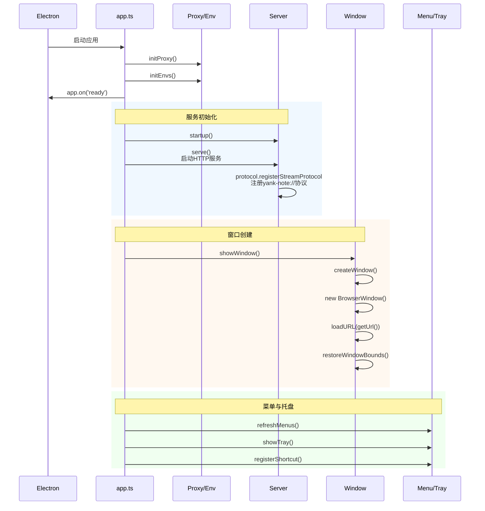

### 1.2 渲染进程启动流程

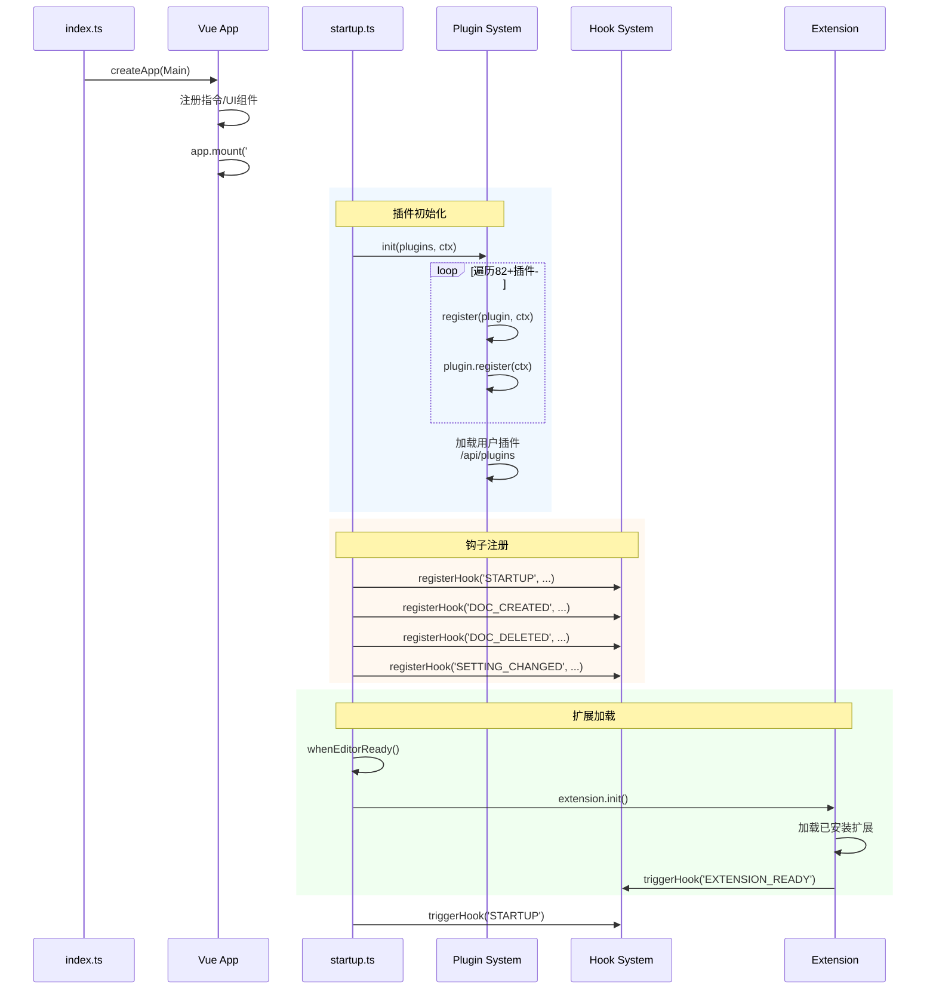

---

## 2. 文档操作核心流程

### 2.1 打开/切换文档流程

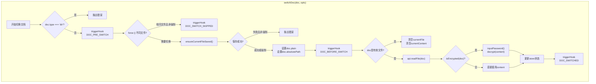

### 2.2 保存文档流程

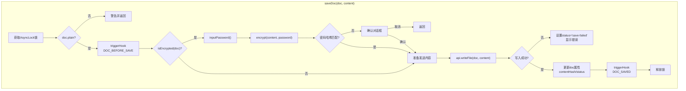

### 2.3 创建文档流程

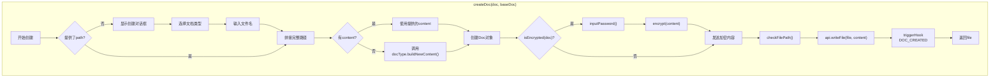

---

## 3. Markdown 渲染流程

### 3.1 完整渲染流程

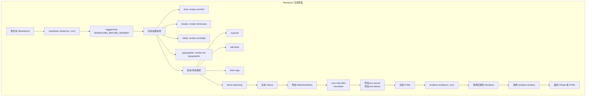

### 3.2 渲染器调度逻辑

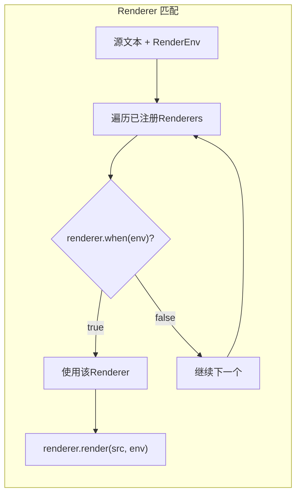

### 3.3 内置 Markdown 插件处理链

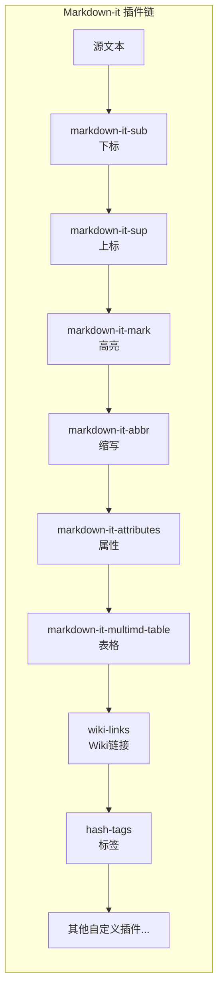

---

## 4. 文件树与索引流程

### 4.1 文件树构建流程

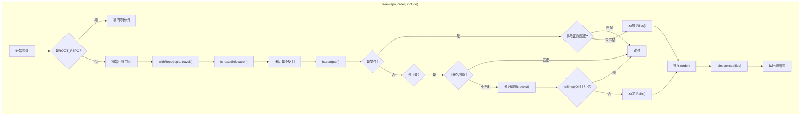

### 4.2 文件索引 Worker 架构

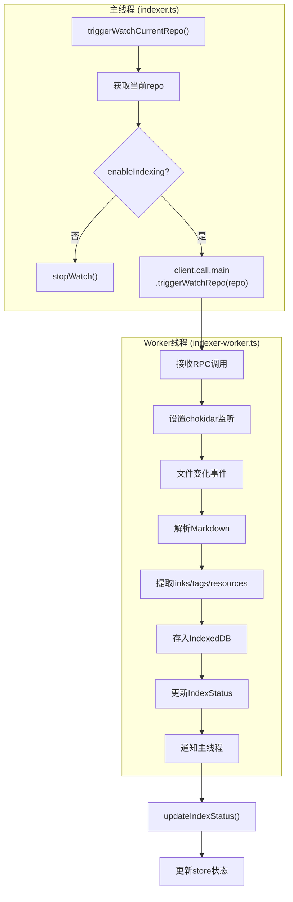

---

## 5. HTTP 服务端路由流程

### 5.1 请求处理管道

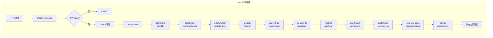

### 5.2 文件操作 API 流程

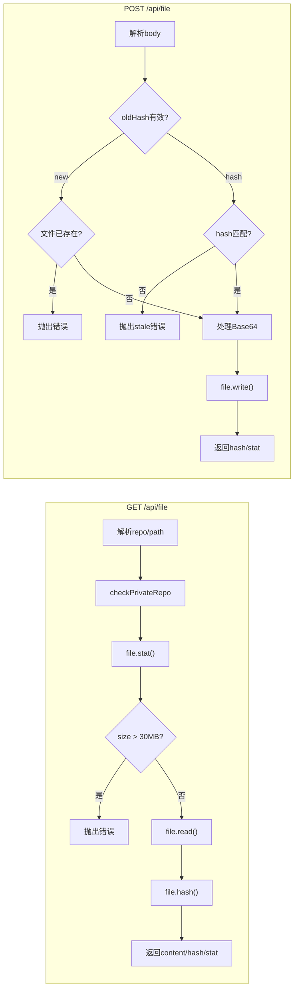

---

## 6. 插件系统调用流程

### 6.1 插件注册与初始化

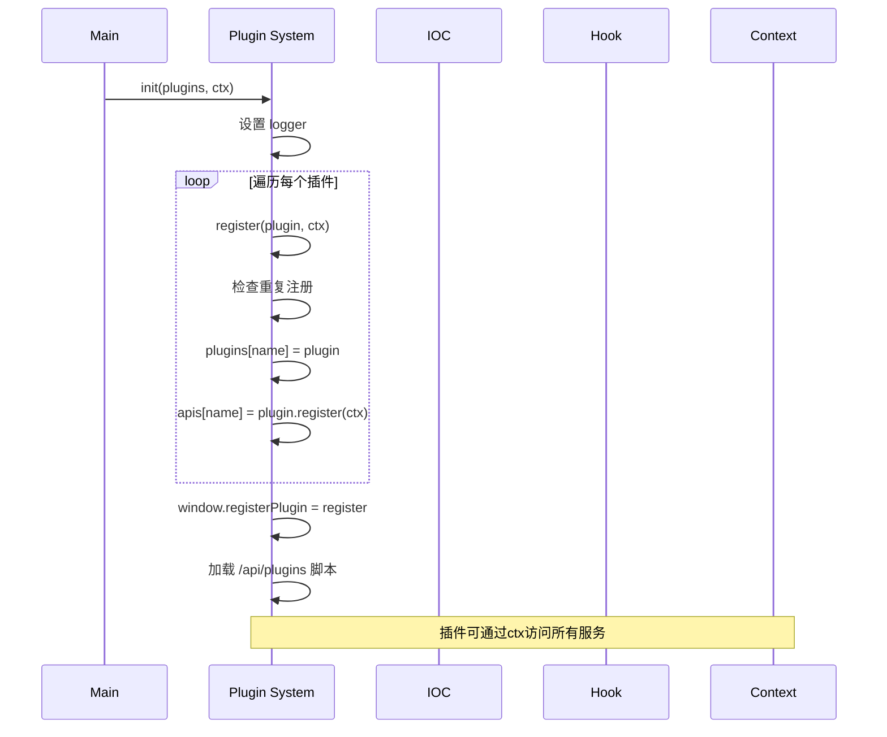

### 6.2 典型插件结构

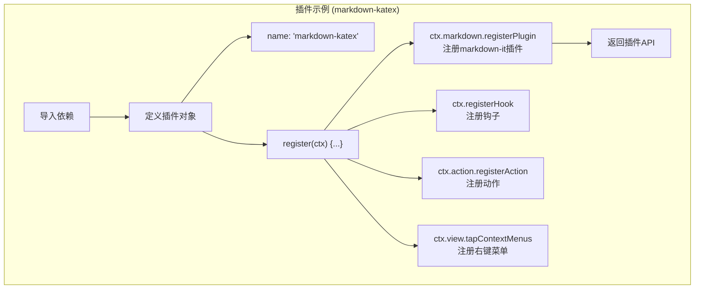

---

## 7. Hook 事件流程

### 7.1 Hook 触发机制

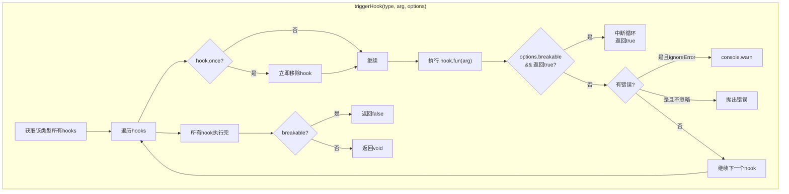

### 7.2 核心 Hook 事件流

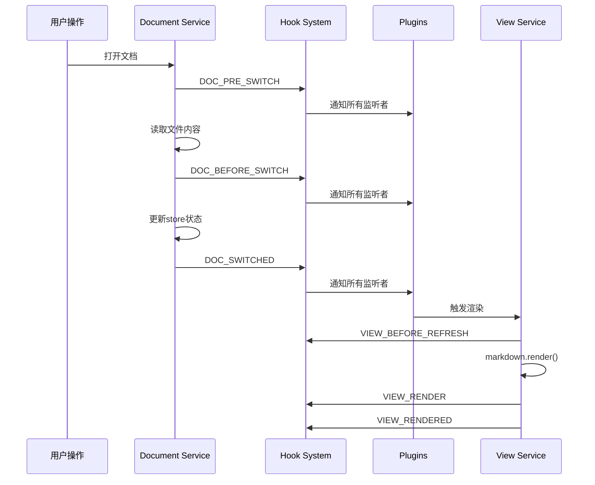

---

## 8. 关键算法分析

### 8.1 文档历史版本管理

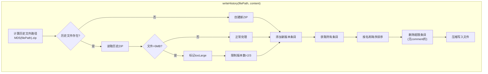

**算法要点**：
- 使用 MD5 哈希文件路径作为历史文件名
- 双层 ZIP 压缩（外层压缩整个版本包）
- 版本数限制（默认500，最大10000）
- 大文件自动削减版本数
- 带 comment 的版本不会被自动删除

### 8.2 文件树排序算法

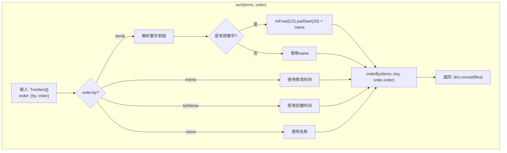

**算法要点**：
- 目录始终排在文件前面
- `serial` 模式支持数字前缀智能排序（如 "1. xxx", "2. xxx"）
- 数字格式化为12位小数 + 20位填充，确保正确排序

### 8.3 加密/解密算法

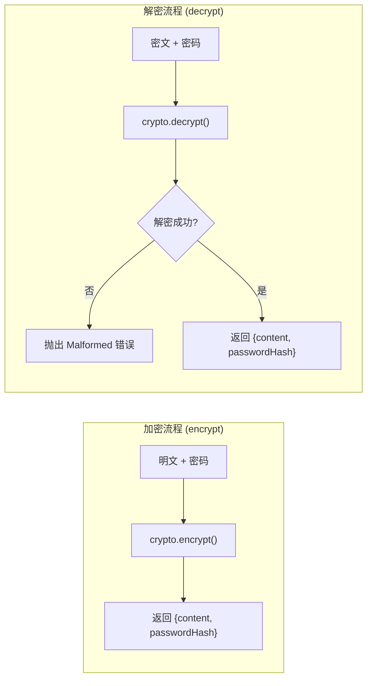

**算法要点**：
- 使用 `.c.md` 后缀标识加密文件
- 密码哈希用于验证密码是否变化
- 加密/解密在前端完成，后端只存储密文

### 8.4 同步滚动算法

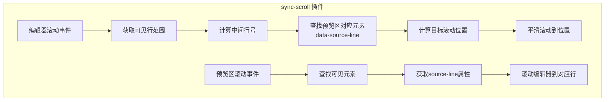

---

## 9. 进程间通信流程

### 9.1 主进程与渲染进程通信

```mermaid
flowchart TB
    subgraph "通信方式"
        A["渲染进程"] --> B["HTTP API"]
        B --> C["主进程 Koa 服务"]
        
        A --> D["JSON-RPC"]
        D --> E["主进程 jsonrpc-bridge"]
        
        A --> F["Electron Remote"]
        F --> G["主进程模块直接调用"]
        
        A --> H["WebSocket"]
        H --> I["主进程 socket.io"]
        I --> J["终端 node-pty"]
    end
```

### 9.2 Worker 通信流程

```mermaid
sequenceDiagram
    participant H as 主线程
    participant W as Worker线程
    
    H->>W: postMessage({from:'host', message})
    Note over W: JSONRPCServer 接收
    W->>W: 处理请求
    W->>H: postMessage({from:'worker', message})
    Note over H: JSONRPCClient 接收响应
```

---

## 10. 关键参数定位

### 10.1 超参数/配置

| 参数 | 位置 | 默认值 | 说明 |
|------|------|--------|------|
| `server.port` | config | 3044 | HTTP 服务端口 |
| `server.host` | config | 127.0.0.1 | 服务监听地址 |
| `doc-history.number-limit` | config | 500 | 历史版本数限制 |
| `auto-save` | settings | 2000 | 自动保存间隔(ms) |
| `editor.font-size` | settings | 16 | 编辑器字体大小 |
| `editor.tab-size` | settings | 4 | Tab 宽度 |
| `tree.exclude` | settings | 正则 | 文件树排除规则 |

### 10.2 关键路径

| 路径类型 | 获取方式 | 说明 |
|----------|----------|------|
| 用户数据目录 | `USER_DATA` | 用户配置/插件目录 |
| 历史版本目录 | `HISTORY_DIR` | 文档历史存储 |
| 插件目录 | `USER_PLUGIN_DIR` | 用户插件 |
| 扩展目录 | `USER_EXTENSION_DIR` | 已安装扩展 |
| 主题目录 | `USER_THEME_DIR` | 自定义主题 |
| 静态资源 | `STATIC_DIR` | 前端构建输出 |

---

## 11. 总结

### 核心调用链路

1. **启动链路**：
   `app.ts` → `serve()` → `createWindow()` → `index.ts` → `startup.ts` → `init(plugins)`

2. **文档操作链路**：
   `UI事件` → `document.switchDoc()` → `api.readFile()` → `server/file.ts` → `fs-extra`

3. **渲染链路**：
   `DOC_SWITCHED` → `view.render()` → `markdown.render()` → `renderer.render()` → `Vue VNode`

4. **插件扩展链路**：
   `plugin.register(ctx)` → `ctx.registerHook()` / `ctx.markdown.registerPlugin()` → 功能集成

### 设计亮点

| 设计 | 优点 |
|------|------|
| **Hook 事件系统** | 模块解耦，易于扩展 |
| **AsyncLock** | 防止文档并发操作问题 |
| **Worker 索引** | 不阻塞主线程，性能优良 |
| **双层 ZIP 压缩** | 历史版本存储高效 |
| **渲染器管道** | 支持多种预览方式 |
| **HTTP + WebSocket** | 灵活的进程间通信 |

